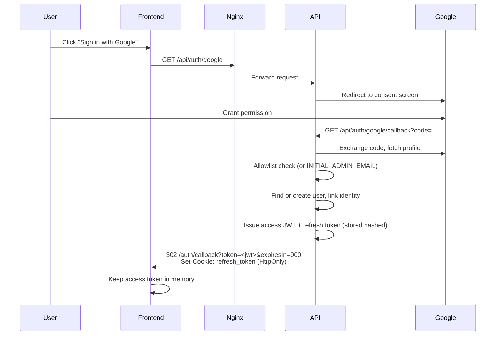
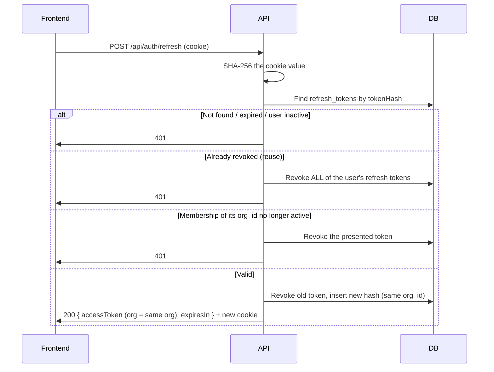
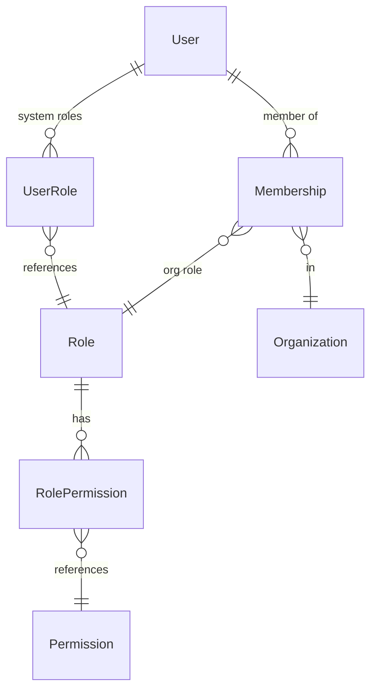
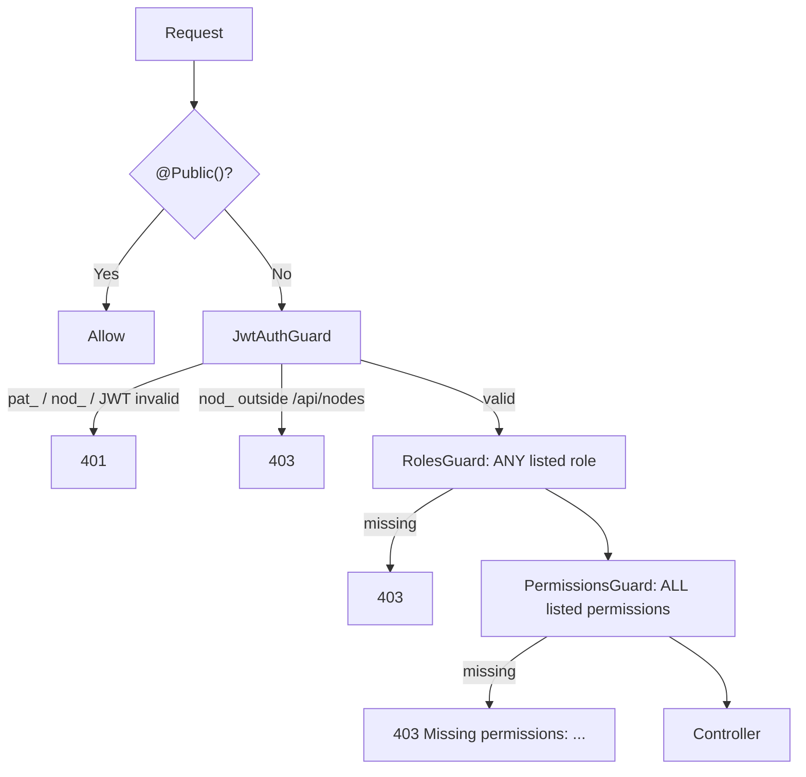
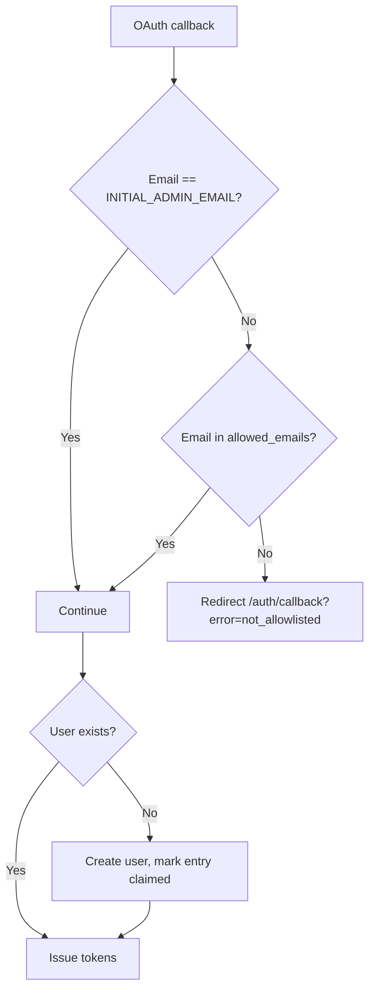

# Security Architecture

This document describes how the application authenticates callers, authorizes
them, protects the secrets it holds, and hardens the edge. It is the design
reference; the permission matrix lives in
[ARCHITECTURE.md](ARCHITECTURE.md#7-authorization) and the per-endpoint
contract lives in the generated OpenAPI document (`/api/docs`).

**Summary**

- **Authentication**: Google OAuth 2.0 / OpenID Connect. No passwords are stored.
- **Access control**: an email allowlist decides who may sign in at all.
- **Sessions**: 15-minute JWT access tokens held in memory, plus a rotating
  refresh token in an HttpOnly cookie, stored hashed.
- **Other credentials**: personal access tokens (`pat_`), worker-node
  credentials (`nod_`), device-flow tokens, and per-job brokered secrets. See
  [Credential kinds](#2-credential-kinds).
- **Authorization**: RBAC with a system role (Admin) and org roles (Org admin,
  Contributor, Viewer) held on a membership, and fine-grained permissions,
  enforced server-side by guards.
- **Secrets at rest**: runtime-configured secrets are encrypted with
  AES-256-GCM under `SECRETS_ENCRYPTION_KEY`.
- **Edge**: Nginx serves UI and API from one origin and sets HSTS, CSP,
  Permissions-Policy and framing headers.
- **Audit**: security-relevant actions are written to `audit_events`.

## Contents

1. [Authentication](#1-authentication)
2. [Credential kinds](#2-credential-kinds)
3. [Session tokens](#3-session-tokens)
4. [Authorization (RBAC)](#4-authorization-rbac)
5. [Email allowlist](#5-email-allowlist)
6. [Request lifecycle](#6-request-lifecycle)
7. [Audit logging and security tables](#7-audit-logging-and-security-tables)
8. [File storage security](#8-file-storage-security)
9. [Infrastructure security](#9-infrastructure-security)
10. [Encrypted credential storage](#10-encrypted-credential-storage)
11. [Attack mitigation matrix](#11-attack-mitigation-matrix)
12. [Configuration reference](#12-configuration-reference)
13. [Test authentication (development only)](#13-test-authentication-development-only)
14. [Fastify and Passport](#14-fastify-and-passport)
15. [File reference](#15-file-reference)
16. [Developer checklist](#16-developer-checklist)
17. [User-owned data and scoped access](#17-user-owned-data-and-scoped-access)
18. [Tenant isolation (RLS)](#18-tenant-isolation-rls)

---

## 1. Authentication

### OAuth 2.0 flow with Google

All interactive sign-in goes through Google. The application never sees or
stores a password.


```mermaid
sequenceDiagram
    participant User
    participant Frontend
    participant Nginx
    participant API
    participant Google

    User->>Frontend: Click "Sign in with Google"
    Frontend->>Nginx: GET /api/auth/google
    Nginx->>API: Forward request
    API->>Google: Redirect to consent screen
    User->>Google: Grant permission
    Google->>API: GET /api/auth/google/callback?code=...
    API->>Google: Exchange code, fetch profile
    API->>API: Allowlist check (or INITIAL_ADMIN_EMAIL)
    API->>API: Find or create user, link identity
    API->>API: Issue access JWT + refresh token (stored hashed)
    API->>Frontend: 302 /auth/callback?token=<jwt>&expiresIn=900<br/>Set-Cookie: refresh_token (HttpOnly)
    Frontend->>Frontend: Keep access token in memory
```

| Route | Purpose |
|---|---|
| `GET /api/auth/providers` | Public. Lists enabled providers |
| `GET /api/auth/google` | Public. Redirects to Google. `?select_account=1` makes Google show its account chooser |
| `GET /api/auth/google/callback` | Public. Provisions the user, sets the refresh cookie, redirects to the web app |

On success the callback redirects to `<APP_URL>/auth/callback?token=<accessToken>&expiresIn=<seconds>`.
On failure it redirects to `<APP_URL>/auth/callback?error=<code>`, where
`<code>` comes from a closed set (next section).

### Sign-in failure contract

Every failed Google sign-in ends as a 302 to `<APP_URL>/auth/callback?error=<code>`.
The code is one of a closed set and never free text: no exception message, no
Google `error_description`, no JSON body.

| Code | Meaning | Web screen primary action |
|---|---|---|
| `not_allowlisted` | The email is not on the allowlist | Sign in with a different account |
| `account_disabled` | The account exists but is deactivated | Sign in with a different account |
| `access_denied` | The person cancelled or denied consent at Google | Try again |
| `authentication_failed` | Token exchange failed, code replayed or expired, no email on the profile, or anything unexpected. The default for every unrecognised failure | Try again |
| `server_misconfigured` | Seed data is missing (`DatabaseSeedException`) | None; an administrator must fix it |
| `no_organization` | `TENANCY_MODE=multi` and the user has no active organization membership (see [User provisioning](#user-provisioning)) | Sign in with a different account |

**Why free text is excluded.** The `/auth/callback` URL is a link anyone can
craft. If the page rendered its `error` value, an attacker could put
attacker-chosen copy on a trusted origin (content spoofing). It also made the
web app recognise cases by matching prose. The API therefore sends only a code,
and the web app maps each code to fixed copy and never renders the raw query
value. An unknown, legacy or missing value shows the `authentication_failed`
screen without echoing the input.

**Where a failure is caught.**

- **Callback handler.** `AuthController.googleAuthCallback` catches failures
  from `handleGoogleLogin` and resolves them with `resolveAuthErrorCode`.
  Policy refusals (allowlist, deactivated account, no organization in
  multi-org mode) are `AuthLoginDeniedException`, a 403 `ForbiddenException`
  carrying a `reason` that becomes the code. The redirect is sent with an
  explicit `302`: Nest has already set the route default (200) on the reply,
  and Fastify's `redirect(url)` keeps a status that was set.
- **Guard failures.** `GoogleOAuthGuard` runs before the handler, so its errors
  (cancelled consent, replayed or expired code, profile without an email)
  never reach the handler's `try/catch`. `GoogleOAuthExceptionFilter`, applied
  with `@UseFilters` on the callback route only, redirects them to the same
  URL. Every other route keeps the JSON error envelope.
- **Anything unrecognised** becomes `authentication_failed`, so a new failure
  mode cannot leak its message into the redirect.

**`access_denied`.** When the person cancels at Google, `passport-oauth2`
reports `?error=access_denied` through `fail()`, so the guard sees no user and
no error. The guard reads only the `error` query value, and when it equals
`access_denied` raises `AuthLoginDeniedException('access_denied')`. Google's
`error_description` is never read. A strategy that instead raises an
`AuthorizationError` with code `access_denied` lands on the same code.

**Account chooser.** After a refusal, the web screen offers "Sign in with a
different account", which calls `login('google', { selectAccount: true })`.
That navigates to `/api/auth/google?select_account=1`, and the guard forwards
`prompt=select_account` to Google. Any other value of the parameter is ignored.

**Logging.** The filter logs the exception's name, never the request URL (it
carries the authorization code). Expected outcomes (`access_denied`,
`not_allowlisted`, `account_disabled`) log at `warn`; the rest at `error`.
`AuthService` logs a `no_organization` refusal at `warn` with the user id only,
never the email, and counts it as the `no_organization` outcome of the
`app.auth.logins` metric.

**Adding a code** touches three places. The list is defined once (#727), so
the API and the web cannot drift:

1. `AUTH_ERROR_CODES` in `packages/platform-contract/src/identity/constants.ts` (`@marinoscar/platform-contract/identity`), plus the branch in `resolveAuthErrorCode` (`packages/platform-api/src/identity/auth/auth-error-codes.ts`) that produces it.
2. The copy for it in `createSignInErrorContent` (`packages/platform-web/src/identity/ui/sign-in-error-content.ts`). Its table is keyed by the contract's codes, so a code without copy is a type error.
3. `packages/platform-web/test/identity/sign-in-error-content.test.ts`, which checks that the web's codes are the contract's list and that every code has copy. It needs no edit unless the code changes severity rules.

Also update the `error` description on the callback route's `@ApiResponse` in
`auth.controller.ts`.

Guardrails: `packages/platform-api/test/identity/auth/auth.controller.spec.ts` (no exception message
in the redirect), `packages/platform-api/test/identity/auth/filters/google-oauth-exception.filter.spec.ts`,
`packages/platform-api/test/identity/auth/guards/google-oauth.guard.spec.ts` (account chooser,
`access_denied`), `apps/api/test/auth/oauth.integration.spec.ts` (guard failures
redirect with a code), `packages/platform-web/test/identity/auth-callback-page.test.tsx`,
`apps/web/src/__tests__/contexts/AuthContext.test.tsx` and the copy test above.

### User provisioning

`AuthService.handleGoogleLogin` runs these steps:

1. Lowercase the email. Reject with 403 unless it is in `allowed_emails` or
   equals `INITIAL_ADMIN_EMAIL`.
2. Look up the identity by `(provider, providerSubject)`. If absent, look up
   the user by email and link the identity.
3. If there is no user, create one inside a transaction: the user row, the
   identity, default user settings, the default role (`viewer`), an active
   membership in the default organization (`OrganizationsService.ensureMembership`)
   and, when `AdminBootstrapService.shouldGrantAdminRole` says so, the `admin`
   role. The default-organization membership is written only when the tenancy
   mode auto-joins this user (below). A missing default organization (neither
   the migration backfill nor the seed ran) fails the sign-up before anything
   is written, like a missing default role.
   The allowlist entry is then marked claimed.
4. Refresh the provider display name and picture.
5. Reject an inactive user (`isActive = false`).
6. Apply the tenancy mode (below): ensure the default-organization membership,
   or refuse with `no_organization`.
7. Issue tokens.

**Auto-join by tenancy mode.** `TENANCY_MODE` (`single`, the default, or
`multi`) is a deployment-level environment variable, read once at startup; an
invalid value stops the API from starting. It is deliberately not an admin
setting: switching it at runtime would change who can see what in the middle of
a session. `TenancyService` (`packages/platform-api/src/identity/organizations/tenancy.service.ts`)
exposes it, and `GET /api/auth/me` reports it as `tenancyMode`.

| Mode | New user | Returning user |
|---|---|---|
| `single` | Joins the default organization inside the creation transaction | Self-heal: a user without a default-organization membership gets one at sign-in (`OrganizationsService.ensureDefaultOrgMembership`, read first, idempotent upsert). A suspended membership stays suspended |
| `multi` | Joins nothing, except the `INITIAL_ADMIN_EMAIL` account, which always joins the default organization so the deployment can be administered | Signs in only with at least one active membership; zero active memberships is refused with `no_organization` (after the inactive-user check) |

`TestAuthService` (the non-production test login) applies the same rules and
redirects a refusal to the same `/auth/callback?error=<code>`. Pending invites
are claimed before the membership check once invite acceptance lands (#726).
The admin Doctor's `tenancy.mode` check reports a database that contradicts the
mode.

The admin role is granted only when the email matches `INITIAL_ADMIN_EMAIL`
and no other active admin exists. Seeding adds `INITIAL_ADMIN_EMAIL` to the
allowlist.

### Access token (JWT)

```json
{
  "sub": "user-uuid",
  "email": "user@example.com",
  "roles": ["viewer"],
  "org": "org-uuid",
  "iat": 1706123456,
  "exp": 1706124356
}
```

- Signed HS256 with `JWT_SECRET` (at least 32 characters). **There is no
  fallback secret**: a missing or blank `JWT_SECRET` stops the API at boot
  with a message naming the variable (`requireJwtSecret`,
  `packages/platform-api/src/identity/identity.configuration.ts`, #727). The
  strategy used to fall back to a hard-coded string, which a public package
  must not ship. The `auth.jwt-secret` doctor check still warns about a
  short value.
- **`org` is the active organization** (#724): the one org this token acts
  in. Every token the API issues carries it (sign-in, refresh, switch-org,
  the device flow's session path). At sign-in it is the default organization
  in single mode, and in multi mode the active membership with the latest
  `memberships.last_active_at` (sign-in and switch-org move that column). It
  is signed, but trusted only after `validateJwtPayload` re-checks that it is
  an **active** membership of `sub`, read from the same cached graph as the
  roles: a removed or suspended member's token is refused (401) on the next
  request on the replica that made the change, on other replicas within
  event-bus latency, and within `AUTH_PRINCIPAL_CACHE_TTL_SECONDS` (default
  30 s) at worst. The org is **never** taken from a header, query or body;
  the only request input naming an org is the body of `POST
  /api/auth/switch-org`, which is checked against the caller's memberships
  before anything is issued. The org id goes on the request span as
  `org.id`, never on a metric label.
- **Temporary compatibility path.** A token issued before #724 has no `org`.
  In single mode it is accepted for one access-token lifetime after the API
  process started (the device token lifetime for a `did` token), mapped to
  the default organization exactly as before; in multi mode it is refused
  and the client refreshes. This path will be removed in a later release.
- Sent as `Authorization: Bearer <jwt>`. The strategy reads only the header,
  never a cookie.
- `JwtStrategy` verifies signature and expiry, then resolves the user with
  roles and permissions (the *principal*) and rejects an inactive user. Roles
  in the token are informational; the database is authoritative.
- The principal is read through a short-TTL, in-process cache
  (`PrincipalCache`, `packages/platform-api/src/identity/auth/principal-cache/`), keyed by
  `(userId, orgId, tokenKind)` (#724), for at most
  `AUTH_PRINCIPAL_CACHE_TTL_SECONDS` (default 30; `0` turns it off and every
  request reads the database). Every write that changes what a principal
  resolves to (`PATCH /api/users/{id}`, `PUT /api/users/{id}/roles`, user
  deactivation, the first-login and bootstrap admin grants, profile and
  display-name updates, membership create, delete, status or role change,
  PAT revoke, device-session revoke) calls `invalidateUser(userId)` (or
  `invalidate`) after it commits, dropping every entry of that user in every
  org. The guarantee for a role change, a deactivation or a membership change
  is therefore:
  - **the next request on the replica that made the change** is refused or
    re-authorised: the local entry is dropped synchronously;
  - **other replicas** drop their entry within event-bus latency, through the
    `auth.principal.invalidate` channel (`EVENT_BUS_ADAPTER=postgres`);
  - **if the bus is unavailable** (or the deployment runs more than one
    replica on the `in-process` adapter), a stale entry lives at most
    `AUTH_PRINCIPAL_CACHE_TTL_SECONDS`, well under the access-token lifetime.
    The Doctor's `auth.principal-cache` check warns in both cases;
  - a request whose database read was already in flight when the change
    landed can never store its stale result (a per-user generation guard);
  - a token carrying `did` (a device session) has that session checked
    **live, on every request**, before the cache is consulted, so revoking a
    device session is still immediate.

  The cache holds only the user/role/permission row graph the join already
  loaded, deep-frozen, never token material, and at most 10,000 entries. PATs
  and node credentials are not cached: their token row is read per request.
  A role ↔ permission change made by the seed reaches running replicas within
  the TTL; a deploy restarts the API, which empties the cache anyway.

---

## 2. Credential kinds

Every credential the system accepts or holds, and where it is valid.

| Kind | Format | Stored as | Lifetime | Accepted on | Revocation |
|---|---|---|---|---|---|
| Session access token | JWT (HS256) | Not stored | `JWT_ACCESS_TTL_MINUTES` (15) | Every `@Auth()` route | Expiry; deactivating the user; removing the membership of its `org` |
| Refresh token | 32 random bytes, hex, in `refresh_token` cookie | SHA-256 hash in `refresh_tokens` | `JWT_REFRESH_TTL_DAYS` (14) | `/api/auth/*` only (cookie path) | Logout, logout-all, rotation, reuse detection, switch-org; removing the membership of its `org_id` |
| Personal access token | `pat_` + 64 hex | SHA-256 hash in `personal_access_tokens`, shown once | Chosen at creation | Every `@Auth()` route, with the owner's full authority **in its org** | `DELETE /api/pat/{id}`; deactivating the user; removing the membership of its `org_id` |
| Node credential | `nod_` + 64 hex | SHA-256 hash in `node_credentials`, shown once | No mandatory expiry | `/api/nodes` and `/api/nodes/*` only | `DELETE /api/node-credentials/{id}` or the admin fleet view |
| Device-flow token | Session JWT + refresh token, or a `pat_` | As above | `DEVICE_TOKEN_EXPIRY_DAYS` (7) or `DEVICE_PAT_EXPIRY_DAYS` (90) | As above, in the approver's org | `DELETE /api/auth/device/sessions/{id}`, immediately, for either kind |
| Per-job node secret | Short-lived PostgreSQL login role | Only its handle, in `job_node_secrets` | The job's lease + 60 s | The database, from one node, for one job | Job settles, sweep cron, or `VALID UNTIL` |
| Runtime-configured secret | Provider key, SMTP password, VAPID key, etc. | AES-256-GCM ciphertext | Until replaced | Server-side only, never returned | Replace or delete in the admin UI |
| Link-share token | `lnk_` + 43 base64url (32 random bytes) | SHA-256 hash (`grants.link_token_hash`, unique) plus AES-256-GCM ciphertext bound to the grant id; returned once | `links.defaultTtlDays` (30), capped at `links.maxTtlDays` (365) | The `X-Link-Token` header on `GET /api/public/links/current` and app routes behind `LinkGrantGuard`, for ONE record and role | `DELETE /api/grants/{id}`, immediately; expiry |
| `STACK_AGENT_TOKEN` | 32 random hex bytes | Plaintext in `.env`, on both the `api` and `stack-agent` services | Until rotated | Bearer on `stack-agent`'s `/v1/*` routes only, reachable from `app-network` only | Edit `.env` and recreate `stack-agent`/`api` |

`JwtAuthGuard` recognizes the bearer families by prefix before Passport runs:
`Bearer pat_…` goes to `PatService.validateToken`, `Bearer nod_…` to
`NodeCredentialService.validateToken`, anything else to the JWT strategy.

**Org binding per kind (#724).** Every user credential is bound to exactly
one organization and acts only there; none can hop orgs:

| Kind | Bound to | Where the binding lives | Switches? |
|---|---|---|---|
| Session (browser) | The org chosen at sign-in or by switch-org | The access token's `org` claim and `refresh_tokens.org_id` | Only through `POST /api/auth/switch-org`, which re-issues both |
| Device session (`did`) | The approver's active org at approval | `device_codes.org_id`, the token's `org` (must match), `refresh_tokens.org_id` | No (403 on switch-org) |
| PAT | The caller's active org at creation, or an explicit `orgId` the caller is an active member of | `personal_access_tokens.org_id` | No (403 on switch-org) |
| Node (`nod_`) | **No org: system-scoped.** Only the owner's system grants count | — | Not applicable |

Each path re-checks its binding on every request against the user's active
memberships and refuses (401) a credential whose membership was removed or
suspended. The request carries the result as `request.principal` (ADR 0001's
`Principal`: user id, `activeOrgId` (absent for a node), every membership
with its role and status, roles, permissions, credential kind), beside the
legacy `request.user`.

### Session tokens

The access JWT and refresh cookie are what the web app uses. See
[Session tokens](#3-session-tokens).

### Personal access tokens (`pat_`)

A PAT is a user delegating their own authority to a script. It is accepted on
every authenticated route with the owner's roles and permissions.

- 32 random bytes, prefixed `pat_`. Only the SHA-256 hash and a display
  prefix (`tokenPrefix`, e.g. `pat_1a2b`) are stored. The raw value is
  returned once, at creation.
- Validation rejects unknown, revoked and expired tokens, tokens whose
  owner is inactive, and (#724) tokens whose org (`personal_access_tokens.org_id`)
  is no longer an active membership of the owner. A PAT created before #724
  has no org: honoured in single mode (the default org), refused in multi
  mode. `lastUsedAt` is updated on success.
- Bound to one org at creation (#724): the caller's active org, or an
  `orgId` in the body that must be an active membership of the caller (else
  400). Creation and revocation write `pat:created` / `pat:revoked` audit
  events whose `meta` carries the `orgId`.
- Managed at `/settings/tokens` or `POST/GET/DELETE /api/pat`. See
  [personal-access-tokens.md](personal-access-tokens.md).

### Node credentials (`nod_`)

A node credential is authority handed to an unattended worker process on a
machine the deployment may not own. It resolves to its owning user (an
admin, since `nodes:write` is Admin-only), so the guard confines it.

- Same shape as a PAT: `nod_` + 32 random bytes, SHA-256 at rest, shown once.
- **System-scoped** (ADR 0001, #724): a node credential acts in no
  organization. Its principal has no `activeOrgId`, records `tokenKind:
  'node'`, and carries only the owner's **system** grants (`nodes:*` among
  them); no org role contributes.
- **Route allowlist.** A `nod_` bearer is accepted only on `/api/nodes` and
  paths under `/api/nodes/`. The guard checks the raw URL *before* looking up
  the token, so a refused request costs no database round trip and does not
  touch `lastUsedAt`. Everything else answers 403.
- **Cannot mint another.** `/api/node-credentials` is outside that prefix on
  purpose. Minting and revoking need a session or a `pat_`, so a leaked node
  token cannot regrow itself.
- The admin fleet view is on a different prefix (`/api/admin/nodes`) and is
  equally unreachable with a `nod_` token.

Design: [specs/worker-nodes.md](specs/worker-nodes.md). Operator guide:
[runbooks/run-worker-nodes.md](runbooks/run-worker-nodes.md).

### Device-flow tokens

The device authorization grant (RFC 8628) lets the CLI and other headless
clients sign in through the browser at `/activate`. When the user approves,
`POST /api/auth/device/token` returns one of two credentials, chosen by the
client's `clientInfo.tokenType`:

- **Session** (default): a JWT access token and a refresh token, both living
  `DEVICE_TOKEN_EXPIRY_DAYS` days.
- **PAT** (`tokenType: "pat"`): a `pat_` token living `DEVICE_PAT_EXPIRY_DAYS`
  days, with no refresh token.

The credential a device session issues is linked to the `DeviceCode` row that
minted it: a session-kind access token carries a `did` claim naming that row,
which `AuthService.validateJwtPayload` re-checks on every request, and the
paired refresh token carries the same link, enforced again on every rotation.
The session is bound to the approver's active org (#724): `device_codes.org_id`
is set at approval, the session tokens carry it as `org` (and
`validateJwtPayload` refuses a `did` token whose `org` differs from its row),
and a collected PAT is bound to it. The credential is minted only while that
membership is active (`access_denied` otherwise).
`DELETE /api/auth/device/sessions/{id}` revokes the session **and** whatever
it issued in one step — the linked PAT (if any), every refresh token minted
from it, and, via the `did` check, the access token itself, immediately
rather than at its eventual expiry. Revoking the same PAT independently from
`DELETE /api/pat/{id}` or the Access Tokens page is not an error either way.
`POST /api/auth/logout-all` and deactivating the user remain the tools for
revoking every credential a user holds, not just one device. See
[DEVICE-AUTH.md](DEVICE-AUTH.md#device-session-management).

### Per-job brokered secrets

Some node-eligible jobs need a credential of their own; the database backup
needs a database connection. A node never persists such a secret.

- The node asks `POST /api/nodes/{id}/jobs/{jobId}/secret`. The server checks
  that the node holds the job, then the job type's `nodeSecretBroker` mints
  the secret. For the backup this is a login role with `CONNECT`, `USAGE` and
  `SELECT` only, `VALID UNTIL` the job's lease plus 60 seconds.
- The secret is returned once and held in the node's memory.
- `job_node_secrets` records the broker kind, the handle (the role name) and
  the expiry. It has no column that could hold the material.
- Three independent paths revoke it: the job-settle listener, the ten-minute
  `node-secret-sweep` cron, and PostgreSQL's own `VALID UNTIL`.
- Brokering is off unless the `nodes.jobSecretBrokerEnabled` system setting is
  on. A database role without `CREATEROLE` answers `guided` with paste-ready
  SQL rather than an error.

Operator guide: [runbooks/node-job-secrets.md](runbooks/node-job-secrets.md).

### Node span relay

`POST /api/nodes/{id}/telemetry` writes what a node says into the
deployment's trace store. A node is authenticated but not trusted, so the
relay treats its spans as untrusted input:

- **Identity from the path.** `node.id` and `node.name` come from the path
  node after `assertOwnership` (`404` missing, `403` another owner's), and
  `job.id` and `job.type` from the job row. The body cannot name a node, a
  trace, a span or a parent. The parent is the job's stored `trace_context`.
- **Attributed or dropped.** A span is accepted only for a job the node
  holds now, or settled within the last 10 minutes (an in-memory ledger
  written at settle time). Any other span is dropped and counted, never
  emitted under this node's identity. The count says nothing about who does
  hold the job.
- **Bounded and allowlisted.** The body is `.strict()` at every level:
  at most 50 spans, five phase names, integer-only attributes from a fixed
  set of four, times inside a 24-hour window, and an identifier-shaped
  `errorType` of at most 64 characters. It has no free-form string, so no
  message, URL, path or credential fits.
- **Rate-limited.** 60 requests and 1000 spans per node per minute, in
  memory on each replica, charged only after ownership passes. Over budget
  answers `429`.
- **Never fatal.** Emission cannot throw into the request, and the CLI sends
  after the job settles, off the job's path, dropping on any error.

Design: [specs/worker-nodes.md, Span relay](specs/worker-nodes.md#span-relay).

### Link-share tokens (`lnk_`)

A link share (#730) grants one record, with one role, to anyone holding its
token: the only credential that authenticates a request with no principal.

- **Format.** `lnk_` + 32 random bytes in base64url (47 characters). The
  prefix makes a leaked token recognisable to secret scanning, like `pat_`
  and `nod_`; anything else is refused before any lookup.
- **Storage.** `grants.link_token_hash` (SHA-256 hex, unique) is the lookup
  key. `grants.link_token_ciphertext` is `encryptSecret(token,
  'sharing.link:' + grantId)`, the grant id chosen before the insert so the
  cipher domain binds the row: the sharer can copy the link again, and a dump
  without `SECRETS_ENCRYPTION_KEY` is useless. Without the key, creation
  fails closed (`503 LINKS_UNAVAILABLE`); a token is never stored in clear.
  The create response is the only place it is returned in clear; the list
  re-derives the URL.
- **Transport: the URL fragment, then a header.** The share URL is
  `<APP_URL>/s#lnk_…`. A browser never sends a fragment, so the token reaches
  neither nginx's access log (`$request`), nor the API's request log, nor the
  server span's `url.path`, nor a `Referer`. The SPA sends it in
  `X-Link-Token`; a token in a path or a query string is never read.
- **Resolution.** The one cross-organization read of the sharing slice: ONE
  `grants` row by its hash on the bypass client (reason `link-resolution`).
  The record check and every app read (`withLinkScope`) then run in the
  grant's organization with no user id, under row-level security. Unknown,
  malformed, revoked, expired, wrong-type and otherwise invalid tokens all get
  the same `404 Link not found`.
- **Throttle.** Failed resolutions count per client address (`request.ip`,
  honouring the proxy settings): 30 in 10 minutes, then `429
  LINK_RESOLUTION_THROTTLED` with `Retry-After`, even for a valid token.
  In-process, so approximate across replicas.
- **Revocation.** `DELETE /api/grants/{id}` (soft); nothing caches a
  resolution, so the next request is a 404. Creating, changing and revoking a
  link are audited (`grant:link:*`); resolutions are counted
  (`app.sharing.link_resolutions`), not audited.
- **Egress.** Never in a log line (a failure logs the reason enum and a keyed
  address tag), a span (only `sharing.link.grant_id`, on success), an audit
  row, an event or an error body (`apps/api/test/sharing/link-grants.integration.spec.ts`).
  Public responses carry `Cache-Control: no-store` and `Referrer-Policy:
  no-referrer`; file bytes are served by presigned URL, never with the token.

Design: [the sharing README](../packages/platform-api/src/sharing/README.md#security-notes).

### Encrypted runtime secrets

Secrets an administrator enters in the UI (SMTP password, VAPID private key,
object-storage secret key, AI provider org keys) and secrets a user brings
(AI provider keys) are encrypted under `SECRETS_ENCRYPTION_KEY` and never
returned by any route. See [Encrypted credential storage](#10-encrypted-credential-storage).

---

## 3. Session tokens

### Access token vs refresh token

| Aspect | Access token | Refresh token |
|---|---|---|
| Type | JWT | 32 random bytes, hex |
| Client storage | Memory only (the API client's private field) | HttpOnly cookie `refresh_token` |
| Server storage | None | SHA-256 hash in `refresh_tokens` |
| Lifetime | 15 minutes | 14 days |
| Exposed to JavaScript | Yes (needed for the header) | No |
| Revocable | No; expires | Yes |
| Rotation | New one on every refresh | Single use; replaced on every refresh |

Short-lived access tokens bound the damage of a stolen token. The HttpOnly
cookie keeps the refresh token away from XSS. Hashing means a database leak
does not yield usable tokens.

### Rotation


```mermaid
sequenceDiagram
    participant Frontend
    participant API
    participant DB

    Frontend->>API: POST /api/auth/refresh (cookie)
    API->>API: SHA-256 the cookie value
    API->>DB: Find refresh_tokens by tokenHash
    alt Not found / expired / user inactive
        API->>Frontend: 401
    else Already revoked (reuse)
        API->>DB: Revoke ALL of the user's refresh tokens
        API->>Frontend: 401
    else Membership of its org_id no longer active
        API->>DB: Revoke the presented token
        API->>Frontend: 401
    else Valid
        API->>DB: Revoke old token, insert new hash (same org_id)
        API->>Frontend: 200 { accessToken (org = same org), expiresIn } + new cookie
    end
```

Rotation is **org-preserving** (#724): the new refresh row keeps the
presented row's `org_id` and the new access token's `org` claim names the
same org. Once the user's membership there is removed or suspended, the
rotation fails (401, metric outcome `no_organization`) and the presented token
is revoked. A row written before #724 has no `org_id`; it is bound to the org
a sign-in would pick.

### Switching organization

`POST /api/auth/switch-org` with `{ "orgId": "<uuid>" }` (#724) is a rotation
for another org. It requires a **session** access token (a PAT, device or node
credential is bound to one org and gets 403) and the refresh cookie (401
without a live, non-device refresh token of the caller). `orgId` must be an
active membership of the caller, else 404, so an org that exists but is not
the caller's is indistinguishable from one that does not; in single mode only
the default org qualifies (a no-op re-issue). The presented refresh token is
revoked conditionally (two concurrent switches with one cookie cannot both
succeed), a new one bound to `orgId` is set with the cookie attributes below,
and the response is `POST /api/auth/refresh`'s `{ accessToken, expiresIn }`.
It writes the audit event `auth:org_switched` (`targetType: organization`,
`meta.fromOrgId`) and logs the user and org ids at `info`.

### Reuse detection

A refresh token is single use. If a revoked token is presented, someone else
has used it: the API revokes every refresh token the user holds, logs
`Refresh token reuse detected for user: <id>` at warn level, and returns 401.
Every session must sign in again.

### Cookie settings

```typescript
const COOKIE_OPTIONS = {
  httpOnly: true,
  secure: process.env.NODE_ENV === 'production',
  sameSite: 'lax' as const,
  path: '/api/auth',
  maxAge: 14 * 24 * 60 * 60, // seconds
};
```

| Setting | Why |
|---|---|
| `httpOnly` | JavaScript cannot read it |
| `secure` in production | Sent only over HTTPS |
| `sameSite: 'lax'` | Not sent on cross-site POST, so a third-party page cannot drive a refresh |
| `path: '/api/auth'` | Sent only to the auth routes, not with every API call |

Fastify's cookie plugin is registered with `COOKIE_SECRET` (falling back to
`JWT_SECRET`).

### Logout and disabled users

- `POST /api/auth/logout` revokes the current refresh token and clears the cookie.
- `POST /api/auth/logout-all` revokes every refresh token the user holds.
- Deactivating a user (`PATCH /api/users/{id}` with `isActive: false`) stops
  their JWTs, refresh tokens, PATs and node credentials on the next request,
  because every validator checks `isActive`. For a JWT on another API replica,
  "next request" means within event-bus latency, and at most
  `AUTH_PRINCIPAL_CACHE_TTL_SECONDS` if the bus is down (see §1).

### Cleanup

A daily cron (03:00) enqueues the `auth.token.cleanup` job, which deletes
expired and revoked refresh tokens. The cron only enqueues; the work runs on
the job queue.

---

## 4. Authorization (RBAC)

### Model

RBAC is split into **system roles**, which operate the deployment, and **org
roles**, which operate one organization (issue #723). Roles stay global rows
of one table with a `scope` (`system` or `org`); what differs is where a user
holds them.


```mermaid
erDiagram
    User ||--o{ UserRole : "system roles"
    UserRole }o--|| Role : references
    User ||--o{ Membership : "member of"
    Membership }o--|| Organization : in
    Membership }o--|| Role : "org role"
    Role ||--o{ RolePermission : has
    RolePermission }o--|| Permission : references
```

Four seeded roles:

- **Admin** (system, `user_roles`): every system permission. Backups, the
  Doctor, telemetry, storage and AI configuration, nodes, users and roles.
- **Org admin** (org, on a membership): every org permission, including the
  organization's members and invites (`org_members:*`, `org_invites:*`). A
  customer's org admin manages their members without becoming a deployment
  operator: none of these is a system permission.
- **Contributor** (org): manage own settings and storage objects, use AI.
- **Viewer** (org): the default membership role (`DEFAULT_ORG_ROLE`). Manage
  own settings, read storage. No `ai:use`.

A role is granted only permissions of its own scope; the permission registry
refuses a declaration that crosses scopes, so a system permission can never be
seeded onto an org role.

**Effective permissions.** A request's permissions are the union of the
user's system roles' grants and the grants of the role on the user's
**active-org membership**, computed in one place, `PrincipalFactory`
(`packages/platform-api/src/identity/auth/principal.factory.ts`), for the guards, `/api/auth/me`
and the users list. The active organization is the one the request's
credential is bound to (#724): the access token's `org` claim, the PAT's or
device session's `org_id`; a node credential has none and gets its owner's
system grants only. A graph loaded outside a request (the users list, a
pre-#724 token) falls back to the sign-in rule: the default org in single-org
mode, the active membership used most recently in multi-org mode. A suspended
membership, or none, contributes nothing. `PermissionsGuard` reads
`request.principal.permissions`. JWT, PAT and node credentials all
load the same graph (`PRINCIPAL_USER_INCLUDE`), so the three cannot disagree.
The system administrator holds the system `admin` role and `org_admin` on the
default organization; `ROLES.ADMIN` in `@Auth({ roles })` means the system
role.

The full permission list and the role-to-permission matrix are in
[ARCHITECTURE.md](ARCHITECTURE.md#7-authorization).

Where RBAC data is declared: each permission, with its description and
default role grants, in a declaration file beside the module whose controller
enforces it (`apps/api/src/<module>/<module>.permissions.ts`); the four roles
in `apps/api/src/common/permissions/platform-roles.ts` (each with its scope); an app's own roles and
permissions in `apps/api/src/app-registrations/permissions.ts`. The role and
permission registries (`apps/api/src/common/permissions/`) validate them at
import time (id shape, non-empty description, a `system` or `org` scope,
every grant names a registered role of the same scope, no duplicate id), so a
malformed declaration stops the API from
starting. `roles.constants.ts` derives the `PERMISSIONS` constants `@Auth()`
names from the same files, so the enforced string and the seeded string
cannot drift.

The seed runs in the production image, which has no `src/`, so it reads a
generated, committed catalog: `apps/api/prisma/catalog/permissions.json`
(`npm run catalog:permissions --workspace=api`; a test fails when it is
stale). `npm run prisma:seed` upserts it, so re-seeding an existing database
adds new permissions without duplicating grants, and never removes a grant an
administrator revoked.

### Guards

There is no global authentication guard. The only global guard is the
maintenance-mode guard. Authentication and RBAC are applied per controller or
per route with `@Auth()`, which composes three guards:


```mermaid
flowchart TD
    A[Request] --> B{"@Public()?"}
    B -->|Yes| Z[Allow]
    B -->|No| C[JwtAuthGuard]
    C -->|pat_ / nod_ / JWT invalid| E[401]
    C -->|nod_ outside /api/nodes| F[403]
    C -->|valid| G[RolesGuard: ANY listed role]
    G -->|missing| K[403]
    G --> N[PermissionsGuard: ALL listed permissions]
    N -->|missing| Q["403 Missing permissions: ..."]
    N --> S[Controller]
```

- **JwtAuthGuard**: skips `@Public()` routes; handles `pat_` and `nod_`
  bearers; otherwise runs the JWT strategy.
- **RolesGuard**: if `roles` is set, the user needs **any** of them. Every
  role named in `@Auth({ roles })` today is the system `admin` role.
- **PermissionsGuard**: if `permissions` is set, the user needs **all** of
  them, out of the effective set above (`request.principal.permissions`).
  The 403 names the missing ones.

A route with neither `@Auth()` nor `@Public()` is unauthenticated. Every new
controller therefore needs `@Auth()` at class or method level.

### Decorators

```typescript
import { Auth } from '../auth/decorators/auth.decorator';
import { PERMISSIONS } from '../common/constants/roles.constants';

@Auth()                                                     // any signed-in user
@Get('profile')
getProfile(@CurrentUser() user: RequestUser) {}

@Auth()                                                     // the org-aware principal (#724)
@Get('mine')
listMine(@CurrentPrincipal() principal: Principal) {}       // principal.activeOrgId, .memberships, .credential

@Auth({ permissions: [PERMISSIONS.SYSTEM_SETTINGS_WRITE] }) // one permission
@Patch('system-settings')
updateSystemSettings() {}

@Public()                                                   // no auth at all
@Get('providers')
getProviders() {}
```

`@Auth()` also stamps an `x-rbac` extension into the OpenAPI document, so the
API reference states each route's requirements. Prefer permissions over
roles: a permission can be granted to another role without a code change.

---

## 5. Email allowlist

Only pre-authorized addresses can sign in, even with a valid Google account.


```mermaid
flowchart TD
    A[OAuth callback] --> B{Email == INITIAL_ADMIN_EMAIL?}
    B -->|Yes| K[Continue]
    B -->|No| C{Email in allowed_emails?}
    C -->|No| D["Redirect /auth/callback?error=not_allowlisted"]
    C -->|Yes| K
    K --> F{User exists?}
    F -->|No| G[Create user, mark entry claimed]
    F -->|Yes| L[Issue tokens]
    G --> L
```

| Field | Meaning |
|---|---|
| `email` | Unique, lowercased |
| `addedById`, `addedAt` | Who allowlisted it, and when |
| `claimedById` (unique), `claimedAt` | The user who first signed in with it; `null` means **pending** |
| `notes` | Optional, up to 500 characters |

| Route | Permission | Behavior |
|---|---|---|
| `GET /api/allowlist` | `allowlist:read` | Paginated; filter by status, search by email |
| `POST /api/allowlist` | `allowlist:write` | 409 if the email already exists. Sends an invitation email |
| `DELETE /api/allowlist/{id}` | `allowlist:write` | 400 if the entry is claimed |

A claimed entry cannot be removed. To cut off an existing user, deactivate
them instead. Additions and removals write `allowlist:add` and
`allowlist:remove` audit events. The UI is the Allowlist tab at
`/admin/settings/users`.

**Organization invitations add allowlist entries (#726).** Inviting an
address to an organization (`POST /api/org/invites`, or the first-admin
invitation `POST /api/admin/organizations` writes) creates its
`allowed_emails` row when none exists, in the same transaction as the
invitation, with an `allowlist:add` audit event (`meta.source: "org_invite"`),
so the invitee can sign in. An existing entry is left as it is, and revoking
the invitation does not remove the entry. The invitation itself is claimed at
sign-in, before the multi-org "no organization" check: each pending,
unexpired invitation to the signing-in address creates the membership with its
org role, or upgrades an existing one (never downgrades), and is marked
`accepted`; a lapsed one is marked `expired` (invitations last 14 days, and
re-inviting renews them). There is no invitation token: signing in with the
invited Google address is the acceptance, so nothing secret is emailed or
logged. The `org.invitation` email goes to the invitee only, after the write
commits, and never carries the administrator's notes.

**Removing a member** (`DELETE /api/org/members/{userId}`) deletes the
membership and, in the same transaction, revokes that user's refresh tokens,
personal access tokens and device sessions bound to that organization (their
other organizations are untouched), then invalidates the principal cache: an
access token already issued for that organization stops validating at once on
the replica that served the removal and within the principal-cache TTL
elsewhere.

---

## 6. Request lifecycle

A protected request passes these checkpoints in order:

1. **Nginx**: same-origin routing and security headers ([§9](#9-infrastructure-security)).
2. **MaintenanceGuard** (global): 503 while a maintenance window is open,
   except for routes marked `@AllowDuringMaintenance()`.
3. **JwtAuthGuard**: credential family, signature, expiry, revocation, user
   active, and the credential's org binding (an active membership, #724).
4. **RolesGuard / PermissionsGuard**: RBAC.
5. **ZodValidationPipe** (global): validates body, query and params against
   the route's Zod DTO. Unknown keys are stripped.
6. **Controller and service**: business logic, including ownership checks.
7. **HttpExceptionFilter** (global, from `@marinoscar/platform-api/core`): turns every error into the standard
   error envelope with a closed `code` set and no stack trace.

After the guards, `request.user` is the full `AuthenticatedUser` (with role
and permission relations) and `request.requestUser` is the flattened
`{ id, email, roles[], permissions[] }` the controllers use via
`@CurrentUser()`. `request.principal` (#724) is ADR 0001's `Principal`, read
with `@CurrentPrincipal()`: user id, active org (absent for a node),
memberships with role and status, roles, permissions and credential kind.

---

## 7. Audit logging and security tables

| Table | Security role |
|---|---|
| `users` | `isActive` stops every credential of that user |
| `user_identities` | `(provider, providerSubject)` is unique |
| `roles`, `permissions`, `role_permissions`, `user_roles` | RBAC; seeded, changed by admins |
| `refresh_tokens` | SHA-256 hashes, `revokedAt`, the bound `org_id` |
| `personal_access_tokens`, `node_credentials` | SHA-256 hashes, display prefix, `revokedAt`; a PAT's bound `org_id` |
| `device_codes` | Device-flow codes, stored hashed; the approved session's `org_id` |
| `allowed_emails` | The allowlist |
| `credentials`, `user_credentials`, `org_credentials`, `user_ai_keys` | Encrypted secrets |
| `job_node_secrets` | Handles of brokered per-job secrets, never material |
| `audit_events` | Append-only audit log |

`audit_events` rows carry `actorUserId` (null for system actions), `action`,
`targetType`, `targetId`, `meta` (JSON) and `createdAt`, indexed on actor,
target and time. Actions are `<area>:<verb>` strings, for example
`allowlist:add`, `user:roles_update`, `system_settings:patch`,
`storage:object:delete`, `storage_config:test`, `ai_config:set_key`,
`auth:org_switched`, `pat:created`, `pat:revoked` (the last three carry the
org id in `meta`, #724). Audit `meta` never contains key material.

### Support bundle (an egress surface)

`GET /api/admin/doctor/support-bundle` (`system_settings:read`) is the one
route whose purpose is to let the deployment's state LEAVE the deployment:
an administrator downloads a JSON file and attaches it to a support ticket.
It is built only from read-only sections, each validated by a strict zod
schema that drops its data on any unexpected field, and then passed through a
central redaction pass (rules `v1`) that replaces sensitive keys (`password`,
`secret`, `token`, `api key`, `cookie`, `credential`, `hint`, `dsn`, ...) and
secret-looking values (PEM blocks, bearer tokens, JWTs, URL credentials and
query strings, `pat_`/`nod_` tokens, AWS key ids, email addresses, IP
addresses, long hex/base64 runs including UUIDs) and counts what it replaced.
Raw telemetry (logs, spans, traces, explorer rows) is never included, the
`telemetry` section needs `telemetry:query` as well, and the downloader's
identity is audited (`support_bundle:download`) but never written into the
file. `apps/api/test/doctor/support-bundle-secret-egress.integration.spec.ts`
seeds every credential kind plus personal values and asserts none of them
reaches the file, raw or encoded. Design: [doctor spec §2.10](specs/doctor.md#210-support-bundle).

---

## 8. File storage security

### Where the bucket comes from

Provider, bucket, region, endpoint and credential are configured at runtime
at `/admin/settings/storage` (`storage_config:read`/`storage_config:write`).
The secret access key is stored encrypted and never returned. See
[specs/storage-providers.md](specs/storage-providers.md) and
[runbooks/storage-configuration.md](runbooks/storage-configuration.md).

### Object access

- Every `/api/storage/objects` route requires `storage:read` (list, get,
  download) or `storage:write` (uploads, metadata update, delete,
  upload complete/abort).
- `ObjectsService` also enforces ownership on top of the permission: list
  returns only the caller's objects, and get, download, metadata update and
  upload complete/abort all return 403 unless `uploadedById` is the caller.
- A caller who also holds `storage:delete_any` may delete another user's
  object, with one exception: another user's profile image is refused with
  403 and can only be removed by its owner, through
  `DELETE /api/user-settings/profile-image`.
- The AI platform's storage-input resolver (an image to edit, audio to
  transcribe, a file a response reads) is ownership-only: no permission lets
  one user use another's object there.

### Upload limits

| Setting | Env var | Default |
|---|---|---|
| Max file size | `MAX_FILE_SIZE` | 10 GiB |
| Allowed MIME types | `ALLOWED_MIME_TYPES` | empty (allow every type) |
| Signed URL lifetime | `SIGNED_URL_EXPIRY` | 3600 s |
| Multipart part size | `STORAGE_PART_SIZE` | 10 MiB |

`ObjectsService` enforces `MAX_FILE_SIZE` on the resumable upload's init
route (`413` when the declared size is too large) and `ALLOWED_MIME_TYPES` on
both upload routes (`415` for a disallowed type). An empty `ALLOWED_MIME_TYPES`
allows every type; when set, entries are exact MIME types or `type/*`
wildcards, matched case-insensitively.

The simple upload route (`POST /api/storage/objects`) is capped by the
Fastify multipart plugin at the smaller of 100 MB and `MAX_FILE_SIZE`, so a
deployment limit below 100 MB also binds this route. Profile images are
stricter: at most 5 MiB, and the type is detected from magic bytes (JPEG,
PNG, GIF, WebP), not from the declared MIME type.

### Signed URLs

- Downloads use a presigned GET, valid `SIGNED_URL_EXPIRY` seconds (1 hour by
  default). The browser never sees the storage credential.
- Resumable uploads return one presigned PUT per part (1 hour by default);
  the bytes go straight to the bucket, then the client calls
  `POST /api/storage/objects/{id}/upload/complete`.
- Worker nodes use the same presigned data plane, so job bytes never pass
  through the API.

### Avatar routes

Uploaded profile pictures are served by two purpose-built routes, not the
generic object routes:

| Route | Auth | Serves |
|---|---|---|
| `GET /api/users/{userId}/avatar/{objectId}` | Public (an `` cannot send a bearer) | Only while that object is exactly the user's selected uploaded avatar, `ready`, owned by them, under `avatars/<userId>/`, and a valid image by magic bytes. Every failure is the same 404, so the route cannot enumerate users or objects |
| `GET /api/user-settings/profile-image` | `user_settings:read` | The caller's own stored upload, whatever source is selected. No user or object id in the path, so it cannot reach anyone else's |

Both share one lookup and streaming path in `AvatarService`, and both send
`X-Content-Type-Options: nosniff`, `Content-Disposition: inline` and
`Content-Security-Policy: default-src 'none'; sandbox`. The public route
caches `private, max-age=86400`; the authenticated one sends
`private, no-store`.

### Bucket hardening

`POST /api/admin/storage-config/bucket` creates the bucket and applies Block
Public Access, default encryption and a CORS rule for this deployment's
origin. If the credential cannot create buckets, it answers 200 with
`outcome: "guided"` and a paste-ready command block. For a bucket created by
hand, apply the same settings:

```json
{
  "BlockPublicAcls": true,
  "IgnorePublicAcls": true,
  "BlockPublicPolicy": true,
  "RestrictPublicBuckets": true
}
```

```json
{
  "CORSRules": [
    {
      "AllowedOrigins": ["https://yourdomain.com"],
      "AllowedMethods": ["PUT", "GET", "HEAD"],
      "AllowedHeaders": ["*"],
      "ExposeHeaders": ["ETag"],
      "MaxAgeSeconds": 3600
    }
  ]
}
```

`ExposeHeaders: ["ETag"]` is required: without it a browser multipart upload
transfers every byte and then fails to complete. Also consider denying
non-TLS access with a bucket policy (`aws:SecureTransport: false` → Deny) and
enabling access logging and versioning.

### Storage audit events

`storage:upload:complete`, `storage:upload:abort`, `storage:object:delete`,
`storage:object:metadata:update`, `user_settings:profile_image:upload`,
`user_settings:profile_image:delete`, plus `storage_config:test` and
`storage_config:provision_bucket` for configuration changes.

---

## 9. Infrastructure security

### Same origin

Nginx serves the web app at `/`, the API at `/api` and the API reference at
`/api/docs` from one host. Cookies and bearer tokens never cross origins in
normal use.

### Security headers

Set at server level in `infra/nginx/nginx.conf`, with `always` so they also
apply to error responses:

| Header | Value |
|---|---|
| `Strict-Transport-Security` | `max-age=31536000; includeSubDomains` (ignored by browsers over plain HTTP, so inert on `http://localhost:3535`) |
| `Content-Security-Policy` | Per path, from `infra/nginx/csp.conf` (see below) |
| `X-Frame-Options` | `SAMEORIGIN` |
| `X-Content-Type-Options` | `nosniff` |
| `Referrer-Policy` | `strict-origin-when-cross-origin` |
| `Permissions-Policy` | `camera=(), microphone=(self), geolocation=(), payment=()` |
| `X-XSS-Protection` | `1; mode=block` (legacy browsers) |

`microphone=(self)`, not `()`: an empty allowlist disables the device for the
app's own origin too, so the AI Playground's Voice mode could never get a
microphone, no matter what the browser or site permission said.

The CSP is chosen by a `map $uri $csp_policy`:

- **Default (the app)**: `default-src 'self'; script-src 'self'; style-src 'self' 'unsafe-inline'; img-src 'self' data: blob: https:; media-src 'self' blob: https:; font-src 'self' data:; connect-src 'self' https:; worker-src 'self'; manifest-src 'self'; object-src 'none'; base-uri 'self'; form-action 'self'; frame-ancestors 'self'`.
  `connect-src` allows `https:` so Voice mode can POST its WebRTC SDP offer
  directly to the runtime-configured provider connect URL (e.g.
  `https://api.openai.com/v1/realtime/calls`) with the server-minted
  ephemeral secret; that host isn't knowable in advance, so it can't be
  listed explicitly. The trade-off is scoped: `connect-src`
  governs fetch/WebSocket/WebRTC destinations, not script execution — the
  XSS control is `script-src 'self'`, which stays strict. `/api/docs` keeps
  `connect-src 'self'`, since the Scalar reference has no such caller.
- **`/api/docs`**: additionally allows scripts and styles from
  `cdn.jsdelivr.net` and fonts from `fonts.scalar.com`, for the Scalar reference.
- **Development**: `dev.compose.yml` mounts `csp.dev.conf` instead, which adds
  `'unsafe-inline' 'unsafe-eval'` to `script-src` for Vite's React Refresh.

nginx's `add_header` replaces rather than merges: a `location` that declares
its own `add_header` must repeat the security headers.

### CORS

`apps/api/src/common/cors/cors-options.ts` builds the CORS policy from
`CORS_ORIGIN` at startup:

- **Unset (default)**: `{ origin: false }` — no CORS headers at all, so
  browsers enforce same-origin. The same-origin deployment doesn't need CORS.
- **Set**: a comma-separated list of exact origins (`scheme://host[:port]`, no
  path) is allowed with credentials — `{ origin: [...], credentials: true }`.
  Each entry must match the browser's `Origin` header byte for byte.
- **Invalid**: a `*` anywhere in the list, or an entry that isn't an exact
  serialized origin, throws at bootstrap and the process exits before binding
  the port.

The refresh cookie's `SameSite=Lax` and `/api/auth` path, and the in-memory
access token, limit what a cross-origin page could do, but do not rely on
that alone.

### Rate limiting

There is no global HTTP rate limiter in the API or Nginx. The device flow
enforces its polling interval (`slow_down`), the AI platform has its own
per-user and per-model limits, and the node span relay limits each node
([Node span relay](#node-span-relay)). See [API.md](API.md#rate-limiting).

### Environment secrets

| Variable | Requirement |
|---|---|
| `JWT_SECRET` | At least 32 random characters |
| `COOKIE_SECRET` | Random; falls back to `JWT_SECRET` |
| `GOOGLE_CLIENT_SECRET` | From the Google Cloud Console |
| `POSTGRES_PASSWORD` | Strong password |
| `SECRETS_ENCRYPTION_KEY` | `openssl rand -base64 32` |

The API builds its database URL from the `POSTGRES_*` variables at runtime;
there is no `DATABASE_URL` to configure. `npm run setup` (`appctl init`)
generates `infra/compose/.env` with random secrets at mode `0600`. Never
commit `.env`. In production, inject secrets from your platform's secret
manager and use different values per environment.

### Collector host mount

The telemetry collector bind-mounts the host's `/` read-only at `/hostfs`
(`infra/compose/telemetry.compose.yml`) so its `hostmetrics` receiver can read
the host's `/proc`, `/sys` and mount table. The mount exposes host files to a
container, so it is bounded:

- **read-only** (`:ro`); the collector cannot write to the host.
- **`/hostfs/run` is masked by a `tmpfs`**, which hides `/run/docker.sock` and
  `/run/containerd` beneath the mount. The scrapers never read them.
- **unprivileged**: the collector runs as uid 10001 (not root, not in the
  `docker` group), with no `privileged`, no `pid: host` and no socket mount.
- **loopback self-metrics**: the collector's own metrics listen on
  `127.0.0.1:8888` and are not published.
- **no credentials in scrape config**: GreptimeDB's `/metrics` is scraped
  without any.
- **VPS**: `vps.telemetry.compose.yml` adds `rslave` propagation so later host
  mounts are seen; it changes visibility of mounts, not access rights.

The Docker socket itself remains confined to `stack-agent` (next section).
Design: [specs/telemetry.md §11.2](specs/telemetry.md#112-data-sources-what-is-collected-and-why-no-docker-stats).

### Nginx status listener

The collector's `nginx` receiver reads `stub_status`, which counts every
request the edge serves. It is served on a second listener, kept internal by
two independent protections (`infra/nginx/nginx.conf`):

- **Not reachable.** The listener is on container port `8081`, which no
  compose file publishes (dev, prod, vps, vps.telemetry), and the host proxy
  forwards only to container port `80`.
- **Not allowed.** The listener admits `127.0.0.1`, `10.0.0.0/8`,
  `172.16.0.0/12` and `192.168.0.0/16` and denies everything else; every path
  but `/nginx_status` is `404`.

The public server on port `80` also answers `404` for `/nginx_status`;
without it the SPA fallback would return `200`. Guardrails:
`apps/api/test/telemetry/nginx-status-internal.spec.ts` and the compose-file
tests. Design: [specs/telemetry.md §11.2](specs/telemetry.md#112-data-sources-what-is-collected-and-why-no-docker-stats).

### Docker socket / stack-agent

A VPS deployment's `stack-agent` service (`infra/compose/vps.compose.yml`,
code in `apps/stack-agent/`) is the **only** container in the stack that
mounts `/var/run/docker.sock`. That socket is root-equivalent on the host:
whoever can talk to it can start a privileged container that mounts `/`.
Rather than mount it into the API — a large, internet-facing NestJS process
with a broad route surface and third-party dependencies — it is confined to
this one small, purpose-built sidecar, which:

- **accepts no parameters at all.** No path segment, query string, header
  value or request body (drained up to 1 KB and discarded) is ever read into
  a command. It runs exactly `docker compose up -d --no-build greptimedb
  otel-collector` and `docker compose ps` of those same two services, both
  fixed in the code.
- **discovers its own project from its own container's compose labels**, so
  it cannot be redirected at a different project or a different set of
  services.
- **is published on no port.** Only containers on `app-network` — in
  practice, the API — can reach it.
- **answers `/v1/*` only with `STACK_AGENT_TOKEN`** (constant-time compare),
  refusing every call with `503` when the token is unset or shorter than 32
  characters, and scrubbing the token from anything it might otherwise echo
  back (redacted `compose up` output).
- **runs read-only**, with every Linux capability dropped and
  `no-new-privileges`, on a 128 MB memory limit.

What remains is the residual risk any socket holder carries: a compromise of
`stack-agent` itself is a compromise of the host. Confining the socket to a
process this small and this constrained is the mitigation, not a claim that
the risk is eliminated.

**Rejected: mounting the socket into the API.** The API already handles
arbitrary authenticated requests, parses bodies, and (per the AI platform)
loads third-party provider SDKs; any bug anywhere in that surface would hand
an attacker the host, not just the telemetry containers. The sidecar's tiny,
parameter-free surface is reviewable in one sitting, which the API's is not.

See [specs/telemetry.md §10](specs/telemetry.md#10-deploying-the-stack-stack-agent)
for the full design and the admin-facing deploy flow, and the credential
table above for `STACK_AGENT_TOKEN`'s lifecycle.

### Telemetry collector's PostgreSQL access

The collector's `postgresql` receiver logs in as `POSTGRES_MONITOR_USER`. See
[the runbook](runbooks/telemetry.md#82-postgresql-metrics) for setup.

- **A monitor login, not the application's.** The intended role holds only
  `pg_monitor`: it reads the statistics views and needs no `SELECT` on an
  application table. It is created with a `CONNECTION LIMIT` (the runbook uses
  5), and the collector opens about two short connections per 30 s scrape. A
  blank `POSTGRES_MONITOR_USER`/`POSTGRES_MONITOR_PASSWORD` falls back to the
  API's `POSTGRES_USER`/`POSTGRES_PASSWORD`, which works but gives a telemetry
  component the application's full credentials.
- **Secret handling.** `POSTGRES_MONITOR_PASSWORD` is marked `secret` in the
  CLI's env metadata, so the deploy journal
  redacts its value (`***REDACTED:POSTGRES_MONITOR_PASSWORD***`).
  `POSTGRES_MONITOR_USER` is plain.
- **TLS** follows `POSTGRES_SSL` with the API's rule: exactly `true` means
  `sslmode=require` (encrypted, certificate not verified).

#### Collector on `devnet`

`telemetry.compose.yml` joins the collector to `devnet`, as well as
`app-network`, so it can reach a shared `postgres` container on a multi-app
VPS. The trade-off:

- The collector's OTLP receivers (4317 gRPC, 4318 HTTP) have no
  authentication. Other containers on `devnet` can now reach them. This is the
  same exposure class as the API's port 3000 on that network.
- Nothing is published on the host by joining the network.
- The risk is integrity, not confidentiality: a container on `devnet` could
  write telemetry into this store, not read from it (reads need the GreptimeDB
  reader login).
- Mitigation for later: authentication on the OTLP receivers.

### Outbound dependencies and air-gapped mode

The admin Doctor's `network.egress` check (#773) lists every host the running
deployment reaches outside itself: Google sign-in, AI providers (and their
daily catalog refresh and browser-side realtime voice), Web Push services,
the SMTP relay or SES, object storage (which presigned URLs make browsers
reach too), GreptimeDB and the API docs CDN. Each owning module contributes
an `EgressContributor` to `EgressRegistry`; a host is classified `public`,
`private` or `unknown` by its shape alone. The inventory is held to the
Doctor's read-only and no-secret rules: contributors read settings through
the masked admin views (never `resolveActiveVapidConfig()`,
`StorageConfigService.resolveActiveConfig()` or a telemetry fingerprint), do
no DNS lookup or connection, and return hostnames only, never a URL path or
query (a push endpoint's path is a capability URL), userinfo, port, key or
password. `DEPLOYMENT_NETWORK=air-gapped`, a deployment-level environment
variable, makes the check grade the inventory: a required public dependency
fails, optional ones warn, and an unclassifiable host counts as public (fail
closed). It changes no capability's behaviour. See
[runbooks/air-gapped.md](runbooks/air-gapped.md).

---

## 10. Encrypted credential storage

Deploy-time secrets live in the environment. Secrets an administrator or a
user enters **through the application** cannot, because changing an
environment variable needs a redeploy. Those are encrypted at rest.

| Store | Owner | Table | Cipher purpose | Holds |
|---|---|---|---|---|
| `CredentialsService` | The deployment | `credentials` | The row's purpose: `smtp`, `push_vapid`, `storage`, `ai`, `telemetry_greptime` | SMTP password, VAPID private key, object-storage secret key, AI provider org keys, GreptimeDB reader/admin passwords |
| `UserCredentialsService` | A user | `user_credentials` | `user:<userId>:<purpose>` | Generic per-user secrets (no production purposes declared yet) |
| `OrgCredentialsService` | An organization | `org_credentials` (row-level security forced) | `org:<orgId>:<purpose>` | Organization-owned secrets (#735); the `ai` purpose's `org` tier is where an organization's AI key goes |
| `UserAiKeysService` | A user | `user_ai_keys` | `ai_user_key` | A user's own AI provider keys (BYOK) |

None of these stores has a generic HTTP surface. Each feature exposes its own
narrow admin or user routes, which call the store. No route, log line,
span, error body or audit row returns key material; `describe`/`list` reads
never even select the ciphertext column. AWS SES's secret access key is one
more `CredentialsService` entry, at its own purpose (`email_ses`), independent
of the object-storage secret; the access key id is an ordinary field in the
`email` settings namespace. Neither authorizes the other.

### The cipher

`packages/platform-api/src/core/crypto/secret-cipher.ts`, exported by
`@marinoscar/platform-api/core` (moved from `apps/api/src/common/crypto/` by
issue #698, byte-compatible; see the
[core README](../packages/platform-api/src/core/README.md#security-notes)):

- **AES-256-GCM**, key from `SECRETS_ENCRYPTION_KEY` (base64, 32 bytes).
- Stored as one base64 string: `[iv 12 bytes][auth tag 16 bytes][ciphertext]`.
- A fresh random IV per encryption; equal secrets never produce equal ciphertext.
- Any tampering, a wrong key, or a wrong purpose fails authentication and
  throws. It never returns corrupted plaintext.
- The key is read from `process.env` once and cached at module scope, so the
  process must load exactly one copy of the package.

### Purpose-bound keys

The master key is never used directly:

```
derivedKey = HMAC-SHA256(masterKey, "enterpriseappbase:secret-cipher:v1:" + purpose)
```

A ciphertext copied into another purpose's row, or another user's row (the
owner id is part of the per-user purpose), fails authentication instead of
decrypting in the wrong context. HMAC rather than a password KDF is correct
here because the input is already 32 bytes of full entropy. The label string
is permanent: changing it makes every stored credential undecryptable (see
[RENAMING.md](RENAMING.md#do-not-rename)).

Signing keys for short-lived server-signed tokens (a download link) come from
the same master key under a separate, equally permanent label, via
`deriveSigningKey(purpose)` (issue #822):

```
signingKey = HMAC-SHA256(masterKey, "enterpriseappbase:signing-key:v1:" + purpose)
```

The two labels differ at a fixed position, so no signing purpose can yield an
encryption sub-key or the reverse. Rotating the master key invalidates every
outstanding signed token.

### Startup validation

`verifyEncryptionKeyAtStartup` (also in `@marinoscar/platform-api/core`) runs in
`main.ts` before the port is bound; the app passes it a counter,
`() => prisma.credential.count()`, so the package never imports Prisma:

| Key | Rows in `credentials` | Result |
|---|---|---|
| Malformed (bad base64 or length) | any | Boot fails |
| Well-formed | any | Boots |
| Absent or empty | at least one | Boot fails, in every environment |
| Absent or empty | none | Warns and boots |
| any | Table unreachable or unmigrated | Warns and boots |

There is no development fallback key and `NODE_ENV` plays no part. The check
counts rows; it does not decrypt them, so a *wrong* but well-formed key is
only detected when a secret is read. Rotation is
[runbooks/rotate-secrets-encryption-key.md](runbooks/rotate-secrets-encryption-key.md).

In practice the key is required: uploads, avatars and backups all need the
storage secret it protects. Keep it only in the deployment's environment or
secret manager, never in the database or the repository.

### Per-user secrets

`UserCredentialsService` and `UserAiKeysService` hold keys users bring
themselves. A user credential that exists but fails to decrypt throws; it
never silently falls back to the deployment's key, so the organization is
never billed for a user whose own key broke. Design:
[specs/user-credentials.md](specs/user-credentials.md) and
[specs/ai-platform.md](specs/ai-platform.md).

---

## 11. Attack mitigation matrix

| Attack | Mitigation |
|---|---|
| SQL injection | Prisma parameterized queries |
| XSS | React escaping; strict CSP (`script-src 'self'` in production) |
| CSRF | Bearer access token (not a cookie); refresh cookie `SameSite=Lax`, path `/api/auth` |
| Token theft via XSS | Access token in memory only; refresh token HttpOnly |
| Token theft in transit | HTTPS, `secure` cookie in production, HSTS |
| Password attacks | No passwords; Google OAuth only |
| Session hijacking | 15-minute access tokens; refresh rotation |
| Refresh token replay | Reuse detection revokes every session |
| Leaked node credential | Route allowlist; cannot mint credentials; revocable; span relay rate-limited and attributed to held jobs only |
| Leaked database of tokens | Every bearer token and refresh token stored as SHA-256 |
| Leaked database of secrets | AES-256-GCM, purpose-bound keys, key only in the environment |
| Privilege escalation | Server-side guards; roles and permissions reloaded from the database per request |
| IDOR | Ownership checks in services (storage objects, AI runs, PATs, device sessions) |
| Mass assignment | Zod DTOs strip unknown keys |
| Clickjacking | `X-Frame-Options: SAMEORIGIN`, CSP `frame-ancestors 'self'` |
| MIME sniffing | `nosniff`; avatar CSP sandbox; magic-byte detection for images |
| Information disclosure | Global exception filter; no stack traces; OAuth errors sanitized |
| Denial of service | No global rate limiter; add one at the edge (see [§9](#rate-limiting)) |

---

## 12. Configuration reference

Security-relevant environment variables. The full list is in
`infra/compose/.env.example`.

```bash
# JWT and cookies
JWT_SECRET=                      # at least 32 characters
JWT_ACCESS_TTL_MINUTES=15
JWT_REFRESH_TTL_DAYS=14
AUTH_PRINCIPAL_CACHE_TTL_SECONDS=30  # principal cache bound if the bus is down; 0 disables (§1)
COOKIE_SECRET=

# Encryption of runtime-configured secrets
SECRETS_ENCRYPTION_KEY=          # openssl rand -base64 32

# Google OAuth (required)
GOOGLE_CLIENT_ID=
GOOGLE_CLIENT_SECRET=
GOOGLE_CALLBACK_URL=http://localhost:3535/api/auth/google/callback

# Admin bootstrap
INITIAL_ADMIN_EMAIL=admin@example.com

# Device flow
DEVICE_CODE_EXPIRY_MINUTES=15
DEVICE_CODE_POLL_INTERVAL=5
DEVICE_TOKEN_EXPIRY_DAYS=7
DEVICE_PAT_EXPIRY_DAYS=90

# Database (the API builds its connection string from these)
POSTGRES_HOST=
POSTGRES_PORT=5432
POSTGRES_USER=
POSTGRES_PASSWORD=
POSTGRES_DB=
POSTGRES_SSL=false

# Application
NODE_ENV=production              # also removes the test-auth module
APP_URL=https://yourdomain.com   # OAuth redirects; must be HTTPS in production
```

Shorter lifetimes trade convenience for exposure. A high-security deployment
might use `JWT_ACCESS_TTL_MINUTES=5` and `JWT_REFRESH_TTL_DAYS=1`, and either
run `EVENT_BUS_ADAPTER=postgres` or set `AUTH_PRINCIPAL_CACHE_TTL_SECONDS=0`
so a demotion never waits on a TTL.

---

## 13. Test Authentication (Development Only)

A sign-in bypass lets Playwright authenticate as any role without Google.
It is disabled in production by four independent layers:

| Layer | Mechanism |
|---|---|
| Build | `/testing/login` is only routed when `!import.meta.env.PROD` (`App.tsx`) |
| Module | `TestAuthModule` is only imported when `NODE_ENV !== 'production'` (`app.module.ts`) |
| Runtime | `TestEnvironmentGuard` rejects the route when `NODE_ENV` is `production` |
| Boot | `main.ts` throws if `NODE_ENV=production` and `TEST_AUTH_ENABLED=true` |

Flow:

1. Playwright opens `/testing/login`, enters an email and picks a role.
2. The page posts to `POST /api/auth/test/login` with
   `{ "email": "...", "role": "admin" | "contributor" | "viewer", "displayName"?: "..." }`.
3. The API finds or creates that user with that role, issues real tokens, sets
   the refresh cookie and redirects to `/auth/callback?token=<jwt>&expiresIn=<s>`.
4. The web app completes sign-in through its normal callback.

The users and tokens are real; only Google is skipped. All RBAC still
applies. Use a recognizable domain such as `@test.local`. See
[TESTING.md](TESTING.md#end-to-end-tests-playwright).

---

## 14. Fastify and Passport

The API runs on Fastify, but Passport expects raw Node request and response
objects. `GoogleOAuthGuard` (`packages/platform-api/src/identity/auth/guards/google-oauth.guard.ts`)
returns `request.raw` and `response.raw` to Passport and copies the
authenticated profile back onto the Fastify request in `handleRequest`.
Reuse that pattern for any additional Passport strategy. Controllers reply
with Fastify's `reply.code(...).send(...)`, never Express's
`res.status(...).json(...)`. More detail:
[DEVELOPMENT.md](DEVELOPMENT.md).

---

## 15. File reference

| Area | Files |
|---|---|
| OAuth and sessions | `packages/platform-api/src/identity/auth/auth.controller.ts`, `auth.service.ts`, `strategies/google.strategy.ts`, `strategies/jwt.strategy.ts` |
| Guards and decorators | `packages/platform-api/src/identity/auth/guards/` (`jwt-auth.guard.ts`, `roles.guard.ts`, `permissions.guard.ts`, `google-oauth.guard.ts`), `packages/platform-api/src/identity/auth/decorators/` |
| Token cleanup | `packages/platform-api/src/identity/auth/tasks/token-cleanup.task.ts`, `auth/handlers/token-cleanup.handler.ts` |
| Admin bootstrap | `packages/platform-api/src/identity/auth/admin-bootstrap.service.ts` |
| Roles and permissions | `apps/api/src/common/permissions/` (registries, manifest, recipe), `apps/api/src/*/*.permissions.ts` (declarations), `apps/api/src/common/constants/roles.constants.ts` (derived constants), `apps/api/prisma/catalog/permissions.json` (generated seed catalog), `apps/api/prisma/seed-data.ts` |
| Allowlist | `packages/platform-api/src/identity/allowlist/` |
| PATs | `packages/platform-api/src/identity/pat/` |
| Device flow | `packages/platform-api/src/identity/device-auth/` |
| Node credentials and brokered secrets | `apps/api/src/nodes/node-credential.service.ts`, `node-credential.controller.ts`, `node-secret-broker.service.ts`, `apps/api/src/jobs/job-secret-broker.ts`, `apps/api/src/db-backup/pg-job-role.broker.ts` |
| Encrypted stores | `packages/platform-api/src/core/crypto/secret-cipher.ts`, `encryption-key-startup-check.ts` (`@marinoscar/platform-api/core`), `apps/api/src/credentials/`, `apps/api/src/user-credentials/`, `apps/api/src/ai/keys/` |
| Test auth | `packages/platform-api/src/identity/testing/`, `apps/web/src/pages/TestLoginPage.tsx` |
| Edge | `infra/nginx/nginx.conf`, `infra/nginx/csp.conf`, `infra/nginx/csp.dev.conf` |
| Web session | `packages/platform-web/src/identity/headless/auth-context.tsx` (`AuthProvider`, `@marinoscar/platform-web/identity/headless`), `packages/platform-web/src/core/http/client.ts` (`PlatformHttpClient`: token holder, refresh), `apps/web/src/services/api.ts` (the app's binding) |
| Compose | `infra/compose/base.compose.yml` (api, web, nginx; no database service), `infra/compose/.env.example` |

---

## 16. Developer checklist

**When adding code**

- Put `@Auth()` on every new controller; use `@Public()` only deliberately.
- Gate on permissions, and use the exact permission string the seed defines.
- Validate every input with a Zod DTO (`createZodDto`).
- Check ownership in the service for any user-owned resource, and read it
  through `ScopedPrismaService.forUser(userId)` ([§17](#17-user-owned-data-and-scoped-access)).
- Register every new model with a `User` relation in the user-owned data
  registry, with a purge and export policy.
- Use Prisma; never build SQL from strings.
- Never log or return tokens, keys or passwords. Store secrets through the
  encrypted stores, never in plain settings.
- Write a security event to `audit_events` for administrative changes.
- Cover RBAC with integration tests ([TESTING.md](TESTING.md)).

**Before deploying**

- [ ] `NODE_ENV=production` (secure cookies, no test auth)
- [ ] Strong `JWT_SECRET`, `COOKIE_SECRET`, `POSTGRES_PASSWORD`
- [ ] `SECRETS_ENCRYPTION_KEY` set before configuring storage, SMTP, push or AI
- [ ] HTTPS in front of Nginx, `APP_URL` on `https://`
- [ ] `CORS_ORIGIN` set only if another browser origin must call the API with credentials; leave unset for same-origin deployments
- [ ] Production Google OAuth client with the production redirect URI
- [ ] `INITIAL_ADMIN_EMAIL` correct; database seeded
- [ ] A rate limiter at the edge, if the deployment is internet-facing
- [ ] Database backups configured
- [ ] `npm audit` run (no CI gate); Dependabot is configured in `.github/dependabot.yml`

**Monitor**

- `Refresh token reuse detected` warnings
- Role changes, allowlist changes and credential changes in `audit_events`
- Sign-in denials (`Login denied - email not in allowlist`)
- Node credential `lastUsedAt` for machines that should be idle

---

## 17. User-owned data and scoped access

Authorization decides **whether** a caller may act and **for which user**.
Until #688, keeping each query on that user's rows was a convention: a
`where: { userId }` in every service. Three mechanisms now back it up. They
are defence in depth, not a replacement for `@Auth(...)` and the service's
own ownership checks.

The mechanism (the registry, the scoped client extension, `asSystem` and
`ScopedAccessError`) lives in `@marinoscar/platform-api/core`
([`packages/platform-api/src/core/data-access/`](../packages/platform-api/src/core/data-access/index.ts),
documented in the [core README](../packages/platform-api/src/core/README.md#scoped-data-access))
since #699, so packaged slices scope their queries the same way; it is
schema-independent and receives the app's client at call time. The app keeps
its registrations and a thin `ScopedPrismaService` in
`apps/api/src/prisma/ownership/`.

**The user-owned data registry.** Every model with a foreign key to `User`
is registered (`apps/api/src/prisma/ownership/platform-user-owned-models.ts`,
and `apps/api/src/app-registrations/user-owned-models.ts` for a fork), with
each key's role and the row's policies:

| Role | Meaning | Models today |
|---|---|---|
| Owner | The row belongs to the user | `UserIdentity`, `UserRole`, `UserSettings`, `RefreshToken`, `PersonalAccessToken`, `DeviceCode`, `UserCredential`, `Notification`, `PushSubscription`, `NodeCredential`, `UserAiKey`, `WorkerNode`, `StorageObject`, `NotificationDelivery`, `AiRun`, `AiUsageEvent` |
| Actor | The row only names who acted | `SystemSettings`, `AuditEvent`, `AllowedEmail`, `Credential`, `NotificationBroadcast`, `DatabaseBackupRun`, `AiModel` |

The purge policy (`delete`, `detach`, `retain`) must match the relation's
`onDelete` (`Cascade`, `SetNull`, `Restrict`/`NoAction`); the export policy
says whether a user's data export includes the row, and `exportOmit` names
columns that never leave the server (`PersonalAccessToken.tokenHash`,
`UserCredential.secret`, `UserAiKey.secret`). Tokens, push subscriptions and
node credentials are excluded from export outright.
`apps/api/test/prisma/user-owned-models.spec.ts` (the `userOwnedData`
conformance suite of `@marinoscar/platform-api/testing`) fails when a `User`
relation is unregistered or a policy contradicts the schema.

**The user-scoped client.** `ScopedPrismaService.forUser(userId)` (or
`forScope(scope)`, or the typed `PrismaService.forUser(scope)`; in a packaged
slice, `forUser(client, scope)` from the package; with the `Scope` from
[ADR 0001](adr/0001-org-aware-principal-and-scope.md)) returns a Prisma
client extension that:

- adds `ownerField = userId` to every read, update and delete on an owner
  model, so another user's row is "not found" (never a 403 that confirms it
  exists);
- sets the owner on create, and throws `ScopedAccessError` for a create or
  update naming another owner;
- throws for actor-only and unregistered models (including `User`) and for
  raw SQL, also inside `$transaction`.

Nested writes and relation `include`s are not rewritten; a nested write into
another user-owned model goes through that model's own scoped call.
`Scope.orgId` is enforced by the database, not by this extension: see
[section 18](#18-tenant-isolation-rls). `Scope.groupIds` is accepted and
ignored until group grants (#729).

**`asSystem(actor)`** returns the unscoped client for system work and needs a
`SystemActor` (`{ kind: 'system', reason }`). The reason is logged at debug
and set on the active span (`db.access.scope = 'system'`,
`db.access.reason`), never as a metric label.

**Raw SQL** bypasses all of the above, so the files allowed to issue it are
listed with a reason in `apps/api/test/prisma/raw-sql-allowlist.ts`; the
same `userOwnedData` conformance suite fails for a new file and for a stale
entry. A raw
statement must never take a request-derived id without scoping it to the
caller.

Adoption is incremental: `UserCredentialsService` is the reference, and the
other user-facing services move slice by slice. Recipe and full rules:
[prisma/ownership/README.md](../apps/api/src/prisma/ownership/README.md).

---

## 18. Tenant isolation (RLS)

Authorization says **who may act**; the database says **which organization's
rows a transaction can see at all**. Since #725 (PP-6.5, [ADR 0002
D5](adr/0002-database-packaging-and-rls.md)) a cross-organization read is
refused by PostgreSQL itself, so a missing `where`, a forgotten ownership check
or a raw query cannot leak another tenant's data. Row-level security (RLS) is a
second line behind `@Auth(...)` and the service's checks, never a replacement.

**What is isolated.** The models registered `org` in the model ownership
registry (`apps/api/src/prisma/ownership/platform-model-ownership.ts`, a
`@marinoscar/platform-api/core` registry): `StorageObject`,
`StorageObjectChunk`, `AiRun`, `AiUsageEvent`, the sharing slice's `Group`,
`GroupMember`, `GroupInvite` (#728) and `Grant` (#729), declared by
`@marinoscar/platform-api/sharing`, the settings slice's `OrgSettings`
(#733, an organization's settings overrides, declared by
`@marinoscar/platform-api/settings`), and the credentials slice's
`OrgCredential` (#735, declared by `@marinoscar/platform-api/credentials`;
policy `org_credentials_org_isolation`). Each carries `org_id`, has
`ENABLE` and `FORCE ROW LEVEL SECURITY`, and one policy named in
`packages/platform-db/rls-policies.json` (`RLS_POLICIES`). `AuditEvent` has a
nullable `org_id` and no policy yet (`org-optional`). `Job` (#734) is
`org-optional` by design: `jobs.org_id` records whose work a job is, but the
claim is one cross-organization `FOR UPDATE SKIP LOCKED` statement, so the
admin routes are system routes and a handler reaches tenant tables through
`JobScope.run(job, fn)` (transaction-local `app.org_id`); `user` and `system`
models carry no organization. A table that merely **references** an
organization (`Membership`, `Invite`, org-bound tokens) says so with
`orgReference` and is not isolated by RLS; its service code guards it.

**Owner, group and grant rules (#729)** are the app-policy layer above RLS:
RLS confines a request to its organization, and `AccessPolicy`
(`@marinoscar/platform-api/sharing`) decides which of that organization's
records the caller may act on. A grant names its record polymorphically and
cannot name another organization's group (composite key `(grantee_group_id,
org_id)`) or user (the API requires an active membership of the record's
organization, 422 otherwise). A denial of a type that hides existence is the
same `404` as a missing record; a missing action permission is a `403` naming
it, even for the owner. Decisions are memoised per request only, so a revoked
grant stops working on the next request.

**The policy.** Every org table uses this template (the ADR's):

```sql
ALTER TABLE storage_objects ENABLE ROW LEVEL SECURITY;
ALTER TABLE storage_objects FORCE ROW LEVEL SECURITY;
CREATE POLICY storage_objects_org_isolation ON storage_objects
  USING      (org_id = NULLIF(current_setting('app.org_id', true), '')::uuid
              OR current_setting('app.rls_bypass', true) = 'on')
  WITH CHECK (org_id = NULLIF(current_setting('app.org_id', true), '')::uuid
              OR current_setting('app.rls_bypass', true) = 'on');
```

`FORCE` makes the policy apply to the table owner, which is the application
role. `NULLIF(..., '')` matters: after a connection has held a setting
transaction-locally, `current_setting` returns the empty string, not NULL, and
an unguarded `''::uuid` would raise instead of failing closed.

**The settings are transaction-local, always.** `app.org_id`, `app.user_id` and
`app.rls_bypass` are written only with `set_config(name, value, true)` (the
third argument is `is_local`) as the first statement of a transaction, and
vanish at `COMMIT` or `ROLLBACK`. **Never a session-level `SET`**: it leaks to
the next request on a pooled connection, and behind a transaction-mode pooler
(PgBouncer, RDS Proxy) a session setting is not even attached to the client's
next statement. The transaction-local form is the one that survives both. A
test runs 200 interleaved scoped operations for two organizations over a pool
of four connections and asserts none crosses.

**Fail closed.** A client that sets no scope sees **zero rows** and its inserts
fail the `WITH CHECK`. The same holds on a connection that has previously held a
scope. Raw SQL is covered the same way.

**Two clients, two pools.**

| Client | For | How it sets the scope |
|---|---|---|
| `PrismaService.forOrg(orgId, { userId })` | A single operation in an organization. Every model operation and `$queryRaw` becomes `$transaction([set_config, operation])` on one connection. | Prisma extension (`orgScopeExtension`) |
| `PrismaService.runInOrg(orgId, fn, { userId })` | A unit of work of more than one statement. `fn` receives the plain **transaction** client. Nested in the same organization it reuses the outer transaction; another organization throws. | Interactive transaction, `set_config` first |
| `PrismaSystemService.asSystem(reason)` / `.runAsSystem(reason, fn)` | Cross-organization system work. | The same two shapes, setting `app.rls_bypass = 'on'` |

Never use a `forOrg` client inside `$transaction(async tx => ...)`: its
operations open their own transaction and escape the outer one. Use
`runInOrg`; the extension refuses when Prisma tells it it is inside one.

`PrismaSystemService` is a **separate `PrismaClient` with its own small pool**
(`SYSTEM_POOL_MAX = 4`, `application_name = '<app>-system'`, same role and URL as
the tenant pool, no new variable). Because the two pools share no backend, the
bypass flag cannot reach a tenant request's connection whatever a bug does. Each
acquisition names a **closed reason** (`SystemAccessReason`: `backup`, `restore`,
`purge`, `doctor`, `retention`, `admin-aggregate`, `migration-tooling`,
`link-resolution`), which is
put on the active span (`db.access.reason`, plus a `db.rls_bypass` event) and
logged at debug, never used as a metric label. **Only an allowlist of modules
may inject it**: `apps/api/test/tenancy/system-injection-boundary.spec.ts`
scans every constructor and `@Inject`, and fails on a file outside its
`ALLOWLIST` and on a stale entry. Adding a file there is a reviewed decision.

**Where the organization comes from.** An HTTP handler takes it from
`@CurrentOrg()` (`principal.activeOrgId`: signed into the access token and
validated against the user's memberships, never read from a header, query or
body) and passes it to its service; a credential with no active organization
(a worker-node credential) is refused with 403. A **job** carries `orgId` in its
payload, put there by whoever enqueued it. A payload without one is a job
enqueued before #725: in `single` mode it belongs to the default organization,
in `multi` mode it **fails** with `MissingOrgScopeError` (guessing an
organization is the leak this exists to prevent). Job `type` strings did not
change.

**Composite foreign keys.** A foreign-key check is run by PostgreSQL without
row-level security, so a plain `object_id -> storage_objects(id)` would let one
organization store a reference to another's row. `storage_object_chunks` links to
its parent with `(object_id, org_id) -> storage_objects (id, org_id)`; any new
link between two org-owned tables does the same.

**Migrations that touch an org table** run as system work, in an explicit
transaction that raises the flag, or the statement silently affects zero rows
under `FORCE`:

```sql
BEGIN;
SELECT set_config('app.rls_bypass', 'on', true);
-- backfill or data fix here
COMMIT;
```

**Backups and restores carry every row.** `pg_dump --enable-row-security`
**without** the `app.rls_bypass` option exits 0 and writes a valid archive with
the schema and **no rows**; the option without the flag is refused by
`pg_dump`. So every dump and restore path (`buildPgDumpArgs`,
`buildPgRestoreArgs`, the node-side dump in `packages/platform-cli/src/engine/node/pg-dump.ts`)
carries both: the flag in argv and `PGOPTIONS=-c app.rls_bypass=on` in the
child's environment (never argv). The API merges the option into any `PGOPTIONS` already set; the node's CLI clears every inherited libpq variable and sets exactly this one. The
SELECT-only role minted for a worker node stays SELECT-only and is created
`NOBYPASSRLS`: it reads the rows through the same option, not through a role
attribute. The restore's cluster-admin connection (outside the Prisma pool) is
unaffected. `apps/api/test/db-backup/db-backup-rls.db.spec.ts` proves the row
counts per organization after a restore, for the engine's dump, the broker's
minted role and the CLI's dump, plus both negative controls. **A dump needs a
direct (or session-mode) connection to the database**: a transaction-mode
pooler rejects the startup option. The Doctor check `backup.rls-bypass` counts
the org tables with the system client and over a connection carrying the option
and fails when they differ (a warning when the connection cannot be opened).

### The application role

RLS is **inert for a superuser or a `BYPASSRLS` role**, `FORCE` included. The
API must therefore connect as an ordinary role (`NOSUPERUSER NOBYPASSRLS`) that
owns its tables (it needs `CREATEDB` for restore and, only when worker nodes
dump, `CREATEROLE`; on PostgreSQL 16 also
`ALTER ROLE app SET createrole_self_grant = 'inherit, set'`, or it cannot drop
the job roles it creates).

- **Development database** (`devdb.compose.yml`) and **test database**
  (`test.compose.yml`): the image's bootstrap login stays `postgres`
  (administration only); `postgres-init/10-application-role.sh` creates the
  role from `POSTGRES_USER` (default `app`) on the first start of an empty
  volume and makes it the database owner. `.env.example` and the compose
  defaults say `app`.
- **An existing development volume** keeps its old superuser, and the Doctor
  reports it. The clean path: take a backup in the admin UI (or `pg_dump`),
  remove the volume (`docker volume rm`), start the stack so the init script
  runs, run `prisma:migrate`, then restore the backup. Do not
  `REASSIGN OWNED BY postgres`: it also moves the cluster's own databases.
- **CI** (`smoke`, `deploy-e2e`): a step runs the same script against the
  service container.
- **Production**: provision the role the same way, run the migrations as it,
  and set `POSTGRES_USER` to it. A superuser may remain for the cluster
  administration connection only.

**The Doctor check `db.rls_role`** fails while any table has `FORCE` and the
role the API connects as is a superuser or has `BYPASSRLS`, naming the role and
the remedy. Everything else in this section can be correct and the deployment
still isolates nothing without it.

### Tests that hold this in place

- `apps/api/test/tenancy/rls-isolation.db.spec.ts`: two organizations, an
  ordinary role the suite creates itself, `FORCE` on. `forOrg(A)` never reads,
  updates, deletes or inserts into B (including raw SQL), an unscoped client
  sees nothing, the system client sees both, concurrent scoped transactions
  never cross, and the composite key refuses a cross-organization chunk.
- `apps/api/test/tenancy/rls-coverage.db.spec.ts` (and its pure counterpart): every
  `org` model has `relrowsecurity`, `relforcerowsecurity` and a policy named in
  `RLS_POLICIES`; no unregistered table has an `org_id`; it fails for a fixture
  table with an `org_id` and no policy.
- `apps/api/test/tenancy/storage-org-isolation.db.spec.ts`: the real storage
  service answers 404 across organizations even for the same user.
- `apps/api/test/tenancy/system-injection-boundary.spec.ts` and
  `rls-overhead.db.spec.ts` (the measured cost: about one extra millisecond at
  p50 and 2 to 4 ms at p95 per scoped query on 1,000 rows per organization).
- `platform db drift` allows exactly the policies in `RLS_POLICIES` and fails
  on a missing one.

### Extending it

A new org-owned table: add the model to the owning fragment with `orgId`
(NOT NULL, a Restrict foreign key to `organizations`, an index starting with it),
register it `org` in the ownership manifest, write the migration with the
policy template and the bypass-flag transaction for any backfill, add the policy
to `rls-policies.json`, route every caller through `forOrg` / `runInOrg` or a
named system reason, and put `orgId` in the payload of every job that touches
it. The coverage tripwire fails until each step is done.

