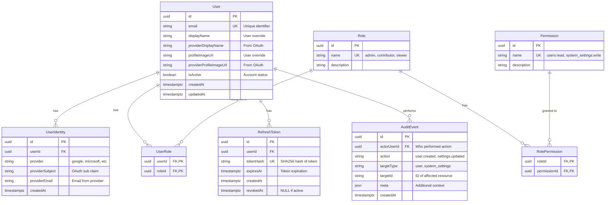

# Security Architecture

## Executive Summary

This document provides a comprehensive overview of the security architecture for the Enterprise Application Foundation. The system implements defense-in-depth security through multiple layers: OAuth 2.0 authentication with Google, JWT-based session management with token rotation, Role-Based Access Control (RBAC), and comprehensive audit logging.

**Key Security Technologies:**
- **Authentication**: OAuth 2.0 / OpenID Connect (Google)
- **Session Management**: JWT access tokens + HttpOnly refresh tokens with rotation
- **Authorization**: Role-Based Access Control (RBAC) with three roles (Admin, Contributor, Viewer)
- **Token Storage**: SHA256 hashed refresh tokens in PostgreSQL
- **Infrastructure**: Nginx reverse proxy with security headers
- **Audit**: Comprehensive event logging for all security-relevant actions

**Security Posture**: Production-grade security suitable for enterprise applications handling sensitive user data.

---

## 1. Authentication Architecture

### OAuth 2.0 Flow with Google

The application uses OAuth 2.0 with OpenID Connect for authentication. All user authentication flows through Google's OAuth service, eliminating the need to store or manage passwords.


**OAuth Endpoints:**
- `GET /api/auth/google` - Initiates OAuth flow, redirects to Google
- `GET /api/auth/google/callback` - Handles OAuth callback, provisions user, returns tokens

**User Provisioning Logic:**
1. Check if user identity exists (provider + subject)
2. If not, check if user exists by email (identity linking)
3. If neither, create new user with:
   - Default role: `viewer`
   - Default user settings (theme, locale)
   - Linked OAuth identity
4. Check if user email matches `INITIAL_ADMIN_EMAIL`
5. If match and no other admins exist, grant admin role
6. Update provider profile information (display name, profile image)
7. Generate JWT tokens

### JWT Token Structure

**Access Token Payload:**
```json
{
  "sub": "user-uuid",
  "email": "user@example.com",
  "roles": ["viewer"],
  "iat": 1706123456,
  "exp": 1706124356
}
```

**Token Signing:**
- Algorithm: HS256 (HMAC with SHA-256)
- Secret: `JWT_SECRET` environment variable (minimum 32 characters)
- Signature validates token integrity and authenticity

**Token Validation Process:**


**Access Token Validation (JWT Strategy):**
- Verify signature using `JWT_SECRET`
- Check expiration (`exp` claim)
- Extract user ID from `sub` claim
- Load user from database with roles and permissions
- Validate user is active (`isActive = true`)
- Attach full user object to request for downstream guards

---

## 2. Token Management

### Access Tokens vs Refresh Tokens

| Aspect | Access Token | Refresh Token |
|--------|--------------|---------------|
| **Type** | JWT (signed JSON) | Random 32-byte hex string |
| **Storage (Client)** | Memory only (never localStorage) | HttpOnly cookie |
| **Storage (Server)** | None (stateless) | SHA256 hash in `refresh_tokens` table |
| **Lifetime** | 15 minutes (default) | 14 days (default) |
| **Purpose** | Authorize API requests | Obtain new access tokens |
| **Exposed to JS** | Yes (needed for Authorization header) | No (HttpOnly prevents access) |
| **Revocable** | No (stateless, valid until expiry) | Yes (database record can be revoked) |
| **Rotation** | New token on each refresh | New token on each refresh (old one revoked) |
| **Attack Surface** | XSS (if stored in localStorage) | CSRF (mitigated by SameSite) |

**Why This Design:**
- **Short-lived access tokens** minimize damage from token theft (15 min window)
- **HttpOnly cookies** protect refresh tokens from XSS attacks
- **Token rotation** limits refresh token reuse and enables reuse detection
- **Database storage** allows server-side revocation (logout, security breach)

### Token Rotation Mechanism

Refresh tokens are rotated on every use to detect token theft and limit the impact of compromised tokens.


**Rotation Benefits:**
1. **Reuse Detection**: If a revoked token is used, all tokens are invalidated (indicates theft)
2. **Limit Exposure**: Each token is single-use, limiting replay attack window
3. **Audit Trail**: Each refresh creates a database record for security monitoring

### Token Reuse Detection

The system implements refresh token reuse detection to identify potential token theft:

**Attack Scenario:**
1. Attacker steals refresh token from victim
2. Victim uses token normally (rotates to new token)
3. Attacker attempts to use old (revoked) token

**Detection & Response:**
```typescript
// Check if token is revoked
if (storedToken.revokedAt) {
  // SECURITY ALERT: Revoked token used - likely token theft
  await this.revokeAllUserTokens(storedToken.userId);
  logger.warn(`Refresh token reuse detected for user: ${userId}`);
  throw new UnauthorizedException('Refresh token has been revoked');
}
```

When a revoked token is used, the system:
1. **Revokes all refresh tokens** for that user across all devices
2. **Logs a security warning** for monitoring and alerting
3. **Forces re-authentication** on all sessions

This aggressive response ensures that if a token is stolen, the attacker's window is minimized and legitimate users are forced to re-authenticate.

### Cookie Security Settings

Refresh tokens are stored in HttpOnly cookies with strict security settings:

```typescript
const COOKIE_OPTIONS = {
  httpOnly: true,                          // Prevents JavaScript access
  secure: process.env.NODE_ENV === 'production', // HTTPS only in production
  sameSite: 'lax' as const,               // CSRF protection
  path: '/api/auth',                      // Limit scope to auth endpoints
  maxAge: 14 * 24 * 60 * 60 * 1000,      // 14 days in milliseconds
};
```

| Setting | Value | Purpose |
|---------|-------|---------|
| `httpOnly` | `true` | Prevents XSS attacks - JavaScript cannot read cookie |
| `secure` | `true` (prod) | Requires HTTPS - prevents MITM attacks |
| `sameSite` | `lax` | CSRF protection - blocks cross-site POST requests |
| `path` | `/api/auth` | Minimizes cookie scope - only sent to auth endpoints |
| `maxAge` | 14 days | Auto-expires after 14 days |

**SameSite Policy Explanation:**
- `lax`: Cookie sent on same-site requests and top-level navigation (safe GET)
- Blocks cookie on cross-site POST/PUT/DELETE (prevents CSRF on token refresh)
- Allows OAuth redirect callbacks (same-site navigation)

### Token Cleanup Task

Expired and revoked refresh tokens are automatically cleaned up to reduce database size:

```typescript
@Cron(CronExpression.EVERY_DAY_AT_3AM)
async handleCron() {
  const count = await this.authService.cleanupExpiredTokens();
  logger.log(`Token cleanup: ${count} tokens removed`);
}
```

**Cleanup Logic:**
- Runs daily at 3:00 AM
- Deletes tokens where:
  - `expiresAt < NOW()` (expired)
  - `revokedAt IS NOT NULL` (revoked)
- Removes sensitive data from database
- Improves query performance

---

## 3. Authorization & RBAC

### Roles and Permissions Model

The system implements a flexible Role-Based Access Control (RBAC) model with three predefined roles:


### Permissions Matrix

| Permission | Description | Admin | Contributor | Viewer |
|------------|-------------|-------|-------------|--------|
| `system_settings:read` | View system-wide settings | ✅ | ❌ | ❌ |
| `system_settings:write` | Modify system-wide settings | ✅ | ❌ | ❌ |
| `users:read` | View user list and details | ✅ | ❌ | ❌ |
| `users:write` | Modify user accounts (activate/deactivate, assign roles) | ✅ | ❌ | ❌ |
| `rbac:manage` | Assign roles to users | ✅ | ❌ | ❌ |
| `user_settings:read` | View own user settings | ✅ | ✅ | ✅ |
| `user_settings:write` | Modify own user settings | ✅ | ✅ | ✅ |

**Role Descriptions:**
- **Admin**: Full system access - manage users, roles, and all settings
- **Contributor**: Standard user capabilities - manage own settings (ready for future feature expansion)
- **Viewer**: Read-only access - minimal privileges, manage own settings (default role for new users)

**Default Role Assignment:**
- New users are assigned the `viewer` role automatically
- First user matching `INITIAL_ADMIN_EMAIL` receives `admin` role (bootstrap)
- Additional roles can be assigned by admins via `/api/users/{id}` endpoint

### Guard Execution Flow

The authorization system uses three guards that execute in sequence:


**Guard Logic:**

1. **JwtAuthGuard** (Global, Required by default)
   - Checks for `@Public()` decorator - if present, skip all auth
   - Validates JWT token from `Authorization: Bearer <token>` header
   - Loads user with roles and permissions from database
   - Verifies user is active
   - Attaches `AuthenticatedUser` object to `request.user`

2. **RolesGuard** (OR Logic)
   - Checks for `@Roles()` decorator - if absent, allow access
   - Extracts required roles from decorator metadata
   - Checks if user has **ANY** of the required roles
   - Returns 403 if user lacks all required roles
   - Example: `@Roles('admin', 'contributor')` - user needs admin OR contributor

3. **PermissionsGuard** (AND Logic)
   - Checks for `@Permissions()` decorator - if absent, allow access
   - Extracts required permissions from decorator metadata
   - Checks if user has **ALL** required permissions
   - Returns 403 with list of missing permissions if check fails
   - Example: `@Permissions('users:read', 'users:write')` - user needs BOTH

**Why OR for Roles but AND for Permissions?**
- **Roles** are broad categories - "any admin or contributor can access"
- **Permissions** are specific capabilities - "needs both read AND write"
- This provides flexibility: `@Auth({ roles: ['admin'], permissions: ['system_settings:write'] })`

### Using Authorization Decorators

**Combined `@Auth()` Decorator (Recommended):**
```typescript
import { Auth } from './auth/decorators';
import { ROLES, PERMISSIONS } from './common/constants/roles.constants';

// Just authentication, no role/permission requirements
@Auth()
@Get('profile')
async getProfile(@CurrentUser() user: RequestUser) { }

// Require admin role
@Auth({ roles: [ROLES.ADMIN] })
@Get('users')
async listUsers() { }

// Require specific permissions
@Auth({ permissions: [PERMISSIONS.SYSTEM_SETTINGS_WRITE] })
@Patch('system-settings')
async updateSystemSettings() { }

// Combine roles and permissions
@Auth({
  roles: [ROLES.ADMIN],
  permissions: [PERMISSIONS.USERS_WRITE]
})
@Patch('users/:id')
async updateUser() { }
```

**Individual Decorators:**
```typescript
import { UseGuards } from '@nestjs/common';
import { JwtAuthGuard, RolesGuard } from './auth/guards';
import { Roles } from './auth/decorators';

@UseGuards(JwtAuthGuard, RolesGuard)
@Roles('admin', 'contributor')
@Get('dashboard')
async getDashboard() { }
```

**Public Endpoints:**
```typescript
import { Public } from './auth/decorators';

@Public()
@Get('auth/providers')
async getProviders() {
  // No authentication required
}
```

---

## 4. Request Lifecycle

### End-to-End Protected Request Flow

This diagram shows the complete security lifecycle of a protected API request:


**Security Checkpoints:**
1. **Nginx Layer**: Security headers, rate limiting (if configured)
2. **JWT Validation**: Signature, expiration, user exists and active
3. **Role Check**: User has required role (if specified)
4. **Permission Check**: User has all required permissions (if specified)
5. **Business Logic**: Controller executes with verified user context

**Request Object After Guards:**
```typescript
interface FastifyRequest {
  user: AuthenticatedUser;  // Full user object with relations
  requestUser: RequestUser; // Simplified user object
}

interface AuthenticatedUser {
  id: string;
  email: string;
  isActive: boolean;
  userRoles: Array<{
    role: {
      name: string;
      rolePermissions: Array<{
        permission: { name: string; }
      }>;
    };
  }>;
}

interface RequestUser {
  id: string;
  email: string;
  roles: string[];        // ['admin', 'viewer']
  permissions: string[];  // ['users:read', 'users:write', ...]
}
```

---

## 5. Database Security Model

### Security Tables ERD



**Table Descriptions:**

| Table | Purpose | Security Features |
|-------|---------|-------------------|
| `users` | Core user accounts | `isActive` flag for soft deletion, prevents auth |
| `user_identities` | OAuth provider links | `provider + providerSubject` unique constraint |
| `roles` | Role definitions | Seeded at deployment, rarely modified |
| `permissions` | Permission definitions | Seeded at deployment, rarely modified |
| `role_permissions` | Role-to-permission mapping | Defines RBAC matrix |
| `user_roles` | User role assignments | Modified by admins via API, cascade delete |
| `refresh_tokens` | Active refresh tokens | SHA256 hashed, includes revocation timestamp |
| `audit_events` | Security audit log | Immutable log of all security events |

### Audit Logging

The `audit_events` table provides a comprehensive audit trail for compliance and security monitoring.

**Audited Events:**
- User account creation
- User role assignments/changes
- User activation/deactivation
- System settings modifications
- User settings modifications
- Authentication events (login, logout, token refresh)

**Audit Event Structure:**
```typescript
interface AuditEvent {
  id: string;
  actorUserId: string | null;  // null for system actions
  action: string;               // e.g., 'user.role_assigned'
  targetType: string;           // e.g., 'user', 'system_settings'
  targetId: string;             // ID of affected resource
  meta: Record<string, any>;    // Additional context (changes, IP, etc.)
  createdAt: Date;
}
```

**Example Audit Entries:**
```json
[
  {
    "action": "user.created",
    "actorUserId": null,
    "targetType": "user",
    "targetId": "uuid-123",
    "meta": {
      "email": "user@example.com",
      "provider": "google",
      "initialRole": "viewer"
    }
  },
  {
    "action": "user.role_assigned",
    "actorUserId": "admin-uuid",
    "targetType": "user",
    "targetId": "user-uuid",
    "meta": {
      "role": "admin",
      "previousRoles": ["viewer"]
    }
  }
]
```

**Indexed Fields** (for query performance):
- `actorUserId` - Find all actions by a user
- `targetType + targetId` - Find all events for a resource
- `createdAt` - Time-based queries and retention policies

---

## 6. Infrastructure Security

### Nginx Security Headers

The Nginx reverse proxy applies security headers to all responses:

```nginx
# Security headers
add_header X-Frame-Options "SAMEORIGIN" always;
add_header X-Content-Type-Options "nosniff" always;
add_header X-XSS-Protection "1; mode=block" always;
add_header Referrer-Policy "strict-origin-when-cross-origin" always;
```

| Header | Value | Purpose |
|--------|-------|---------|
| `X-Frame-Options` | `SAMEORIGIN` | Prevents clickjacking - only allow framing from same origin |
| `X-Content-Type-Options` | `nosniff` | Prevents MIME sniffing - force declared content type |
| `X-XSS-Protection` | `1; mode=block` | Legacy XSS protection for older browsers |
| `Referrer-Policy` | `strict-origin-when-cross-origin` | Limit referrer info sent to external sites |

**Additional Headers (Recommended for Production):**
```nginx
# Add these for enhanced security
add_header Strict-Transport-Security "max-age=31536000; includeSubDomains" always;  # HTTPS only
add_header Content-Security-Policy "default-src 'self'; script-src 'self' 'unsafe-inline'; style-src 'self' 'unsafe-inline';" always;
add_header Permissions-Policy "geolocation=(), microphone=(), camera=()" always;
```

### CORS Configuration

The application uses same-origin architecture (frontend and API served from same host via Nginx), so CORS is disabled by default:

- Frontend: `http://localhost/`
- API: `http://localhost/api`
- Swagger: `http://localhost/api/docs`

**Benefits of Same-Origin:**
- No CORS configuration needed
- Cookies work without `withCredentials`
- Simplified security model
- No preflight requests

**If CORS is Needed (e.g., mobile app, separate domains):**
```typescript
// In main.ts
app.enableCors({
  origin: process.env.ALLOWED_ORIGINS?.split(',') || 'http://localhost:3000',
  credentials: true,  // Allow cookies
  methods: ['GET', 'POST', 'PUT', 'PATCH', 'DELETE', 'OPTIONS'],
  allowedHeaders: ['Authorization', 'Content-Type'],
});
```

### Environment Secrets

**Critical Secrets (Must Protect):**

| Variable | Purpose | Security Requirement |
|----------|---------|---------------------|
| `JWT_SECRET` | Signs JWT tokens | Min 32 chars, random, never commit |
| `COOKIE_SECRET` | Signs session cookies | Min 32 chars, random, never commit |
| `GOOGLE_CLIENT_SECRET` | OAuth with Google | From Google Console, never commit |
| `DATABASE_URL` | Database connection | Contains credentials, never commit |
| `POSTGRES_PASSWORD` | Database password | Strong password, never commit |

**Generate Secrets:**
```bash
# Generate strong secrets (32+ characters)
openssl rand -base64 32

# Or use Node.js
node -e "console.log(require('crypto').randomBytes(32).toString('base64'))"
```

**Environment File Security:**
```bash
# Never commit .env files
echo ".env" >> .gitignore
echo ".env.local" >> .gitignore
echo ".env.*.local" >> .gitignore

# Use .env.example for template (no real values)
cp .env.example .env
# Then fill in real values
```

**Production Secret Management:**
- Use secret management services (AWS Secrets Manager, Azure Key Vault, HashiCorp Vault)
- Inject secrets as environment variables at runtime
- Rotate secrets regularly (JWT_SECRET, GOOGLE_CLIENT_SECRET)
- Use different secrets per environment (dev, staging, prod)

---

## 7. Attack Mitigation Matrix

| Attack Vector | Mitigation Strategy | Implementation |
|--------------|---------------------|----------------|
| **SQL Injection** | Parameterized queries | Prisma ORM (prepared statements by default) |
| **XSS (Cross-Site Scripting)** | Output encoding, CSP headers | React automatic escaping, `X-XSS-Protection` header |
| **CSRF (Cross-Site Request Forgery)** | SameSite cookies, same-origin | `SameSite=lax` on refresh token cookie |
| **Token Theft (XSS)** | HttpOnly cookies for refresh tokens | Access token in memory only, refresh in HttpOnly cookie |
| **Token Theft (MITM)** | HTTPS only, Secure cookies | `secure: true` in production, HSTS header |
| **Brute Force (Password)** | No passwords (OAuth only) | Google OAuth, no password storage |
| **Session Hijacking** | Short-lived tokens, rotation | 15-min access tokens, refresh rotation on use |
| **Token Reuse Attack** | Reuse detection, revoke all | Revoke all user tokens when revoked token used |
| **Privilege Escalation** | RBAC enforcement, server-side validation | Roles/Permissions guards, database-driven RBAC |
| **Account Enumeration** | Generic error messages | "Invalid credentials" for all auth failures |
| **Clickjacking** | Frame-busting headers | `X-Frame-Options: SAMEORIGIN` |
| **MIME Sniffing** | Content-Type enforcement | `X-Content-Type-Options: nosniff` |
| **Insecure Direct Object Reference** | Authorization checks | Guards verify user permissions before data access |
| **Mass Assignment** | DTO validation | Class-validator on all DTOs, whitelist only |
| **Information Disclosure** | Generic errors, no stack traces | Production error handler, sanitized responses |
| **Denial of Service** | Rate limiting (recommended) | Can add rate limiter to Nginx or NestJS |

**Not Yet Implemented (Consider for Production):**
- **Rate Limiting**: Add `@nestjs/throttler` or Nginx rate limiting
- **Input Validation**: Add class-validator decorators to all DTOs
- **API Key Rotation**: Rotate Google OAuth credentials periodically
- **Anomaly Detection**: Monitor audit logs for suspicious patterns
- **IP Allowlisting**: Restrict admin endpoints to known IPs

---

## 8. Configuration Reference

### Environment Variables

**Authentication & JWT:**
```bash
# JWT Configuration
JWT_SECRET=your-super-secret-key-min-32-characters-long
JWT_ACCESS_TTL_MINUTES=15          # Access token lifetime (default: 15 minutes)
JWT_REFRESH_TTL_DAYS=14            # Refresh token lifetime (default: 14 days)

# Cookie Configuration
COOKIE_SECRET=your-cookie-secret-key-min-32-characters-long
```

**OAuth Providers:**
```bash
# Google OAuth (Required)
GOOGLE_CLIENT_ID=your-google-client-id.apps.googleusercontent.com
GOOGLE_CLIENT_SECRET=your-google-client-secret
GOOGLE_CALLBACK_URL=http://localhost/api/auth/google/callback

# Microsoft OAuth (Optional)
MICROSOFT_CLIENT_ID=your-microsoft-client-id
MICROSOFT_CLIENT_SECRET=your-microsoft-client-secret
MICROSOFT_CALLBACK_URL=http://localhost/api/auth/microsoft/callback
```

**Database:**
```bash
DATABASE_URL=postgresql://postgres:postgres@db:5432/appdb
POSTGRES_USER=postgres
POSTGRES_PASSWORD=your-strong-password-here
POSTGRES_DB=appdb
```

**Admin Bootstrap:**
```bash
# First user with this email becomes admin
INITIAL_ADMIN_EMAIL=admin@example.com
```

**Application:**
```bash
NODE_ENV=development              # development | production
PORT=3000                         # API server port
APP_URL=http://localhost          # Base URL (for OAuth redirects)
```

### Recommended Security Settings

**Development:**
```bash
JWT_ACCESS_TTL_MINUTES=60         # Longer for convenience
JWT_REFRESH_TTL_DAYS=14
NODE_ENV=development
```

**Production:**
```bash
JWT_ACCESS_TTL_MINUTES=15         # Short-lived for security
JWT_REFRESH_TTL_DAYS=7            # Shorter refresh window
NODE_ENV=production
APP_URL=https://yourdomain.com    # HTTPS required
```

**High-Security Environment:**
```bash
JWT_ACCESS_TTL_MINUTES=5          # Very short access tokens
JWT_REFRESH_TTL_DAYS=1            # Require daily re-authentication
NODE_ENV=production
```

---

## 9. File Reference

### Key Security Files

**Authentication & Authorization:**
```
apps/api/src/auth/
├── auth.controller.ts              # Auth endpoints (login, logout, refresh)
├── auth.service.ts                 # Core auth logic (tokens, validation)
├── auth.module.ts                  # Auth module configuration
├── strategies/
│   ├── google.strategy.ts          # Google OAuth strategy
│   └── jwt.strategy.ts             # JWT validation strategy
├── guards/
│   ├── jwt-auth.guard.ts           # Global JWT authentication guard
│   ├── roles.guard.ts              # RBAC roles guard (OR logic)
│   ├── permissions.guard.ts        # RBAC permissions guard (AND logic)
│   └── google-oauth.guard.ts       # Google OAuth flow guard
├── decorators/
│   ├── auth.decorator.ts           # Combined @Auth() decorator
│   ├── public.decorator.ts         # @Public() to skip auth
│   ├── roles.decorator.ts          # @Roles() for RBAC
│   ├── permissions.decorator.ts    # @Permissions() for RBAC
│   └── current-user.decorator.ts   # @CurrentUser() parameter decorator
├── tasks/
│   └── token-cleanup.task.ts       # Scheduled token cleanup (daily 3 AM)
└── interfaces/
    └── authenticated-user.interface.ts  # User object types
```

**Database & RBAC:**
```
apps/api/prisma/
├── schema.prisma                   # Database schema (security tables)
├── seed.ts                         # RBAC seed data (roles, permissions)
└── migrations/                     # Database migration history
```

**Configuration:**
```
apps/api/src/
├── main.ts                         # Application bootstrap (global guards)
└── common/
    ├── constants/
    │   └── roles.constants.ts      # Role and permission constants
    └── services/
        └── admin-bootstrap.service.ts  # Initial admin setup
```

**Infrastructure:**
```
infra/
├── nginx/
│   └── nginx.conf                  # Reverse proxy, security headers
└── compose/
    ├── .env.example                # Environment variable template
    ├── base.compose.yml            # Core services (db, api, web, nginx)
    └── prod.compose.yml            # Production overrides
```

**Frontend (Security-Related):**
```
apps/web/src/
├── contexts/
│   └── AuthContext.tsx             # Auth state management
├── services/
│   └── api.ts                      # API client (token interceptors)
└── utils/
    └── auth.ts                     # Token storage utilities
```

---

## 10. Security Best Practices Summary

### For Developers

**Do's:**
- ✅ Always use `@Auth()` decorator on protected endpoints
- ✅ Validate all input with DTOs and class-validator
- ✅ Use Prisma for database queries (prevents SQL injection)
- ✅ Store access tokens in memory only (never localStorage)
- ✅ Test RBAC logic with integration tests
- ✅ Log security events to audit table
- ✅ Use environment variables for all secrets
- ✅ Keep dependencies updated (npm audit)

**Don'ts:**
- ❌ Never commit `.env` files to Git
- ❌ Never store passwords in plain text
- ❌ Never trust client-side authorization (always verify server-side)
- ❌ Never expose stack traces in production errors
- ❌ Never use `@Public()` without careful consideration
- ❌ Never bypass guards with custom middleware
- ❌ Never log sensitive data (tokens, passwords, secrets)

### Security Checklist

**Pre-Deployment:**
- [ ] All secrets generated with `openssl rand -base64 32`
- [ ] `NODE_ENV=production` set
- [ ] HTTPS enabled and enforced
- [ ] `secure: true` on cookies
- [ ] Database backups configured
- [ ] Rate limiting configured on Nginx or API
- [ ] Security headers enabled in Nginx
- [ ] Admin bootstrap email configured correctly
- [ ] OAuth credentials from production Google project
- [ ] Audit logging verified and monitored
- [ ] Error handler sanitizes responses (no stack traces)

**Monitoring:**
- [ ] Set up alerts for `refresh token reuse detected` logs
- [ ] Monitor audit events for suspicious patterns
- [ ] Track authentication failure rates
- [ ] Monitor token refresh frequency
- [ ] Watch for unusual role assignment changes

---

## Conclusion

This security architecture provides defense-in-depth through multiple layers:
1. **Authentication**: OAuth 2.0 eliminates password risks
2. **Session Management**: Short-lived access tokens + rotated refresh tokens
3. **Authorization**: Fine-grained RBAC with roles and permissions
4. **Infrastructure**: Security headers and same-origin architecture
5. **Audit**: Comprehensive logging for compliance and monitoring

The system is designed for production use and follows industry best practices for web application security. Regular security audits and updates are recommended to maintain security posture.

**For More Information:**
- [ARCHITECTURE.md](./ARCHITECTURE.md) - System design and components
- [SECURITY.md](./SECURITY.md) - Security policies and procedures
- [API.md](./API.md) - API reference and authentication flow
