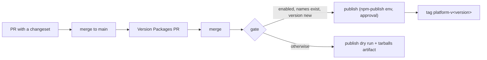

# Runbook: release the platform packages

Version and publish the six `@marinoscar/platform-*` packages (`contract`, `api`, `web`, `db`, `cli`, `infra`) to public npm. They share one version, release from a protected GitHub Actions workflow with npm trusted publishing and provenance, and go out on the `next` dist-tag before anything reaches `latest`. Design: [platform packages spec, Release pipeline](../specs/platform-packages.md#release-pipeline).

The moving parts:

| Part | Where |
|---|---|
| Version tool | Changesets: `.changeset/config.json` (one "fixed" group of the six packages), `.changeset/pre.json` (pre-release mode, tag `next`) |
| Root scripts | `npm run changeset`, `npm run version-packages`, `npm run release` |
| Release workflow | `.github/workflows/release.yml`: `version`, `gate`, `publish`, `publish-dry-run` |
| Pull request check | `changeset-check` job in `.github/workflows/packages.yml` |
| Licence in the tarball | each package's `prepack` runs `scripts/copy-license.mjs` (copies the root `LICENSE`) |
| Tripwire | `apps/cli/src/changeset-config.test.ts` |

This flow is separate from the app release: `deploy.yml` and `v*` tags keep versioning the reference app (`apps/api`, `apps/web`, `apps/cli`), which are private workspaces and never published.

## How a release flows

1. A pull request that changes a platform package adds a changeset (`npx changeset`). `changeset-check` fails it otherwise.
2. When it merges, `release.yml` runs on `main`. The `version` job sees pending changesets and opens (or updates) the **Version Packages** pull request, titled `chore(release): version platform packages`. It bumps all six `package.json` versions in lockstep, writes each `CHANGELOG.md` and refreshes `package-lock.json`.
3. When the Version Packages pull request merges, `release.yml` runs again. No changesets are pending now, so the `gate` job decides between a real publish and a dry run.
4. The real publish waits in the protected `npm-publish` environment for a reviewer's approval, then publishes with `npx changeset publish` (pre mode puts it on `next`) and pushes the git tag `platform-v<version>`.



## Owner prerequisites

These steps need the repository owner. Until they are done the workflow runs in **dry-run mode**, and it stays there until the owner flips one repository variable.

1. **npm scope.** Make sure the `@marinoscar` scope exists and is yours: either your npm user is `marinoscar`, or create an npm organisation named `marinoscar` at https://www.npmjs.com/org/create. Enable two-factor authentication for the account (https://www.npmjs.com/settings/~/tfa), "Authorization and writes".
2. **Bootstrap the six package names** (npm only lets you attach a trusted publisher to a package that already exists). From a clean checkout of `main` after this issue merges, on your own machine (signed in with `npm login`):
   ```bash
   npm ci && npm run build:packages
   for p in contract api web db cli infra; do
     npm publish -w @marinoscar/platform-$p --access public --tag bootstrap   # publishes 0.0.0 under a throwaway dist-tag
   done
   ```
   `0.0.0` under the `bootstrap` tag is never installed by `latest` or `next` consumers.
3. **Trusted publisher, per package.** For each of the six packages open `https://www.npmjs.com/package/@marinoscar/platform-<x>/access` → *Trusted Publisher* → *GitHub Actions*, and enter: owner `marinoscar`, repository `EnterpriseAppBase`, workflow filename `release.yml`, environment `npm-publish`. Then, on the same page, set *Publishing access* to "Require two-factor authentication and disallow tokens".
4. **Protected environment.** GitHub → repository *Settings → Environments → New environment* `npm-publish` (https://github.com/marinoscar/EnterpriseAppBase/settings/environments): add yourself as a required reviewer; *Deployment branches and tags* → "Selected branches" → `main`.
5. **Turn publishing on.** *Settings → Secrets and variables → Actions → Variables* (https://github.com/marinoscar/EnterpriseAppBase/settings/variables/actions): create repository variable `NPM_PUBLISH_ENABLED` = `true`.

Two repository settings the workflow also relies on:

6. **Let Actions open the Version Packages pull request.** *Settings → Actions → General → Workflow permissions* (https://github.com/marinoscar/EnterpriseAppBase/settings/actions): tick "Allow GitHub Actions to create and approve pull requests". Without it the `version` job reports a warning and no Version Packages pull request appears; nothing turns red.
7. **Checks on the Version Packages pull request.** A pull request opened with the workflow's `GITHUB_TOKEN` does not start other workflows, so its `ci.yml` and `packages.yml` checks do not run by themselves. If branch protection requires them, close and reopen the pull request (or push an empty commit to its branch) to start them.

No npm token is ever created or stored. The publish job authenticates to npm with its own short-lived OIDC token, which is what trusted publishing means; do not add an `NPM_TOKEN` secret.

### What happens before they are done

The workflow runs on every push to `main` anyway. The `gate` job reads the variable and the registry without any credential and selects the dry run when `NPM_PUBLISH_ENABLED` is not `true`, when any of the six names is not on npm yet, or when the current version is already published. The `publish-dry-run` job then builds, tests and packs the packages, runs `npm publish --dry-run --tag next` for each, uploads the tarballs as the `platform-tarballs` workflow artifact and writes the reason to the job summary, for example `dry run: NPM_PUBLISH_ENABLED is not true (version 0.0.0)`. It has no environment and no `id-token` permission, so it never waits for approval and cannot publish.

To see it on a branch, run the workflow by hand: *Actions → Release → Run workflow* and pick the branch. On a branch the `version` job is skipped and the dry run always runs.

## Add a changeset

Any pull request that changes a file under `packages/platform-*/` needs a changeset:

```bash
npx changeset          # pick the packages, the bump, and write the summary
git add .changeset     # commit it with the change it describes
```

The packages are one fixed group, so bumping one bumps all six to the same version. Pick the bump by the extension surface (exports, options, registries, tokens, events, slots, models, migrations): `patch` for a fix, `minor` for an addition, `major` for anything that breaks an app built on the previous version; a `major` changeset carries a migration note in its body. A change with no release impact (tests, internal refactors with no behaviour change) still records that fact:

```bash
npx changeset --empty
```

`changeset-check` (in `.github/workflows/packages.yml`) runs `npx changeset status --since=origin/main` on every pull request and fails when a platform package changed without one. Pull requests that only change the apps, docs or infrastructure pass untouched. More on what counts as breaking: [DEVELOPMENT.md, Adding a changeset](../DEVELOPMENT.md#adding-a-changeset).

## The Version Packages pull request

Opened and kept current by the `version` job; never edit versions by hand. It runs `npm run version-packages` (`changeset version && npm install --package-lock-only`), so the lockfile is in step. In pre mode the versions read `x.y.z-next.N`: the first one, from `.changeset/initial-platform-scaffold.md`, is `0.1.0-next.0` for all six. Review the six `CHANGELOG.md` diffs, then merge it like any other pull request. `changeset-check` skips it (its branch is `changeset-release/main`).

## Publish

After the Version Packages pull request merges:

1. Open the `Release` run on `main`. The `gate` summary says `publishing <version>: ...` and the `publish` job waits for review.
2. Approve the `npm-publish` deployment.
3. The job upgrades npm to 11.5.1 or later (trusted publishing needs it), builds and tests the packages, and runs `npx changeset publish` with provenance on. Versions already on the registry are skipped, so re-running a failed job is safe.
4. It pushes the git tag `platform-v<version>` and writes the published version to the job summary.

Never run `npm publish` for a release from your own machine; the only manual publish is the one-off `bootstrap` in the prerequisites.

## `next` and `latest`

While `.changeset/pre.json` exists every release is a pre-release on the `next` dist-tag. Consumers opt in with `npm install @marinoscar/platform-api@next`; nobody gets a `next` build from `latest`. The reference app and the app currently adopting the platform try each `next` before anything is promoted. Do not pass `--tag latest` anywhere, and do not move dist-tags by hand while in pre mode.

Check what each tag points at:

```bash
npm view @marinoscar/platform-api dist-tags
```

## Verify provenance

In a consumer repository, after installing a published version:

```bash
npm audit signatures
```

It reports the packages with verified registry signatures and verified attestations. On npmjs.com each package version page shows a **Provenance** badge linking to the workflow run and commit that built it. A version without it was not published by this workflow: deprecate it (below) and investigate.

## Deprecate a bad version

Never unpublish: consumers' lockfiles and caches hold the version, and npm blocks re-using a version number anyway. Deprecate it, for all six (one version is one compatibility statement), and release a fix:

```bash
for p in contract api web db cli infra; do
  npm deprecate "@marinoscar/platform-$p@0.1.0-next.3" "Broken release; use 0.1.0-next.4 or later"
done
```

Then land the fix with a `patch` changeset and release as usual. If `next` (or `latest`) must stop pointing at the bad version before the fix is out, move the tag back to the previous good version with `npm dist-tag add @marinoscar/platform-<x>@<good> next` for each package.

## Exit pre-release mode

Only after the go/no-go decision that the platform is ready for `latest`:

```bash
npx changeset pre exit
git add .changeset/pre.json && git commit -m "chore(release): exit pre-release mode"
```

Merge that in a pull request. The next Version Packages pull request then produces a plain version (for example `0.1.0`), and its publish goes to `latest`. To start a new pre-release cycle later, `npx changeset pre enter next` again.

## Verification commands

```bash
npm ci
npm run prisma:generate --workspace=api
npm run build:packages
npm run test:run --workspace=cli          # includes changeset-config.test.ts
npx changeset status
for p in contract api web db cli infra; do npm publish --dry-run --tag next -w @marinoscar/platform-$p; done
node scripts/check-package-pack.mjs       # LICENSE in every tarball, publish metadata
```

## Troubleshooting

| Symptom | Cause and fix |
|---|---|
| Job summary says `dry run: NPM_PUBLISH_ENABLED is not true` | Prerequisite 5 is not done (expected until the owner turns publishing on) |
| `dry run: not on npm yet (bootstrap them first): ...` | Prerequisite 2 is not done for the listed packages |
| `dry run: version <v> is already on npm` | Nothing new to publish: no Version Packages pull request has merged since the last release |
| Warning "The Version Packages PR could not be opened or updated" | Prerequisite 6, or the `version-packages` script failed: read the `version` job log |
| `publish` fails with `E404`/`ENEEDAUTH`/`E403` | The trusted publisher does not match: owner, repository, workflow filename `release.yml` and environment `npm-publish` must be exact (prerequisite 3) |
| `publish` fails asking for an OTP | The package still allows token publishing with 2FA on writes; set *Publishing access* as in prerequisite 3 |
| `npm pack`/`npm publish` prints `Root LICENSE missing` | The root `LICENSE` file is gone; restore it (the packages are MIT and must ship it) |
| `changeset-check` fails | Add a changeset (`npx changeset`, or `npx changeset --empty` for no release impact) |

## In a fork

A product forked from this template consumes the platform packages; it never publishes them. The trusted publishers are bound to this repository, so a fork cannot publish under `@marinoscar` even by accident, and without `NPM_PUBLISH_ENABLED` its `release.yml` only dry-runs. A fork that does not want the Version Packages pull requests can disable the `Release` workflow (*Actions → Release → Disable workflow*).
