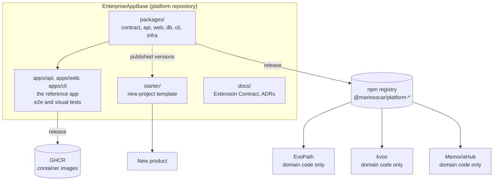
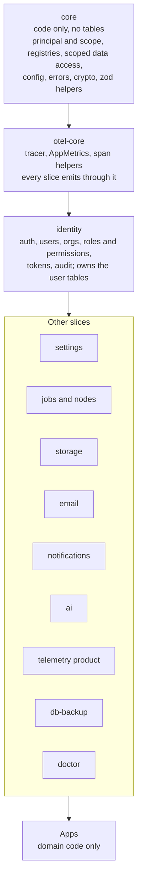
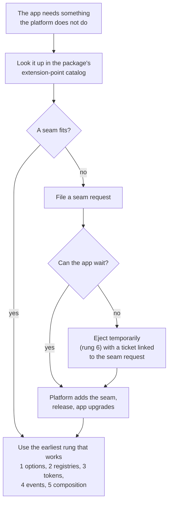
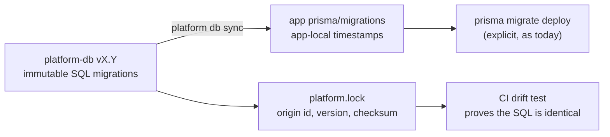
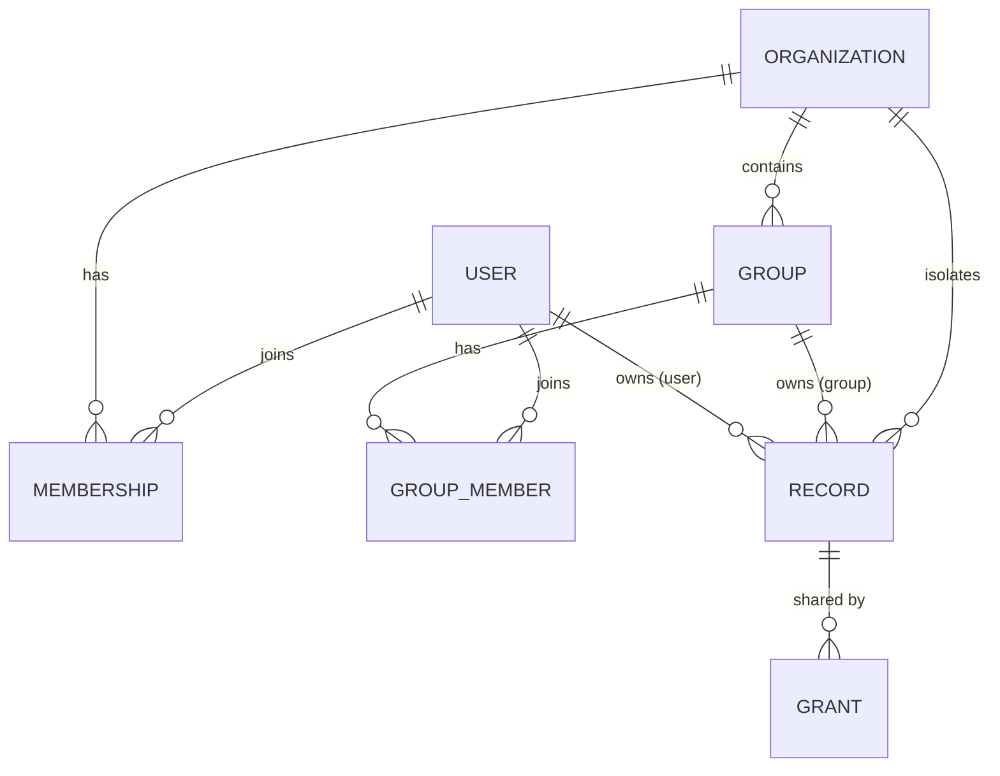
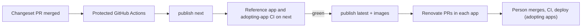
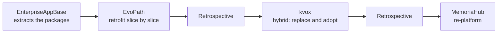
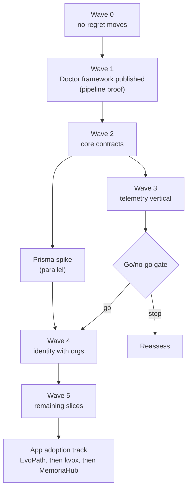

# Platform packages: turning EnterpriseAppBase into a package-based platform

> **Status:** Proposed (vision and approach agreed; implementation not started). **Date:** 2026-10-04. · **Code:** none yet; the layout in [Repository layout](#repository-layout) is the target · **API:** none · **Admin UI:** none · **Runbook:** none yet · **Recipe:** [Definition of done for a slice](#definition-of-done-for-a-slice)

EnterpriseAppBase stops being a template that apps fork and becomes the platform repository: it publishes versioned packages, and each product (EvoPath, kvox, MemoriaHub) keeps only its domain code and consumes the platform. A fix or feature lands once in a package, ships in one release, and every app picks it up through a normal version bump.

This spec records the vision, the decisions the owner has confirmed, and the approach that is recommended but not yet confirmed. Each decision is labelled **DECIDED** (owner confirmed) or **PROPOSED** (recommended, open to change). Nothing described here as a target exists in the code yet; everything described as "today" was verified against the repository or measured (see [Appendix A](#appendix-a-measurement-method-and-caveats)).

## Contents

1. [Executive summary](#executive-summary)
2. [Context](#context)
3. [Vision and principles](#vision-and-principles)
4. [Target architecture](#target-architecture)
5. [Extending a package (consumer guide)](#extending-a-package-consumer-guide)
6. [Package documentation standard](#package-documentation-standard)
7. [Data, migrations and seeds](#data-migrations-and-seeds)
8. [Tenancy and access model](#tenancy-and-access-model)
9. [Deployment modes](#deployment-modes)
10. [Scaling posture](#scaling-posture)
11. [Build, release and distribution](#build-release-and-distribution)
12. [Adoption strategy per app](#adoption-strategy-per-app)
13. [Roadmap](#roadmap)
14. [Program tracking and rollback](#program-tracking-and-rollback)
15. [Definition of done for a slice](#definition-of-done-for-a-slice)
16. [Risks and mitigations](#risks-and-mitigations)
17. [Decision log](#decision-log)
18. [Open questions](#open-questions)
19. [Appendix A: measurement method and caveats](#appendix-a-measurement-method-and-caveats)
20. [Appendix B: glossary](#appendix-b-glossary)

## Executive summary

### The problem

- Four code bases (this template and three apps built from it) share most of their platform code. Every improvement (telemetry, security and auth, AI configuration, notifications) is copied by hand between repositories.
- The copies drift. Only one app (EvoPath) is still mostly identical to the base; the other two have diverged heavily ([Measured drift](#measured-drift)).
- The cause is structural: forks edit platform files to extend them, because the extension points are closed lists ([Root cause: closed extension points](#root-cause-closed-extension-points)).

### The vision

> Change it once in a package, release, and every app upgrades.

- EnterpriseAppBase becomes the **platform repository**: it publishes versioned packages, plus a starter for new products. The existing `apps/api`, `apps/web` and `apps/cli` are the reference app.
- Each app keeps its **domain code** and its **appearance**; the packages own structure and behaviour.
- An upgrade is a deliberate version bump, CI and a deploy per app, automated through Renovate pull requests. It is never an automatic push into production.

### Key decisions

| Id | Decision | State |
|---|---|---|
| D1 | Share code through packages instead of copying | DECIDED |
| D4 | All packages public, MIT licence | DECIDED |
| D5 | Salesforce-like organizations are the tenancy foundation | DECIDED |
| D6 | MemoriaHub circles are sharing groups, not tenants | DECIDED |
| D7 | SaaS, bring-your-own-cloud and on-prem from one codebase; SaaS first | DECIDED |
| D9 | SaaS hosting on AWS, with RDS likely; which app is the first SaaS is undecided | DECIDED |
| D10 | Scale incrementally: bigger server first, change as users grow | DECIDED |
| D11 | Every package is designed and documented for extension by apps that do not exist yet | DECIDED |
| D12 | Adoption order: EnterpriseAppBase first, then EvoPath (easiest; learn there), then kvox, then MemoriaHub. kvox starts after the EvoPath retrospective and MemoriaHub after the kvox retrospective. | DECIDED |
| P1 | About six layer packages released in lockstep; slices are subpath modules | PROPOSED |
| P2 | The Extension Contract ladder: options, registries, tokens, events, composition, eject | PROPOSED |
| P5 | Package migrations are installed into each app's own history, with a baseline procedure for existing databases | PROPOSED |

The full list is in [Decision log](#decision-log).

### Roadmap at a glance

| Wave | Content | Purpose |
|---|---|---|
| 0 | No-regret moves (licence, registries, retention, scoped access, scaling fixes) | Useful even if packaging stops |
| 1 | Publish the Doctor framework | Prove the delivery pipeline in days |
| 2 | Core contracts: principal, scope, registries | Code only, no tables |
| 3 | Telemetry as the first full vertical slice | Prove the extension model; go/no-go gate |
| Spike | Prisma composition, migration install, RLS, RDS Proxy | De-risk identity |
| 4 | Identity with organizations | Own the user tables and tenancy |
| 5 | Remaining slices in dependency order | Settings, jobs, storage, email, notifications, AI, db-backup, then CLI, infra, docs |
| Track | App adoption: EvoPath (retrofit), then kvox (hybrid), then MemoriaHub (re-platform) | Each app starts after the previous app's retrospective |

Details: [Roadmap](#roadmap).

## Context

### The mental model: four layers and slices

A system has four layers:

| Layer | Examples in this repository |
|---|---|
| UI | `apps/web`: React pages, components, hooks |
| API and business logic | `apps/api`: NestJS modules |
| Persistence | `apps/api/prisma`: schema, migrations, seeds |
| Infrastructure | `infra/`: Compose files, nginx, OTel collector; `apps/stack-agent` |

A reusable unit, a **slice**, can span all four layers. Telemetry is the clearest example ([Slice anatomy: telemetry as the worked example](#slice-anatomy-telemetry-as-the-worked-example)). Packaging by layer alone would scatter one feature over several repositories' worth of files; packaging by slice alone would hide that all slices share the same four layers. The design in [Package granularity](#package-granularity) combines both: packages are layers, slices are modules inside them.

### Today: a template that apps fork

- EnterpriseAppBase is a template. Apps are forks created from it (`scripts/new-project.mjs`, `scripts/rename.mjs`; see [RENAMING.md](../RENAMING.md)).
- Stack: React 19 and MUI 9 (web), NestJS 11 on Fastify, Prisma 7.8, Zod 4, PostgreSQL 16, Vite 8, TypeScript 6, Commander and ink (`appctl` CLI), Docker Compose, OpenTelemetry with GreptimeDB.
- The workspaces are `apps/*` and `packages/*`; `packages/shared` already carries the product identity (`identity.json`) used by api, web and cli.
- `LICENSE` (MIT), `SECURITY.md` and `CODEOWNERS` exist.

**All four repositories run the same framework versions** (Nest 11.1, Prisma 7.8, Zod 4.4, React 19.2, MUI 9.1, Vite 8, TypeScript 6.0). No framework upgrade stands in the way of sharing code.

### Apps in scope

| App | What it is | Notes |
|---|---|---|
| EvoPath | Fitness and health coaching | Android companion with Health Connect sync; closest to the base |
| kvox | Transcripts, notes, knowledge graph | Per-record sharing (`TranscriptShare` with roles) |
| MemoriaHub | Family and friends photo and media library | Circles, link shares (`MediaShare`), own enrichment engine |

All three are public GitHub repositories under `marinoscar`. EnterpriseAppBase is public too, which matters for npm provenance ([Build, release and distribution](#build-release-and-distribution)).

### Measured drift

Method: per-file byte comparison of each app's `apps/*/src` against the base. Most EvoPath differences are comment noise (issue numbers renumbered per repository) and the `appctl` to `evopathcli` rename. Real EvoPath code divergence is about 4.2k changed lines, mostly additive. See [Appendix A](#appendix-a-measurement-method-and-caveats).

| | EvoPath | kvox | MemoriaHub |
|---|---|---|---|
| API files identical to base (of 917) | 78% (721) | 29% (271) | 5% (47) |
| Web files identical (of 508) | 69% | 32% | 11% |
| CLI files identical (of 221) | 41% | 23% | 0% (no deploy or init commands) |
| Migrations shared with base | 20, plus 1 same change under a different id | 14 | 2 |
| Base Prisma models present (of 31) | 31 | 26 | 23 |
| Total Prisma models | 77 | 61 | 73 |
| Base platform modules missing | none | telemetry, doctor, user-credentials, AI platform | telemetry, jobs, AI platform, credentials, user-credentials, about; most of db-backup, notifications, nodes, email |
| Domain code (API files outside platform modules) | 790 | 588 | 558 |
| Access and sharing model | per-user only | per-record shares (`TranscriptShare` with roles) | Circles (owner, member roles, invites, personal circle created at signup) plus link shares (`MediaShare`) |

What the numbers say:

- **EvoPath** is a near-copy with additions. Its zero-drift platform modules are `allowlist`, `credentials`, `device-auth`, `doctor`, `health`, `prisma`, `test-auth`, `user-credentials` and `users`. Its highest-drift modules are `email` (24 of 44 files differ), `notifications` (31 of 72), `telemetry` (35 of 92, mostly cosmetic), `ai` (24 of 239), `common` (17 of 60) and `settings` (8 of 23).
- **kvox** and **MemoriaHub** run older AI implementations of their own. 238 of the base's 239 AI files are absent. They store `UserAiCredential` (kvox) or `AiProviderCredential` (MemoriaHub) instead of the base's `AiModel`, `AiRun`, `AiUsageEvent` and `UserAiKey`.
- **MemoriaHub** has its own background-work system (`EnrichmentJob`, a `Workflow` engine and several `*Run` tables) instead of the platform's generic `Job` queue. It already has an internal package, `@memoriahub/enrichment-compute`, built as dual CommonJS and ESM. That is a working precedent for the build setup in [Build, release and distribution](#build-release-and-distribution).
- **Features built twice from scratch:**
  - The Android companion (`android-app` API module in EvoPath and MemoriaHub: 0 of 23 files identical; Android shell: 4 of 109 identical).
  - User-data reset and onboarding (EvoPath and kvox: 0 identical files each).
- **Migration ids drift too.** The same `add_worker_node_vitals` migration is `20260928100000` in the base and `20260930100000` in EvoPath. The SQL is the same; the id is not.
- **Comments change checksums.** `add_job_trace_context` is shared with EvoPath but differs by one comment line, and Prisma's checksum covers comments. The lock-file format records comment-only differences ([Baseline adoption for existing databases](#baseline-adoption-for-existing-databases)).
- **EvoPath alters a platform table.** It changes `push_subscriptions.platform`. The lock file records this as a **declared deviation** ([Rules](#rules)).

### Root cause: closed extension points

Forks edit platform files to extend them, because the extension points are closed lists. Each edit is a merge conflict waiting to happen.

| Closed list | Where | What a fork does to it |
|---|---|---|
| `METRIC_GROUPS`, a closed `as const` tuple of six groups | `apps/api/src/telemetry/metrics/metric-catalog.ts` | Cannot add a group without editing the tuple |
| Metric-name map | `apps/api/src/common/otel/app-metrics.service.ts` | EvoPath adds about 25 `app.health.*` and `app.coach.*` names inline |
| Roles and permissions constants | `apps/api/src/common/constants/roles.constants.ts` | EvoPath adds domain permissions |
| Seed data (462 lines: `ROLES`, `PERMISSIONS` with 31 base permissions, `ROLE_PERMISSIONS`, `DEFAULT_SYSTEM_SETTINGS`) | `apps/api/prisma/seed-data.ts` | Every app edits the same arrays |
| Settings schemas | `apps/api/src/common/schemas/` | Namespaces added in place |
| Notification channels and templates | `apps/api/src/notifications/` | Added in place |
| Storage key prefixes | `apps/api/src/storage/` | Added in place |
| Module list | `apps/api/src/app.module.ts` | Domain modules added beside platform modules |
| User-data purge (hand-listed table names) | EvoPath `user-data-purge.ts`, about 25 domain tables | Must be edited with every new table |

**The good news:** platform-to-domain imports are almost nil (1 non-test file in EvoPath). The layering is already one-directional. That is the precondition for packages: the platform does not need to know the apps exist.

## Vision and principles

### Vision

- **One platform, many products.** Packages own structure and behaviour. Apps own domain and appearance.
- **Change once, release, upgrade everywhere.**
- **An upgrade is a decision.** A version bump, CI and a deploy per app. Renovate opens the pull request; a person merges it. Packages never push themselves into production.

### Principles

| Principle | Meaning |
|---|---|
| Clear boundaries | A package exposes a documented surface; everything else is private |
| API-first | Business logic stays in the API; the web package renders it |
| Extension over modification | An app never edits platform code; it extends through a seam |
| Built to be extended | Every package is designed for apps that do not exist yet ([Extending a package (consumer guide)](#extending-a-package-consumer-guide)) |
| Documented as a product | Documentation ships, is versioned and is tested with the package ([Package documentation standard](#package-documentation-standard)) |
| Registries instead of closed lists | Additive, typed, string-keyed |
| Security and isolation by design | Multi-user and multi-org isolation is enforced by the platform, not by convention |
| Observability by design | Every slice emits logs, metrics and traces through the shared telemetry core |
| A slice travels whole | Code, schema, migrations, seeds, UI, infra, docs and tests move together |
| Start coarse, split only when needed | Few packages first; split on a real need |
| No-regret moves first | Do what is useful even if packaging stops ([Roadmap](#roadmap), wave 0) |

### Goals and non-goals

**Goals**

- One copy of every platform feature, in one repository.
- A new app can extend any package using only its documentation, without reading platform internals or editing platform code.
- A new product starts from the starter and consumes published versions.
- Existing apps migrate slice by slice, without a big-bang rewrite.
- Org-based tenancy that scales from a single-company on-prem install to a multi-customer SaaS.
- One codebase for small on-prem and large SaaS.

**Non-goals**

- Microservices. The platform stays a modular monolith ([Scaling posture](#scaling-posture)).
- Schema-per-tenant databases.
- Building SSO beyond the existing OAuth now.
- Helm or Kubernetes before a client needs it.
- Rewriting domain code. Apps keep their domain code as it is.

## Target architecture

### Repository layout

**PROPOSED.** The repository is not renamed yet ([Open questions](#open-questions)).

```text
EnterpriseAppBase/
  packages/     contract, api, web, db, cli, infra   (published)
  apps/         api, web, cli, stack-agent: the existing apps ARE the reference app;
                they consume the packages and e2e and visual tests run against them
  starter/      template used by new-project; consumes published versions
  docs/         platform docs, Extension Contract, ADRs
```



| Directory | Role |
|---|---|
| `packages/*` | The published platform. Today only `packages/shared` exists. |
| `apps/api`, `apps/web`, `apps/cli` | The **reference app**. These existing apps stay in place (there is no move to an `apps/reference` directory); they are rebuilt on top of the packages as slices are extracted. The e2e and visual tests run against them, so the platform is always exercised as an app would use it. |
| `starter/` | What `new-project` copies. It depends on published versions, never on workspace paths. |
| `docs/` | Platform docs, the Extension Contract, and architecture decision records. |

### Package granularity

**PROPOSED** (revised during the discussion).

Publish about **six layer packages**, released in lockstep under **one platform version**:

| Package | Holds |
|---|---|
| `@marinoscar/platform-contract` | Zod DTOs and types shared by api and web |
| `@marinoscar/platform-api` | NestJS dynamic modules |
| `@marinoscar/platform-web` | React pages, components and hooks |
| `@marinoscar/platform-db` | Prisma schema fragments, SQL migrations, seed functions |
| `@marinoscar/platform-cli` | CLI commands and TUI building blocks |
| `@marinoscar/platform-infra` | Compose fragments, nginx and OTel collector config; Helm later |

**Slices** (telemetry, identity, jobs, storage, notifications, ai, settings, email, doctor, db-backup and so on) are internal modules exposed as **subpath exports**, for example `@marinoscar/platform-api/telemetry`. Lint rules enforce the boundaries between slices.

Split a slice into its own package **only** when an app needs to version it separately or omit it.

**Why layers in lockstep, not a package per slice per layer:**

- One maintainer and three apps. Every app uses nearly every slice.
- Cross-slice changes are common. The job trace-context change touched jobs, nodes, telemetry and the CLI in one go.
- One version number is one compatibility statement.
- An earlier idea of per-slice-per-layer packages (25 to 40 packages) was rejected as too much bookkeeping. The instinct to separate API and web packages is preserved: they are separate packages.

### Slice anatomy: telemetry as the worked example

A full vertical slice, measured in this repository:

| Layer | What telemetry contains |
|---|---|
| API | `apps/api/src/telemetry/`: 92 files (GreptimeDB client, metric catalog, SQL builders, verdicts, dashboard, assistant, export, doctor checks) |
| Web | About 94 files (explorer, dashboard, assistant panel, connection settings) |
| CLI | About 31 files (node span relay, deploy wizard environment) |
| Sidecar | The whole `apps/stack-agent` (4 source files plus tests; holds the Docker socket to start the telemetry stack on a VPS) |
| Infra | `infra/compose/telemetry.compose.yml` (152 lines), `infra/compose/vps.telemetry.compose.yml` (98 lines), `infra/otel/otel-collector-config.yaml` (414 lines) |
| Docs | [telemetry spec](telemetry.md) (2,307 lines), [telemetry runbook](../runbooks/telemetry.md) (701 lines) |
| Tests | Playwright e2e tests (for example `tests/e2e/specs/telemetry-dashboard.spec.ts`) |
| Tables | **None.** The runtime connection lives in system settings. |

Having no Prisma tables makes telemetry the ideal first full-vertical slice: it exercises api, web, cli, infra and docs without touching the migration problem ([Data, migrations and seeds](#data-migrations-and-seeds)).

**Infra layering already exists.** Compose is split into several `-f` files, and the OTel collector accepts several `--config` files that merge. App differences therefore become overlay files, not forks. EvoPath needs no collector overlay: its telemetry and collector configuration is functionally identical to the base (comments and the CLI name differ). Its real telemetry differences are about 25 extra `app.health.*` and `app.coach.*` metric names and three chart files with its own tokens. Its real infra differences are nginx locations and a geolocation header.

### Dependency graph

**PROPOSED.**



Rules:

- `core` is code only. It owns no tables. Shipped so far (issue #698): registries (including the OpenAPI tag registry), principal and scope types, errors (`HttpExceptionFilter`, `ErrorDto`), crypto (the secret cipher and its startup check); scoped data access follows (issue #699). "Config" and "zod helpers" turned out to have no generic code to move: the app's `configuration.ts` maps its own variables, `database-url.ts` moves with `platform-db`, and zod is used directly through `nestjs-zod`'s `createZodDto` and the global `ZodValidationPipe`.
- `otel-core` (emitting) is separate from the **telemetry product** (viewing and querying). Every slice emits through `otel-core`. Apps must still run with `OTEL_ENABLED=false` and no telemetry stack.
- `identity` owns the user tables, so every other slice may reference a user.
- A slice may depend only on slices above it in the graph. Lint enforces it.

**Model ownership follows slices:**

| Slice | Models owned |
|---|---|
| identity | `User`, `UserIdentity`, `Role`, `Permission`, `RolePermission`, `UserRole`, `RefreshToken`, `PersonalAccessToken`, `DeviceCode`, `AllowedEmail`, `AuditEvent` |
| jobs | `Job`, `JobStatsRollup`, `WorkerNode`, `NodeCredential`, `JobNodeSecret` |
| ai | `AiModel`, `UserAiKey`, `AiRun`, `AiUsageEvent` |
| notifications | `Notification`, `NotificationDelivery`, `PushSubscription`, `NotificationBroadcast` |
| storage | `StorageObject`, `StorageObjectChunk` |
| db-backup | `DatabaseBackupRun` |
| settings | `SystemSettings`, `UserSettings` |
| credentials | `Credential`, `UserCredential` |

These are the 31 base models, each assigned to exactly one slice.

### The Extension Contract

**PROPOSED.** Every package must satisfy it. It is the rule that stops apps from editing platform files.

#### The extension ladder

Prefer earlier rungs. Move down only when the earlier rung cannot express the need.

| Rung | Mechanism | Example |
|---|---|---|
| 1 | **Options** in `forRoot()`, merged over defaults | Tune values: EvoPath's own verdict thresholds (`DASHBOARD_VERDICT_THRESHOLDS`) |
| 2 | **Registries** (`register...()`), additive and typed | `registerMetricGroup(coachGroup)`, `registerPermissions()`, `registerSettingsNamespace(zodSchema)`, `registerStorageKeyPrefixes()` (storage key prefixes), notification events, templates and channels, a user-owned-data registry, doctor checks, job handlers |
| 3 | **Injection tokens** so an app overrides one provider | A `VerdictPolicy` token |
| 4 | **Events and hooks**: react without replacing | A hook on user creation |
| 5 | **Composition**: the app builds its own module on exported primitives | A custom module built from `core` primitives |
| 6 | **Eject**: vendor or patch one piece | Temporary, with a ticket to add the missing seam |

Doctor checks and job handlers are already registry-driven in the base ([doctor spec](doctor.md), [job queue spec](job-queue.md)). They show the pattern working.

#### Decision rule

> Is this difference this app's need (extend in the app), or the platform being limited (fix upstream, everyone benefits)?

#### Guardrails

| Guardrail | Effect |
|---|---|
| Closed lists become registries with string ids | Typed through generics or module augmentation |
| A package `exports` map plus a lint rule forbids deep imports | Internals change without a major version |
| Snapshot and tripwire tests discover from registries and ship as conformance suites each app runs | A new registry entry is checked automatically |
| Changesets plus strict semver | The extension surface is the contract |
| Add a seam only when a real consumer needs it | No speculative extension points |
| Apps never add columns to package-owned tables | Use side tables or JSONB `metadata` |
| Export zod schemas | Apps call `.extend()` instead of duplicating |

#### Worked example: a new metric group

Today an app edits the closed tuple and the inline name map. With the contract
(implemented in #680), the app lists its group and its metrics in its own
registration file, which the platform's manifests register after the platform
entries:

```ts
// apps/api/src/app-registrations/telemetry.ts: app code, not platform code
export const APP_METRICS: readonly AppMetricDef[] = [coachNudgesSent /* … */];
export const APP_METRIC_GROUPS: readonly MetricGroupDef[] = [
  { id: 'coach', label: 'Coach', title: 'Coach', order: 70, description: '…', families: coachFamilies },
];
```

The platform owns the dashboard that renders any registered group. The app owns the names and meaning of its metrics.

Since #700 the metric-name registry, the instruments and the gauge-provider seam are packaged in `@marinoscar/platform-api/otel-core` (`registerAppMetrics`, `MetricsHostService.registerGaugeProvider`); `AppMetricKeys` is augmented on that module. See the [otel-core README](../../packages/platform-api/src/otel-core/README.md#worked-example-register-an-app-metric-name-and-a-gauge-provider).

### UI extensibility

**PROPOSED.** Packages own structure and behaviour. Apps own appearance.

The packaged UI is mostly admin and settings surfaces, where style divergence is low. Heavily styled, user-facing domain UI stays in apps.

| Rule | Detail |
|---|---|
| A package never creates a theme | The app owns the MUI theme |
| Peer dependencies | React, MUI, Emotion and `@mui/x-charts` are `peerDependencies`; two MUI copies break theme context |
| Token contract with defaults | `withTelemetryTokens(theme)` adds defaults for `palette.status.{ok,warn,crit,info,neutral}` and `palette.chart.series` (matching EvoPath's existing `PaletteChart { series }`), derived from the theme's own palette; see [telemetry.md §11.16](telemetry.md#1116-theme-tokens-686) |
| Styling hooks | Components accept `sx`, `className` and `slots` |
| Pages are route-level components plus registry entries | Rendered inside the app's shell; they never import the app's Layout, navigation or auth context |
| Split exports | Headless hooks and services under `/headless`; components under `/ui` |
| Visual baselines stay per app | Packages test behaviour and the token contract |
| Copy-out escape hatch | A shadcn-style copy of one component is allowed, rarely |

**Existing token work.** EvoPath already has `theme/tokens.ts`, `chartPalette.ts` and `augment.ts`. They become its overrides of the package defaults.

**Telemetry UI today** uses about 258 theme-token references and about 33 direct palette-role reads. Those 33 reads are routed through the token contract in wave 0 ([Roadmap](#roadmap)); done in #686, which also found one more (a quoted `warning.main` on the telemetry settings page).

**Auth UX.** The package provides a headless `AuthProvider`, `useAuth`, `RequireAuth(permission)` and a callback route. The login page is composed from slots (logo, copy, providers) with `registerAuthProvider()` for additional sign-in methods.

## Extending a package (consumer guide)

**DECIDED principle; PROPOSED mechanics.** This section is written for the developer of a future app, one that does not exist yet and whose author has never read the platform's internals. It explains how to get what the app needs without editing platform code. It builds on [The Extension Contract](#the-extension-contract) and does not repeat it: the ladder, the decision rule and the guardrails live there.

Signatures below are illustrative until the packages exist. Once they do, each package's extension-point catalog ([Package documentation standard](#package-documentation-standard)) is authoritative.

### The decision flow



1. **Need.** State it in domain terms ("coaches need their own metrics on the dashboard").
2. **Check the catalog.** Every package README lists every registry, injection token, event, slot, theme token and overlay point, each with its signature, when to use it and a minimal example.
3. **Pick the earliest rung** of the ladder that works: options, then registries, then injection tokens, then events and hooks, then composition. An earlier rung is cheaper to keep working across upgrades.
4. **If no seam exists, request one.** Do not edit platform code in the app. A seam request is a new issue template in the platform repository with three fields:
   - the app's need;
   - why the existing rungs fail;
   - the proposed seam (name, signature, rung).
5. **Eject only temporarily.** Vendoring or patching one piece is rung 6. It carries a ticket that links the seam request, and it ends when the seam ships.

The decision rule still applies: if the difference is the app's own need, extend in the app; if the platform is limited, fix it upstream so every app benefits.

### Worked examples by layer

Each example uses only the documented surface. Names are illustrative.

#### API

All of these are additive calls made from the app's own module. None of them touches a platform file.

```ts
// Rung 2: registries (additive, typed, string ids)
registerPermissions([{ id: 'workouts:read', description: 'Read own workouts', defaultGrants: ['admin', 'viewer'] }]);
registerSettingsNamespace('coach', coachSettingsSchema);          // a zod schema
registerNotification({ event: coachWeeklyReview, emailTemplate: 'coach-weekly-review' }); // via app-registrations/notifications.ts
registerJobHandler(new WeeklyReviewHandler());                    // job type id is permanent
registerDoctorCheck(new CoachProviderCheck());

// Rung 1: options override defaults
TelemetryModule.forRoot({ dashboard: { verdictThresholds: coachThresholds } });

// Rung 3: override one provider through its injection token
{ provide: VERDICT_POLICY, useClass: CoachVerdictPolicy }
```

Existing precedent in the base: Doctor checks and job handlers already register themselves this way ([doctor spec](doctor.md), [job queue spec](job-queue.md)). Permissions and roles are the first static registry: an app declares them as data in `apps/api/src/app-registrations/permissions.ts`, and the permission manifest passes them to `registerPermissions()` after the platform's ([permissions README](../../apps/api/src/common/permissions/README.md)).

#### Data

| Need | Supported pattern |
|---|---|
| A domain table that belongs to a user or org | The app's table holds `userId` (and `orgId` once tenancy ships) pointing at the platform table. The reference goes from app to platform, never the reverse. |
| Extra fields on a platform entity | A **side table** keyed by the platform id (for example `UserFitnessProfile.userId` unique), or the entity's JSONB `metadata` column where the package documents one |
| Changing a platform table | **Never.** No added columns, no altered constraints. Request a seam. |
| Privacy and ownership | Register the new model in the user-owned-data registry with a purge and export policy; the tripwire test fails otherwise |
| Migrations | The app's own migrations live in the app's `prisma/migrations`, after the installed package migrations ([Data, migrations and seeds](#data-migrations-and-seeds)) |

The Prisma relation to a package-owned model is written in the app's fragment as an `extend model` block ([Known hard problem: relations to package-owned models](#known-hard-problem-relations-to-package-owned-models)): `extend model User { workouts Workout[] }` next to the `Workout` model, with no edit to a platform file.

#### Web

```tsx
// Rung 2: a registry entry renders inside the app's own shell
registerAdminSection({ id: 'coach', title: 'Coach', permission: 'coach:write', route: '/admin/settings/coach', element: <CoachSettings /> });

// Token contract: the app owns the theme and applies platform defaults to it
const theme = withTelemetryTokens(createTheme(appThemeOptions));

// Slots: restyle or replace one part of a packaged component
<LoginPage slots={{ Logo: AppLogo, Footer: AppLegalLinks }} />

// Headless: keep the package's behaviour, supply your own markup
const { user, can } = useAuth();   // from '@marinoscar/platform-web/headless'
```

#### Infra

App differences are overlay files, not forks.

```bash
docker compose -f base.compose.yml -f prod.compose.yml -f telemetry.compose.yml -f app.overlay.compose.yml up
otelcol --config=platform-collector.yaml --config=app-collector.yaml   # the files merge
```

The overlay adds the app's own services, environment and collector pipelines. Platform fragments are never edited.

Because a VPS deploy runs compose from the cloned app repository, where no `node_modules` exists, fragments are **materialised** into the app's `infra/` by `npx platform-infra sync` and committed, with a generated-file header and `infra/platform-infra.lock.json`; `sync --check` in CI fails on a hand edit. App-owned overlays such as `infra/otel/app-collector.yaml` are created once and never overwritten. The collector merges its `--config` files with maps merged and lists replaced, so an overlay adds a new named pipeline (`metrics/app`) rather than restating a platform one ([telemetry runbook §2.4](../runbooks/telemetry.md#24-add-your-own-collector-pipelines-app-overlay)).

#### CLI

```ts
// Rung 2: add a command to the platform CLI from the app's own entry point
registerCliCommand((program) => program.command('coach-seed').action(seedCoachData));
```

### What an extension may and may not rely on

| May rely on (stable across minor versions) | May not rely on |
|---|---|
| Anything listed in a package's extension-point catalog with stability `stable` | Deep imports (`.../internal/...`); the `exports` map and lint forbid them |
| Exported types, zod schemas, injection tokens, events | Non-exported classes, file layout, private method names |
| Documented models, columns and migration ids marked public | Table shapes, columns and indexes the package does not document as public |
| Registry behaviour: ordering, duplicate-id handling, error cases | Incidental behaviour (log wording, timing, internal call order) |
| The documented theme tokens and slot names | Component internals and generated class names |

Stability levels:

| Level | Promise |
|---|---|
| `stable` | Strict semver. A breaking change needs a major release and a migration guide. |
| `experimental` | May change in a minor release. Flagged in the catalog and in TSDoc. |
| `internal` | Not exported. No promise. |

## Package documentation standard

**DECIDED principle; PROPOSED details.** Every package, and every slice inside a layer package, is documented well enough that a developer of a future app can extend it from the documentation alone. Documentation is part of the product: it ships, is versioned and is tested with the package. The implementation (templates, TSDoc tags, TypeDoc configuration and the `check:package-docs` checks) is described in [PACKAGES.md](../PACKAGES.md).

### What ships with every package

| Artifact | Content |
|---|---|
| `README.md` with a fixed outline | See below |
| Generated API reference | From TSDoc (for example TypeDoc) for the exported surface |
| TSDoc on every exported symbol | Purpose, parameters, defaults, stability level, a short example |
| Reference-app examples | A working use of every extension point in the reference app (`apps/api`, `apps/web`, `apps/cli`) |
| `CHANGELOG.md` (Changesets) | Any change to the extension surface is called out; a breaking change ships with a migration guide |

### README outline

Each package, and each slice README under it, uses the same headings in the same order.

1. **Purpose and scope**: what it does and does not do.
2. **Install and peer dependencies**.
3. **Quick start**: the smallest working setup.
4. **Configuration**: a `forRoot()` options table with type, default and meaning.
5. **Extension-point catalog**: every registry, injection token, event, slot, theme token and overlay point (and, in `@marinoscar/platform-contract`, every schema an app extends with `.extend()`, kind `schema`; conventions in its [README](../../packages/platform-contract/README.md#conventions), #701). Each entry has its signature, when to use it, a minimal example and its stability level, and links to a working example in the reference app.
6. **Data**: models owned, migrations, seeds, and what apps may reference.
7. **Permissions and settings** it declares.
8. **UI**: pages, registry entries, slots and theme tokens.
9. **Infra**: compose fragments and environment variables.
10. **Observability**: the logs, metrics and spans it emits.
11. **Security notes**.
12. **Conformance suite**: what it enforces and how an app runs it.
13. **Upgrade notes**: a migration guide per major version.
14. **Troubleshooting**.
15. **Links** to the platform spec for the slice.

### Enforced in CI

Documentation drift becomes a failing build.

| Check | Fails when |
|---|---|
| TSDoc coverage | An exported symbol has no TSDoc |
| Catalog completeness | An exported registry, token, event, option or slot is missing from the README catalog |
| Example build | An example in the reference app does not compile or its test fails |
| Catalog links | A catalog entry has no link to a real, compiled example |
| Changeset check | A change to the extension surface has no CHANGELOG entry, or a breaking change has no migration guide |
| Link check | A README link is broken (the repository's existing docs link test is the model) |

### Seam requests as governance

- A seam request is reviewed through `CODEOWNERS`.
- The decision (accepted, rejected with the alternative rung, deferred) is recorded on the request and, when it changes the contract, as a decision record.
- An accepted seam ships with its catalog entry, TSDoc, reference-app example and changeset in the same pull request.

## Data, migrations and seeds

**PROPOSED.** Database scripts are part of a package.

### Current state

| Item | Today |
|---|---|
| Schema | The base is a generated, committed folder, `apps/api/prisma/schema/` (31 models, 10 enums, 9 files), composed by `platform db compose` from `packages/platform-db/schema/` (one fragment per slice plus `base.prisma`) and the app's own `apps/api/prisma/fragments/` ([ADR 0002](../adr/0002-database-packaging-and-rls.md) D1 and D2). EvoPath still has one file of 3,905 lines and 77 models. |
| Config | `prisma.config.ts` with `@prisma/adapter-pg`, `schema: 'prisma/schema'` and an explicit `migrations.path` |
| Migrations | One linear history per app (22 directories in the base, plus `migration_lock.toml`; they are platform history v1, `0001`..`0022`, in `packages/platform-db/migrations`) |
| Seeds | `prisma/seed.ts` runs `seedPlatform` (`@marinoscar/platform-db/seed`) with an input built from the committed catalogs that `prisma/seed-data.ts` loads, then `seedApp` from `prisma/seed-app.ts` (#712) |
| Startup | The API does not migrate on startup |

### The model

The `db` package ships three things:

1. Prisma **schema fragments**.
2. Authored, **immutable SQL migrations**.
3. **Idempotent seed functions**.

A command (for example `platform db sync`) installs new package migrations into the app's own `prisma/migrations` directory, with an **app-local timestamp**, and records their origin and version in a **lock file**. This is the Rails engines `install:migrations` and Laravel `vendor:publish` pattern.



- Each app has its own database, so differing ids are harmless.
- The lock file proves the installed SQL is byte-identical to the package's.

**Rejected alternatives**

| Alternative | Why rejected |
|---|---|
| Per-package migration histories | Prisma cannot run several histories; cross-package foreign keys need a global order |
| Migrations applied at runtime by the package | Breaks "the API does not migrate on startup" and the safeguards around restore |

### Rules

- **Forward-only.** No down migrations.
- **Immutable once released.** A mistake is fixed by a new migration.
- **Expand/contract** for breaking changes: add, migrate readers and writers, then remove in a later release.
- **Raw-SQL partial indexes** are intentional drift (see CLAUDE.md, "Invariants that are easy to break"). The base has four: `jobs_active_dedup_uniq_idx`, `database_backup_runs_active_uniq_idx`, `jobs_attempts_gt1_idx` and `jobs_succeeded_duration_idx`. In packages they live in migration SQL. `prisma migrate diff` ignores partial and expression indexes in both directions, so they are not allowed through a filter over diff output: `packages/platform-db/raw-sql-indexes.json` lists each with its definition, the drift test asserts every listed index exists in `pg_indexes` with that definition, and a tripwire derives the set so an unlisted one fails the build. The list is exported as `RAW_SQL_INDEXES`. `assertRawSqlIndexes` (run in the package's own tests and by `runDbConformance()` in each app, offline) scans every manifest migration for a partial or expression index and fails on an unlisted one, a listed one that is gone, and a schema fragment that declares `@@unique`/`@@index` under a listed name or on its key columns; the db tier derives the set from `pg_indexes` as well (`apps/api/test/prisma/platform-raw-sql-indexes.db.spec.ts`). Apps contribute entries for raw-SQL indexes of their own tables in `platform.lock` (`rawSqlIndexes`), never by editing the package.
- **Never rewrite a released `migration.sql`.** Prisma's checksum covers SQL comments, so even a comment-only edit breaks every database that already applied it.
- **Declared deviations.** An app that alters a package-owned table (EvoPath's `push_subscriptions.platform`) records it in the lock file as a declared deviation, so the drift test accepts it knowingly.
- **Seeds:** `seedPlatform(prisma, input)` runs first, then the app's own seed (`seedApp`, in `prisma/seed-app.ts`). Both are idempotent: upserts keyed on a natural unique, `update: {}` for values an administrator may edit, and **never a delete**. A permission removed from the registry stays as a row; removal is an expand/contract migration. `prisma` is a structural type (`SeedPrisma`), so the package never imports a generated client, and `seed.ts` stays Nest-free and runnable with `--transpile-only`.
- **Seeds read generated catalogs, never `src/`.** The seed runs in the production image, which carries `dist/` and `prisma/` only. Registry data a seed needs is generated into a committed file under `prisma/catalog/` with a `--check` mode and a staleness test. The first is `prisma/catalog/permissions.json` (#676): roles, permissions and default grants, from the permission registry.
- **Install order** is the package's linear history: the whole history is installed in package order and slice opt-out is not supported in v1 ([ADR 0002](../adr/0002-database-packaging-and-rls.md) D3). `requires` in the manifest is validated as an ordering sanity check. A migration that changes tables of more than one slice names the first owner in `slice` and the others in an optional `touches` array. Platform history v1 is the base's 22 migrations, ids `0001` to `0022` with the legacy slugs, `since` `1.0.0`; the base keeps its directory names and maps them in `platform.lock`.
- **Local names.** `platform db sync` names each installed directory `max(now, latest local timestamp + 1 second) + i seconds`, so an installed migration always sorts after everything already in the history. A name that sorts before an applied one is applied last by `migrate deploy` on an existing database and first on a fresh one, and the two histories diverge.
- **One open `pp:migration` pull request at a time.** A second one waits, rebases and re-runs `prisma migrate dev --create-only` and `platform db promote`, so its local directory gets a newer timestamp than the first's.
- **CI drift test** (`npm run db:drift`): `prisma migrate diff --from-migrations <history> --to-schema <composed schema> --exit-code` must be empty (a schema edit without a migration exits 2 and prints the missing SQL), and every raw-SQL index must exist with its recorded definition. There is no allow-list over the diff output. `npm run db:check` verifies `platform.lock` offline and `npm run db:check:database` compares `_prisma_migrations` with the files, because Prisma itself never notices an edited, already-applied migration.
- **Big-table changes** use concurrent index builds.
- **The Prisma client** is generated per app from the composed schema. Packages compile against types and never bundle a client.

### Baseline adoption for existing databases

An app that already has data must adopt the package history without re-running it.

1. Map the app's existing migrations to platform ids in the lock file. The lock format records **comment-only differences** (for example EvoPath's `add_job_trace_context`) so they do not read as divergence.
2. Diff the **live** schema against the platform schema at that version.
3. Only if the diff is empty, mark the mapped migrations as applied (`prisma migrate resolve --applied`). Otherwise fix the differences first.
4. Rehearse the whole procedure on a restored backup before touching production.

The tool is `platform db baseline` (a dry run unless `--apply`), specified by [ADR 0002](../adr/0002-database-packaging-and-rls.md) D4 and operated by [the baseline runbook](../runbooks/database-baseline.md). **Partial mode** is `--through <NNNN>`: an app that lacks some platform migrations (kvox and MemoriaHub) baselines the ones up to that migration and installs the rest as new, and `prisma migrate deploy` applies them. **App-contributed raw-SQL allow-list entries** are `rawSqlIndexes` in the app's `platform.lock`, asserted against `pg_indexes` like the package's own. The tool refuses on any live difference no declared deviation explains; there is no `--force`. A baseline is never part of `appctl deploy update`.

| App | Baseline outlook |
|---|---|
| EvoPath | Maps cleanly: shares 20 migration ids (one differs only by a comment line) plus 1 under a renamed id, and one declared deviation (`push_subscriptions.platform`) |
| kvox | Partial: shares 14 migrations; AI tables need a data migration |
| MemoriaHub | Fresh baseline plus data migration: shares only 2 migrations |

### Known hard problem: relations to package-owned models

Prisma requires relation fields on both sides. A `Workout` model with a relation to `User` needs a `workouts Workout[]` field on `User`, and the package owns `User`. The same applies to any package-owned model an app points at: `User`, `Job`, `StorageObject` and `Group`. Prisma also cannot extend one model across files (a model declared twice is error `P1012`).

| Option | Description | Trade-off |
|---|---|---|
| 1 (**decided**, [ADR 0002](../adr/0002-database-packaging-and-rls.md) D2) | **Merge `extend model` fragments** into the models their owner marked `// @extensible` (`User`, `Job`, `StorageObject`; `Group` and `Organization` when they ship). The composer **merges explicit blocks and generates nothing**: the slice or app that owns the foreign key writes the back-relation | Keeps `include`, nested writes and relation filters; the generated schema is committed and checked |
| 2 (rejected) | Domain tables carry a plain `userId` with the foreign key added in raw SQL | Loses `include`; creates schema drift (Prisma plans to drop the hand-written key) |

**How it works (shipped in `@marinoscar/platform-db`, issue #709).**

- The package ships `schema/base.prisma` (generator and datasource) and one fragment per slice. A model another slice or an app may point at carries `// @extensible` in the comment run above it; everything else is closed, and opening one more is a minor-version package change reached through a seam request.
- An `extend model User { ... }` block, in any package or app fragment, holds **back-relation fields only**. A scalar field, an owning relation (`fields: [...]`) or a block attribute is rejected, because each would alter the package's table.
- `platform db compose` (`npm run db:compose`) merges the blocks and writes plain Prisma files to `apps/api/prisma/schema/`: `platform.<slice>.prisma` per package fragment and `app.<fragment>.prisma` per app fragment, each starting with a do-not-edit header. Package fragments load first, app fragments second, each alphabetically. The folder is committed and `npm run db:compose:check` (CI) fails when it differs from a fresh compose, the same pattern as `openapi:dump`.
- An app `base.prisma` replaces the package's, which is the only way to change the generator `output` or `previewFeatures`.
- Rejections carry a stable code, a file and a line: `NOT_EXTENSIBLE`, `UNKNOWN_MODEL`, `FIELD_COLLISION`, `EXTEND_SCALAR_FIELD`, `EXTEND_OWNING_RELATION`, `EXTEND_BLOCK_ATTRIBUTE`, `EXTEND_UNKNOWN_TYPE`, `DUPLICATE_MODEL`, `DUPLICATE_BASE`, `MALFORMED`.
- The split is schema-neutral: `prisma migrate diff` from the old single file to the composed folder, and from the migrated database to it, report no difference.

The spike ([ADR 0002](../adr/0002-database-packaging-and-rls.md)) validated multi-file schemas, back-relations on `User`, `Job` and `StorageObject`, the install and baseline procedure, row-level security with Prisma and backup and restore on RLS tables; its sentences superseding this spec are listed there.

## Tenancy and access model

### Decisions

- **DECIDED:** support Salesforce-like **organizations** as the foundation for robust multi-tenancy. "Company A" is an organization: a collection of users.
- **DECIDED:** MemoriaHub **circles are not tenants**. They share content with family and friends.

### The model

**PROPOSED.**

| Concept | Meaning | Existing precedent |
|---|---|---|
| Organization | The tenant: isolation boundary, admin, billing | none |
| Membership | A user in an org, with a role | none |
| Invite | A pending membership | MemoriaHub circle invites |
| Group | A set of users inside an org, with member roles and invites; can own content | MemoriaHub circles; B2B teams |
| Ownership | A record is owned by a user or by a group | EvoPath: user; MemoriaHub: circle |
| Grant | Shares one record to a user, a group or a link, with a role and an optional expiry | kvox `TranscriptShare`; MemoriaHub `MediaShare` |
| Default visibility | Set per resource type; private by default | Salesforce org-wide defaults |

Inside one org this is Salesforce's model: private org-wide defaults, public groups, and sharing.



### Tenancy mode is a deployment setting

| Mode | Behaviour | Who uses it |
|---|---|---|
| Single-org | Everyone is in one org; owner-private by default; org management hidden; users auto-join | EvoPath, MemoriaHub and kvox today; an on-prem single customer |
| Multi-org | One org per customer | B2B SaaS |

- It is the same code and the same tables in both modes.
- **Rejected:** a personal org per user. It would block cross-user sharing.

### App mapping

| App | Mode | Mapping |
|---|---|---|
| EvoPath | Single-org, owner-private | No sharing needed |
| kvox | Single-org | `TranscriptShare` rows become grants |
| MemoriaHub | Single-org | Circles become groups that own content (about 20 tables carry `circleId`); the personal circle becomes plain user ownership; its 12 cross-circle queries become "all groups I am a member of" queries |

### Enforcement

**Roles.** Today there is one global RBAC. It splits along a clear line:

| Kind | Operates | Examples |
|---|---|---|
| System roles | The deployment | Backups, doctor, telemetry, storage, nodes |
| Org roles | One organization | Members, invites, org settings, org audit |

**Principal.** The principal carries the user id, the active org, org memberships, group memberships, roles and permissions, and the token kind. The access token carries the active org; switching org re-issues it. Personal access tokens and device tokens are bound to one org.

The contract (types, credential mapping, scope derivation, `SystemActor`) is decided in [ADR 0001: Org-aware principal and scope](../adr/0001-org-aware-principal-and-scope.md).

**Today isolation is convention.** There are about 46 `where: { userId }` sites and about 153 `@CurrentUser` uses, and no central scoping.

**Proposed enforcement**, in layers:

| Layer | Mechanism |
|---|---|
| Registry | A registry of user-owned and org-owned models |
| Scoped data access | A Prisma client extension that applies the scope; an explicit `asSystem()` for system paths |
| Lint | A rule against unscoped raw SQL (today a Jest tripwire over an allowlist, `apps/api/test/prisma/raw-sql-allowlist.spec.ts`, since the API has no linter) |
| Tripwire test | Fails if a model with an owner or org column is unregistered, or lacks a purge and export policy. It replaces EvoPath's hand-written purge list. |
| Postgres row-level security (RLS) | On `org_id`, one active org per transaction ([ADR 0002](../adr/0002-database-packaging-and-rls.md) D5). A cross-tenant leak is a contractual breach, so the database enforces it. |
| App policy | Handles owner, group and grant rules inside one org |
| Optional owner-based RLS | For sensitive tables, such as EvoPath's health records |

**RLS constraints:**

- RLS settings must be **transaction-local** (`set_config(..., true)` or `SET LOCAL`) so they survive connection poolers.
- Cross-org system work (backups, purge, doctor) uses a **separate bypass connection**, as the restore flow already does for its cluster admin connection.
- `pg_dump` and `pg_restore` fail on RLS-protected tables with today's arguments. They succeed for a role that owns or can read the tables when given `--enable-row-security` and the `app.rls_bypass` startup option; no `BYPASSRLS` role is needed ([ADR 0002](../adr/0002-database-packaging-and-rls.md) D5). Database backup, database restore and the worker-node dump role must each carry both halves when RLS lands ([database backup spec](database-backup.md), [database restore spec](database-restore.md)).

### Per-slice impact

| Slice | Change |
|---|---|
| Settings | Resolve system, then org, then user |
| AI | Keys, caps and usage per org; bring-your-own-key stays per user |
| Storage | Object key prefixes include the org |
| Jobs | Jobs carry `org_id`; per-org fairness later |
| Audit | Audit events carry `org_id` |
| Notifications | Broadcasts target an org |
| Telemetry | The org goes on spans and logs, **not** on metric labels (cardinality) |
| Offboarding | Export, then purge the org. It generalises the user-data reset and factory reset flows. |

### Phasing

| When | Work |
|---|---|
| Now (wave 0 and 2) | The principal and scope in the core contracts include the org |
| Identity wave (wave 4) | `Organization`, `Membership` and `Invite` tables; tenancy mode; org-scoped roles; the active-org token; RLS on `org_id`; backfill (EvoPath's about 40 and kvox's about 35 user-owned tables go into the default org; MemoriaHub circles become groups) |
| Later, when a second app needs it | Groups and generic grants; per-org SSO (Entra, OIDC, SAML); per-org quotas and billing; an org admin console |

## Deployment modes

### Decisions

- **DECIDED:** support **SaaS**, **bring-your-own-cloud (BYOC)** and **on-prem** from one codebase. SaaS comes first.
- **DECIDED:** SSO beyond the existing OAuth is **low priority**. OAuth extends to Entra or generic OIDC later.

### Two packaging layers

- **npm packages are build-time.** They produce an app.
- **Deployable artifacts are container images plus manifests.** They are the second packaging layer and are versioned too ([Build, release and distribution](#build-release-and-distribution)).
- `apps/stack-agent` is the **Compose and VPS adapter**, not a core piece. In Kubernetes the chart does its job.

### Gaps

| Area | Today | Gap and plan |
|---|---|---|
| Tenancy | Single-user ownership | Org, group and grant, plus the mode switch ([Tenancy and access model](#tenancy-and-access-model)) |
| Deployment | Compose on a VM or VPS | A Helm chart for customer clouds, **only when the first such client needs it** |
| Login | Google OAuth plus JWT | OIDC and SAML per org, later |
| Storage | S3 provider only (covers AWS, MinIO and S3-compatible) | An Azure Blob provider when a client needs it |
| AI | Anthropic, Azure OpenAI, Gemini, OpenAI, OpenAI-compatible, plus a kill switch | Already fits |
| Telemetry | Self-hosted GreptimeDB and OTel | Add a **support bundle**: doctor results, versions and telemetry export |
| Air-gapped | No CDN fonts found; SMTP is configurable; Web Push and Google login need the internet | Degrade gracefully; a doctor check that lists outbound dependencies (shipped: `network.egress` with `EgressRegistry` and `DEPLOYMENT_NETWORK`, [#773](https://github.com/marinoscar/EnterpriseAppBase/issues/773); see [the air-gapped runbook](../runbooks/air-gapped.md)) |
| Upgrades | Customers upgrade on their own schedule | Forward-only expand/contract migrations, a supported upgrade path, the Doctor as a pre-upgrade check, release notes |
| Supply chain | Images signed keyless with an SBOM and provenance attestation; Trivy scan reported, not blocking ([runbook](../runbooks/container-images.md)) | Make the vulnerability scan a gate once the baseline is triaged |
| Configuration | Runtime settings in the database; environment variables only for deployment secrets | Already fits |
| Mode switch | `DEPLOYMENT_MODE` (`self-hosted`, the default, or `saas`), a deployment-level variable that fails startup on an unknown value (#685). `saas` disables in-app restore and rollback; backups stay | Further mode-dependent behaviour joins `DeploymentCapabilities` in `apps/api/src/common/deployment/`; see [database restore spec](database-restore.md#deployment-mode) |

## Scaling posture

### Decision

**DECIDED (owner):** the architecture is sound. Scale incrementally: start with a bigger server, and change things as the user base grows.

### Already built for scale

| Capability | Mechanism |
|---|---|
| Job queue | Postgres `FOR UPDATE SKIP LOCKED` with leases and a dedup index |
| Crons | They only enqueue; the dedup index makes them multi-replica safe without leader election |
| File bytes | Bypass the API through presigned S3 URLs |
| Authentication | Stateless JWT |
| Configuration | Stored in the database, not in process memory |
| Compute | Worker nodes add compute horizontally |

### Red flags, ranked

Ranked from the code. Each is a known limit, not a defect.

| Rank | Finding | Evidence | Fix |
|---|---|---|---|
| 1 | Single-host Compose topology is a single point of failure (about 5k users) | `infra/compose/` | Managed Postgres, 2 or more API replicas, separate worker processes |
| 2 | SSE subscribers live in one process's memory; it blocks the second replica | `apps/api/src/notifications/notification-stream.service.ts`: "PER-PROCESS. IT DOES NOT FAN OUT ACROSS REPLICAS. READ THIS BEFORE SCALING." | A Postgres `LISTEN/NOTIFY` bus behind an adapter. Adapter shipped (#682); enable with `EVENT_BUS_ADAPTER=postgres` (its listener needs a direct or session-mode connection, see rank 5) |
| 3 | Per-process limiters: AI limits (in-memory plus a DB `COUNT(*)`), provider throttle (in-memory), maintenance-mode cache | Documented as approximate across replicas | A pluggable shared store: Postgres by default, a Redis or Valkey adapter later |
| 4 | Every authenticated request loads the user with roles and permissions, plus AI-call `COUNT(*)` queries (about 50k users) | `validateJwtPayload` in `apps/api/src/auth/auth.service.ts` | A short-TTL principal cache, or permissions inside the 15-minute token. Principal cache shipped (#683): `AUTH_PRINCIPAL_CACHE_TTL_SECONDS` (default 30), invalidated across replicas on the bus; the AI `COUNT(*)` queries remain |
| 5 | Database connections multiply with replicas | Per-replica Prisma pools | PgBouncer or RDS Proxy; RLS must be transaction-local |
| 6 | Unbounded tables: no retention found for notifications, notification deliveries, audit events or AI runs | AI usage and job history do have purges | Retention first (shipped by #681: the `retention` settings namespace and four purge jobs, see [runbooks/data-retention.md](../runbooks/data-retention.md)), then time partitioning |
| 7 | `pg_dump` plus in-app restore does not fit a large SaaS | [database backup spec](database-backup.md) | Physical backups and PITR (RDS); keep in-app backup for on-prem and small installs; disable in-app restore in SaaS mode |
| 8 | No per-tenant or per-user fairness in the queue (global oldest-first claim) | [job queue spec](job-queue.md) | Caps and quotas at about 500k users or multi-org |

**Smaller items**

- `infra/nginx/nginx.conf` set `worker_connections 1024`, which capped long-lived SSE connections (each takes two). Done in PP-1.13 (#684): `worker_connections 16384`, `worker_rlimit_nofile 65536` and `nofile` ulimits on `nginx` and `api`, and the same limits on a CLI-bootstrapped shared proxy.
- 38 offset (`skip`) paginations against 7 cursor paginations.
- Idle workers poll every 5 s (`DEFAULT_POLL_MS` in `apps/api/src/jobs/job.worker.ts`); a `LISTEN/NOTIFY` wake-up removes the wait and the poll stays as the fallback, because NOTIFY is lost across a listener reconnect. Shipped in #682 (`jobs.enqueued` on the event bus).
- Telemetry needs trace sampling, and GreptimeDB on its own host.
- Big-table migrations need expand/contract and concurrent indexes.
- **AI jobs are server-only by rule** (keys never leave the server; see CLAUDE.md, "AI Platform Rules"). AI throughput therefore scales with server worker replicas, not with worker nodes.

### Stages

| Stage | Topology | Fixes from the table above |
|---|---|---|
| 5 to 500 users | Today's VPS | Add retention (6) |
| About 5k | Managed Postgres, 2 or more API replicas, separate worker processes | 1, 2, the nginx limits, PgBouncer-safe RLS |
| About 50k | Orchestration with autoscaling, a pooler, a CDN | 4, 5, 7, cursor pagination, trace sampling |
| About 500k | Read replicas, partitioning, optional Redis or Valkey | 3, 8, per-org quotas |

**Move on metrics, not user counts:** database CPU above about 60%, connections above about 70%, p95 latency, and queue age. The user counts above are rules of thumb, not load tests.

### Scaling seams ship as platform adapters

An **event bus**, a **cache and rate-limit store** and a **backup strategy** ship as adapters with Postgres defaults. One codebase then runs small on-prem and large SaaS. The platform stays a modular monolith; there are no microservices.

### First SaaS on AWS (app to be decided)

**DECIDED:** SaaS hosting on AWS, with RDS "probably". **UNDECIDED:** which app launches first as a SaaS; the owner decides later.

**PROPOSED path** (generic to whichever app launches):

| Stage | Topology |
|---|---|
| Launch | EC2 running the existing Compose stack, **RDS Postgres** (automated backups, PITR up to 35 days) and **S3** (KMS encryption at rest) |
| About 5k | **ECS Fargate** (2 or more API tasks plus worker tasks) behind an ALB and CloudFront; RDS Multi-AZ |
| About 50k | RDS Proxy or PgBouncer; a read replica |

ECS, not EKS. Whether RDS Proxy pins connections when `set_config(..., true)` is used is still unmeasured ([runbook](../runbooks/rds-proxy-rls-check.md)); until it is, the assumption is PgBouncer on ECS.

**App-specific considerations if EvoPath is hosted as SaaS**

| Risk | Mitigation |
|---|---|
| AI cost per user | Plan-aware caps before launch |
| Scheduled spikes (daily nudges, weekly reviews and emails) | Spread by user local time, with jitter |
| Health-data privacy | Owner-based RLS on health tables; the existing export and reset flows cover GDPR and CCPA-style requests; a privacy review; confirm HIPAA applicability with counsel |
| Android Health Connect sync bursts | Per-device rate limits; idempotency through the existing unique indexes |

**Packaging must not block the SaaS launch.** Do the platform-level scaling fixes once in EnterpriseAppBase (wave 0), then port them once to whichever app launches as SaaS.

## Build, release and distribution

### Decisions

- **DECIDED:** all packages are **public**. The licence is **MIT**. Add a root `LICENSE` file (none exists today).

### Release pipeline

**PROPOSED.**

Implemented by `.changeset/` and `.github/workflows/release.yml`; the operator procedure, including the owner's npm and GitHub prerequisites, is [runbooks/release-platform-packages.md](../runbooks/release-platform-packages.md).

| Topic | Choice |
|---|---|
| Registry | Public npm under `@marinoscar/platform-*`. Not GitHub Packages, which requires authentication even for public npm installs. |
| Publishing | Only from a protected GitHub Actions workflow, with npm trusted publishing and provenance. It needs a public source repository; EnterpriseAppBase is public. |
| Account hygiene | Scope-level two-factor authentication |
| Versioning | Changesets with a "fixed" group: all platform packages share one version. Strict semver. |
| Governance | `CODEOWNERS`; `SECURITY.md` with a disclosure contact; seam requests reviewed through `CODEOWNERS`, with the decision recorded ([Seam requests as governance](#seam-requests-as-governance)) |
| Containers | Public images on GHCR: api, web, worker, stack-agent, built by one reusable workflow (`images.yml`), tagged with the platform version and channel, signed keyless, with an SBOM and provenance ([runbook](../runbooks/container-images.md)) |
| Consumers | Renovate in each consumer repository |
| Pre-release channel | A `next` channel that the reference app and the app currently adopting (EvoPath first) try before `latest` |
| Currency policy | No app more than one minor version behind; security patches are fast-tracked |



### Technical constraints

| Constraint | Consequence |
|---|---|
| The API is **CommonJS** compiled by `tsc` with `emitDecoratorMetadata` (Nest dependency injection needs it) | API packages are built with `tsc` (or SWC with decorator metadata), **never** plain esbuild or tsup |
| Web and CLI are **ESM** | Ship ESM with `sideEffects: false` |
| Single instances | `@nestjs/*`, `fastify`, `@prisma/client`, `zod`, `react`, `@mui/*` and `@emotion/*` are `peerDependencies`. Two copies break DI, hooks and theme context. `scripts/check-single-instance.mjs` (CI job `single-instance`) fails the build on a second copy, in `package-lock.json` or as resolved from any workspace. |
| Cross-repo development loop | `yalc`, a `next` pre-release, or the platform and an app side by side. Not `npm link`, which breaks single-instance. |
| Preventing local edits | Each app's `CLAUDE.md` gains: never edit platform code here; change it in the platform repository |

MemoriaHub's `@memoriahub/enrichment-compute` (dual CommonJS and ESM) is the build precedent.

### Conformance suites travel with packages

The base enforces many invariants through tests (for example `apps/api/test/jobs/cron-enqueue-only.spec.ts`, the suites under `apps/api/test/ai/`: RBAC matrix, secret egress, kill switch, jobs server-only, no SDK leak). If those tests stay in the platform repository, an app silently stops being checked once it consumes a package.

So they move with the packages and run in every app through one entry point, `runPlatformConformance()`. Suites that exist only in a fork today (for example EvoPath's AI orchestration boundary) join the platform set when their slice is extracted.

## Adoption strategy per app

**PROPOSED.**

| Order | App | Strategy | Why |
|---|---|---|---|
| 1 | EvoPath | Retrofit slice by slice | 78% identical to the base; packages replace copies almost directly; the easiest app, so the place to learn; its larger test suite is the regression net |
| 2 | kvox | Hybrid: replace the slices it has (auth, users, storage, jobs, notifications, settings); adopt telemetry, doctor and the AI platform as new (AI needs a data migration) | 29% identical; starts after the EvoPath retrospective |
| 3 | MemoriaHub | Re-platform: move its 558 domain files onto the starter, map `EnrichmentJob` and `Workflow` onto the platform queue, fresh database baseline plus data migration | 5% identical; 2 shared migrations; starts after the kvox retrospective |

**DECIDED (owner):** the adoption order is **EnterpriseAppBase first** (it is extracted into packages and proves the pipeline), **then EvoPath, then kvox, then MemoriaHub**. The order follows measured drift (78%, 29%, 5% identical API files): the closest app teaches the most for the least risk, and what is learned there carries into the next.



- **kvox starts after the EvoPath retrospective.** The retrospective feeds seam fixes, documentation fixes and baseline-tool fixes back into the platform first.
- **MemoriaHub starts after the kvox retrospective**, for the same reason.
- **Which app is the first SaaS is still undecided** ([Open questions](#open-questions)). It is independent of the adoption order.
- The strategy per app (retrofit, hybrid, re-platform) remains **PROPOSED**; the order is **DECIDED**.

### Harvest from the apps, not only the base

| Source | Becomes |
|---|---|
| MemoriaHub circles | The seed of groups |
| kvox and MemoriaHub shares | Grants |
| Android companion (EvoPath and MemoriaHub) | One merged implementation |
| User-data reset and onboarding (EvoPath and kvox) | One merged implementation |
| MemoriaHub's dual-build package | The build precedent |
| EvoPath's generic improvements (for example CSV helpers in `common/export/csv`, absent from the base) | Ported back to the base |

### Rules in flight

- **Platform-first.** Once a slice is extracted, changes go into the package, not into app copies.
- **Port both ways until adoption.** A fix made in a fork before its slice is extracted is ported to the base.
- **Adopt each slice in EvoPath right after extracting it.** No big-bang retrofit.

## Roadmap

**PROPOSED.**



### Wave 0: no-regret moves

Useful even if packaging stops.

- MIT `LICENSE` and `SECURITY.md`.
- Strip the issue-number comment noise from source files. **Never rewrite released `migration.sql` files**: SQL comments are part of Prisma's checksum, so migration files are excluded from any comment clean-up.
- Convert central lists to registries: permissions, settings namespaces, notification templates and channels, storage prefixes, metric groups and names, user-owned data.
- Theme colour tokens in the packaged UI (route the roughly 33 direct palette-role reads in the telemetry UI through `palette.status` and `palette.chart.series`).
- A scoped data-access helper plus its tripwire test.
- Design the org-aware principal and scope contract.
- Retention policies for notifications, deliveries, audit events and AI runs.
- The `LISTEN/NOTIFY` bus behind an adapter.
- A short-TTL principal cache (shipped, #683; see SECURITY-ARCHITECTURE.md §1).
- nginx connection limits.
- A SaaS-mode switch that disables in-app restore.
- Port EvoPath's generic improvements back to the base (for example the CSV helpers in `common/export/csv`).

The gap assessment of kvox and MemoriaHub is **done**: see [Measured drift](#measured-drift).

### Wave 1: pipeline proof

The **Doctor framework** (`apps/api/src/doctor`, 9 files, no drift, no tables; see [doctor spec](doctor.md)): publish it, consume it in every app, wire Renovate and the Docker build. It proves the delivery pipeline in days, before any hard design work.

Extracted by #696 into `@marinoscar/platform-api/doctor` and `@marinoscar/platform-web/doctor/{headless,ui}`. Being the first slice to leave the app, it also defined the **host ports** every later slice reuses unchanged: on the API, a decorator-time access port (`definePlatformHost`: the app's own auth decorators, applied to a controller the slice creates inside its `forRoot()`) and DI-time tokens (`AUDIT_SINK`, `SYSTEM_SETTINGS_STORE`, `PLATFORM_PRISMA`, bound once by `PlatformHostModule.forRoot()`); on the web, `PlatformHostProvider` (the app's transport and viewer) and the `PlatformSettingsPage` descriptor the app turns into a registry card and a route. They live in each package's `core` slice; the app binds them in `apps/api/src/platform/` and `apps/web/src/platform/`. See the [platform-api core README](../../packages/platform-api/src/core/README.md#host-ports) and the [platform-web core README](../../packages/platform-web/src/core/README.md).

### Wave 2: core contracts

Principal and scope (org-aware), registries, scoped access. Code only, no tables.

### Wave 3: telemetry

The full vertical: contract, api, web, infra and cli. An app-specific metric group (for example EvoPath's coach metrics) is the first real extension. Overlay files are the mechanism for app infra differences; EvoPath's own collector config needs none.

### In parallel: the Prisma spike

One week. Multi-file schema, the generated back-relations on package-owned models, migration install and baseline, RLS with Prisma, and RDS Proxy pinning ([Known hard problem: relations to package-owned models](#known-hard-problem-relations-to-package-owned-models)).

### Go/no-go gate (after wave 3)

Measure what one platform change costs to roll out to all apps. If it is not clearly cheaper than copying, **stop and reassess**.

### Wave 4: identity with orgs

Auth, users, orgs, groups (later), roles, tokens, audit, tenancy mode and RLS. Database baseline in each adopting app, in adoption order: EvoPath, then kvox.

### Wave 5: remaining slices

In dependency order: settings, jobs and nodes, storage, email, notifications, AI, db-backup. Then `platform-cli`, `platform-infra` and shared docs.

### App adoption track

A separate track from the platform waves, in the **decided** order: EvoPath (retrofit), then kvox (hybrid), then MemoriaHub (re-platform). kvox starts after the EvoPath retrospective and MemoriaHub after the kvox retrospective ([Adoption strategy per app](#adoption-strategy-per-app)). MemoriaHub's re-platform is the largest single piece of app work.

### Deployment track

Parallel, and only when needed:

- Image signing and SBOM (early).
- The support bundle (early).
- An Azure Blob storage provider.
- A Helm chart when the first customer-cloud client appears.
- An air-gap doctor check (shipped as `network.egress`, [#773](https://github.com/marinoscar/EnterpriseAppBase/issues/773)).

## Program tracking and rollback

The work is tracked as a GitHub program. Issue numbers appear only as links.

- **Program epic:** [PP-0, the umbrella, execution playbook and rollback](https://github.com/marinoscar/EnterpriseAppBase/issues/659).
- **Execution playbook:** the parallel stages, how work is claimed and which files are hot (many agents edit them) live in the program epic, not in this spec.

### Epics

| Epic | Scope | Issue |
|---|---|---|
| PP-1 | Wave 0: no-regret foundations (no packaging yet) | [issue 660](https://github.com/marinoscar/EnterpriseAppBase/issues/660) |
| PP-2 | Wave 1: package scaffolding, release pipeline, pipeline proof (Doctor) | [issue 661](https://github.com/marinoscar/EnterpriseAppBase/issues/661) |
| PP-3 | Wave 2: core contracts | [issue 662](https://github.com/marinoscar/EnterpriseAppBase/issues/662) |
| PP-4 | Wave 3: telemetry vertical slice | [issue 663](https://github.com/marinoscar/EnterpriseAppBase/issues/663) |
| PP-5 | Database packaging: spike and tooling | [issue 664](https://github.com/marinoscar/EnterpriseAppBase/issues/664) |
| PP-6 | Wave 4: identity and organizations | [issue 665](https://github.com/marinoscar/EnterpriseAppBase/issues/665) |
| PP-7 | Groups and grants (sharing primitives) | [issue 666](https://github.com/marinoscar/EnterpriseAppBase/issues/666) |
| PP-8 | Wave 5: remaining slices (settings, jobs, storage, email, notifications, AI, db-backup, credentials, CLI, infra, starter, conformance) | [issue 667](https://github.com/marinoscar/EnterpriseAppBase/issues/667) |
| PP-9 | Harvest app-born features (user-data reset, export, onboarding, Android companion) | [issue 668](https://github.com/marinoscar/EnterpriseAppBase/issues/668) |
| PP-10 | Retrofit EvoPath | [issue 669](https://github.com/marinoscar/EnterpriseAppBase/issues/669) |
| PP-11 | Retrofit kvox | [issue 670](https://github.com/marinoscar/EnterpriseAppBase/issues/670) |
| PP-12 | Re-platform MemoriaHub | [issue 671](https://github.com/marinoscar/EnterpriseAppBase/issues/671) |
| PP-13 | Deployment track: support bundle and air-gap readiness (early items) | [issue 672](https://github.com/marinoscar/EnterpriseAppBase/issues/672) |

### Rollback

| Scope | Rollback point |
|---|---|
| EnterpriseAppBase | The single program rollback point: the annotated git tag `MonoRepo` on `main` at commit `e872eb6` (full SHA `e872eb69db4c6bd419e531a1d5b5b74cf1a80c82`), which is `main` right after this spec was merged and before any program code change. **The owner must push this tag**; agent sessions cannot push tags. |
| Each app | A rollback tag, also named `MonoRepo` (one name in every repository), created by the first story of that app's retrofit, before any change |

A full copy of the same state (all 834 commits of `main`) also exists in the separate repository [`marinoscar/appbase`](https://github.com/marinoscar/appbase), created as a safety copy before the program's changes start.

### Migration rule

**At most one open migration pull request per repository at a time.** Migration ids are timestamps in one linear history, so two open migration branches collide at merge. This applies to the platform repository and to each app.

## Definition of done for a slice

A slice is extracted when all of the following hold:

- [ ] The extension surface is documented: options, registries, tokens, events.
- [ ] Documentation is complete per the [Package documentation standard](#package-documentation-standard): README outline, TSDoc on every export, generated API reference, catalog complete.
- [ ] Every extension point is demonstrated in the reference app with compiled, tested code.
- [ ] The `exports` map is enforced by lint; there are no deep imports.
- [ ] Migrations and seeds follow the package rules ([Rules](#rules)) and the drift test passes.
- [ ] The conformance suite and the docs travel with the package.
- [ ] The reference app and every adopting app pass CI on the `next` pre-release.
- [ ] The local copy is deleted from each adopting app.
- [ ] Observability (logs, metrics, traces) and security (authorization, audit, least privilege) are preserved.
- [ ] A Changesets entry produces the CHANGELOG line.

## Risks and mitigations

| Risk | Mitigation |
|---|---|
| Seams are designed wrong | Adopt each slice in EvoPath immediately; harvest from all apps; add a seam only for a real consumer |
| Version bookkeeping overhead | Six lockstep packages, automated by Changesets and Renovate |
| Prisma composition limits | Spike before the identity wave ([Known hard problem: relations to package-owned models](#known-hard-problem-relations-to-package-owned-models)) |
| Existing-database baselines go wrong | Lock file, schema-diff gate, rehearsal on a restored backup |
| Invariants are lost when tests move | Conformance suites run in every app (`runPlatformConformance()`) |
| Duplicate framework instances | `peerDependencies` plus a single-instance check in CI |
| A SaaS launch is delayed by packaging | Packaging never blocks launch; wave-0 fixes are ported once |
| Packages are hard to extend because the docs are thin | Documentation standard enforced in CI; reference-app examples for every extension point; seam requests |
| Public packages expose internals | `exports` map, strict semver, `SECURITY.md` |
| Tenancy retrofit cost grows with table count | Make the contract org-aware now, while the tables are few |
| Scope creep and over-engineering | Start coarse; add a seam only for a real consumer; go/no-go gate after wave 3 |

## Decision log

Each row is an ADR candidate. Promote it to a record in `docs/` when it is implemented.

### DECIDED (owner confirmed)

| Id | Decision |
|---|---|
| D1 | Packages over copying |
| D2 | EnterpriseAppBase becomes the platform repository, with a reference app and a starter |
| D3 | The consumers are EvoPath, kvox and MemoriaHub |
| D4 | Public packages, MIT licence |
| D5 | Salesforce-like organizations are the tenancy foundation |
| D6 | MemoriaHub circles are sharing groups, not tenants |
| D7 | Three deployment modes (SaaS, BYOC, on-prem), SaaS first |
| D8 | SSO beyond OAuth is low priority |
| D9 | SaaS hosting on AWS, RDS likely; which app is the first SaaS is undecided |
| D10 | Scale incrementally (bigger server first) |
| D11 | Every package is designed and documented for extension by apps that do not exist yet |
| D12 | Adoption order: EnterpriseAppBase first, then EvoPath, then kvox, then MemoriaHub; kvox starts after the EvoPath retrospective and MemoriaHub after the kvox retrospective |

### PROPOSED (recommended, not yet confirmed)

| Id | Proposal |
|---|---|
| P1 | Six layer packages in lockstep; slices as subpath modules |
| P2 | The Extension Contract ladder |
| P3 | UI rule: packages own behaviour, apps own appearance |
| P4 | `core` plus `identity` as the dependency base |
| P5 | Migrations installed into each app's history, plus the baseline procedure |
| P6 | Org, group, ownership and grant model, with a tenancy mode |
| P7 | RLS on `org_id`, plus app policy inside an org |
| P8 | Scaling seams as adapters; a modular monolith |
| P9 | Public npm with provenance; a Changesets fixed group |
| P10 | Superseded by D12 (the adoption order is decided). The per-app strategy (retrofit, hybrid, re-platform) stays proposed and follows measured drift. |
| P11 | Roadmap waves, with a go/no-go gate after wave 3 |
| P12 | Package documentation standard enforced in CI; seam requests as the route to new extension points |

## Open questions

| Question | Why it matters |
|---|---|
| Which app is the first SaaS, and when | Decides whether wave 0 must finish before a SaaS launch |
| Prisma spike outcomes: composed `User`, multi-file schema, RLS, RDS Proxy pinning | Gates the identity wave and the RLS design |
| Exact MemoriaHub circle-to-group mapping | Settled when MemoriaHub is re-platformed |
| Package scope and names (`@marinoscar/platform-*`) | Hard to change after the first publish |
| When to rename the repository | Cosmetic, but affects links and the starter |

## Appendix A: measurement method and caveats

- **Method.** A per-file byte comparison (`cmp`) of `apps/{api,web,cli}/src` in each app against the base, at the 2026-10-03 and 2026-10-04 heads.
- **Repeatable method.** The measurement is now `scripts/platform-drift.mjs`, which ignores comments, whitespace, issue references and identity renames and also matches migrations and Prisma models; see the [platform drift report runbook](../runbooks/platform-drift-report.md).
- **Noise.** Comment noise (issue numbers renumbered per repository) and renames (`appctl` to `evopathcli`) inflate the "modified" counts. Real EvoPath code divergence is about 4.2k changed lines, mostly additive.
- **Correction.** An earlier directory-level diff overstated the number of identical files. The per-file figures in [Measured drift](#measured-drift) replace it.
- **Scaling numbers.** The user counts in [Scaling posture](#scaling-posture) are rules of thumb, not load tests.
- **Facts verified in this repository** while writing: `METRIC_GROUPS` (six groups), the per-process warning in `notification-stream.service.ts`, `DEFAULT_POLL_MS` (5 s) in `job.worker.ts`, `worker_connections 1024`, the 31 base models, the 31 base permissions, the 21 migration directories, the four raw-SQL partial indexes, the 462-line `seed-data.ts`, the compose and collector line counts, and the 9-file Doctor framework.

## Appendix B: glossary

| Term | Meaning |
|---|---|
| Slice | A reusable feature that spans layers (UI, API, persistence, infrastructure), such as telemetry or the job queue |
| Platform | EnterpriseAppBase as a published set of packages, a reference app and a starter |
| Reference app | The existing `apps/api`, `apps/web` and `apps/cli` of EnterpriseAppBase, rebuilt on the packages; e2e and visual tests run against it |
| Consumer app | A product built on the platform: EvoPath, kvox, MemoriaHub |
| Extension Contract | The rules every package follows so apps extend without editing platform code ([The Extension Contract](#the-extension-contract)) |
| Registry | An additive, typed, string-keyed list that replaces a closed list in platform code |
| Extension-point catalog | The README section that lists every registry, injection token, event, slot, theme token and overlay point of a package, each with signature, use, example and stability level |
| Seam | A deliberate extension point in a package: an option, registry, token, event, slot, theme token or overlay point |
| Seam request | An issue asking the platform to add a seam, instead of an app editing platform code: the need, why existing rungs fail, the proposed seam |
| Conformance suite | Tests that enforce a platform invariant and ship with the package so every app runs them |
| Tenancy mode | A deployment setting: single-org or multi-org |
| Org (organization) | The tenant: an isolation boundary with an admin and members |
| Group | A set of users inside an org that can own content (a MemoriaHub circle, a B2B team) |
| Grant | A share of one record to a user, group or link, with a role and optional expiry |
| Baseline | Marking an existing database's migrations as equal to a platform version so it can adopt package migrations |
| Expand/contract | A migration pattern for breaking changes: add the new shape, move readers and writers, then remove the old shape |
| PITR | Point-in-time recovery: restoring a database to any moment in a retention window |
| RLS | Row-level security: Postgres policies that filter rows per connection context |
| BYOC | Bring your own cloud: the platform runs in a customer's cloud account |

## History

- 2026-10-04: proposed after an architecture discussion covering drift measurement across the four code bases, package granularity, the Extension Contract, migrations, tenancy, deployment modes and scaling. No implementation has started.
- 2026-10-04 (rev 2): extensibility and documentation standard made explicit; adoption order and first SaaS left to the owner.
- 2026-10-04 (rev 3): adoption order decided (EnterpriseAppBase, EvoPath, kvox, MemoriaHub); the existing apps are the reference app; program tracking and rollback added; corrections to the migration, telemetry and RLS facts.
- 2026-10-06 (rev 4): single rollback tag `MonoRepo` at e872eb6; safety copy in marinoscar/appbase.
